## Interpreting automated run logs

When you run `tools/auto/gcs_scheduler.py` it writes run artifacts and a `summary.csv` under `logs/auto/gcs/`.
See `logs/auto/gcs/README.md` for a short, human-friendly explanation of the console banners, `FINISH` summary lines, `POWER` START/STOP cues, and common WARN messages.

## Where to go next

 - If you want automatic post-processing, the CSV can be loaded into Python/pandas and plotted. Example quick analysis script:
# PQC Drone ↔ GCS Secure Proxy

A safety-critical, post-quantum secure tunnel that bridges plaintext telemetry/command traffic between a drone and a Ground Control Station (GCS). The system delivers authenticated PQC handshakes, AES-GCM packet protection, replay resistance, and operational tooling validated on a Raspberry Pi 4 (drone) and Windows host (GCS).

> **Status:** Fully operational with 82/82 automated tests passing (one scenario intentionally skipped). Recent LAN validation steps are documented in [`docs/lan-test.txt`](docs/lan-test.txt).

## 🏗️ System Architecture Overview


## 🔐 Cryptographic Protocol Flow


## 🛡️ NIST Security Levels & Cryptographic Suites

This system implements **21 cryptographic suites** across three NIST post-quantum security levels, providing flexible security-performance trade-offs for different operational requirements.

### 📊 Suite Distribution by NIST Level


---

## 🔵 NIST Level 1 (L1) - Performance Optimized

**Target Use Case:** High-throughput scenarios where performance is critical and basic post-quantum security is sufficient.

### L1 Architecture Flow

```mermaid
graph LR
    subgraph "L1 Cryptographic Components"
        KEM1[ML-KEM-512<br/>🔑 128-bit security<br/>📦 Small keys/ciphertext]
        SIG1[Signature Options<br/>📝 ML-DSA-44<br/>🦅 Falcon-512<br/>🌳 SLH-DSA-SHA2-128f]
        AEAD1[AES-256-GCM<br/>🔒 256-bit security<br/>⚡ Hardware accelerated]
    end
    
    KEM1 --> HKDF1[HKDF-SHA256<br/>Key Derivation]
    SIG1 --> AUTH1[Authentication<br/>& Integrity]
    HKDF1 --> AEAD1
    AUTH1 --> AEAD1
    
    style KEM1 fill:#e3f2fd
    style SIG1 fill:#f1f8e9
    style AEAD1 fill:#fce4ec
```



### L1 Available Suites

```mermaid
graph TB
    subgraph "L1 Suite Options (7 total)"
        S1[cs-mlkem512-aesgcm-mldsa44<br/>📝 ML-DSA-44 signatures]
        S2[cs-mlkem512-aesgcm-mldsa65<br/>📝 ML-DSA-65 signatures]
        S3[cs-mlkem512-aesgcm-mldsa87<br/>📝 ML-DSA-87 signatures]
        S4[cs-mlkem512-aesgcm-falcon512<br/>🦅 Falcon-512 signatures]
        S5[cs-mlkem512-aesgcm-falcon1024<br/>🦅 Falcon-1024 signatures]
        S6[cs-mlkem512-aesgcm-sphincs128fsha2<br/>🌳 SLH-DSA-SHA2-128f]
        S7[cs-mlkem512-aesgcm-sphincs256fsha2<br/>🌳 SLH-DSA-SHA2-256f]
    end
    
    style S1 fill:#e3f2fd
    style S2 fill:#e3f2fd
    style S3 fill:#e3f2fd
    style S4 fill:#f1f8e9
    style S5 fill:#f1f8e9
    style S6 fill:#fce4ec
    style S7 fill:#fce4ec
```



### L1 Suite Specifications

| Suite ID | KEM | Signature | AEAD | KDF |
|----------|-----|-----------|------|-----|
| `cs-mlkem512-aesgcm-mldsa44` | ML-KEM-512 | ML-DSA-44 | AES-256-GCM | HKDF-SHA256 |
| `cs-mlkem512-aesgcm-mldsa65` | ML-KEM-512 | ML-DSA-65 | AES-256-GCM | HKDF-SHA256 |
| `cs-mlkem512-aesgcm-mldsa87` | ML-KEM-512 | ML-DSA-87 | AES-256-GCM | HKDF-SHA256 |
| `cs-mlkem512-aesgcm-falcon512` | ML-KEM-512 | Falcon-512 | AES-256-GCM | HKDF-SHA256 |
| `cs-mlkem512-aesgcm-falcon1024` | ML-KEM-512 | Falcon-1024 | AES-256-GCM | HKDF-SHA256 |
| `cs-mlkem512-aesgcm-sphincs128fsha2` | ML-KEM-512 | SLH-DSA-SHA2-128f | AES-256-GCM | HKDF-SHA256 |
| `cs-mlkem512-aesgcm-sphincs256fsha2` | ML-KEM-512 | SLH-DSA-SHA2-256f | AES-256-GCM | HKDF-SHA256 |

> **Note:** Performance benchmarks are planned but not yet completed. All suites provide NIST Level 1 post-quantum security.

---

## 🟡 NIST Level 3 (L3) - Balanced Security

**Target Use Case:** Production deployments requiring strong security with acceptable performance overhead.

### L3 Architecture Flow

```mermaid
graph LR
    subgraph "L3 Cryptographic Components"
        KEM3[ML-KEM-768<br/>🔑 192-bit security<br/>📦 Medium keys/ciphertext]
        SIG3[Signature Options<br/>📝 ML-DSA-44/65/87<br/>🦅 Falcon-512/1024<br/>🌳 SLH-DSA variants]
        AEAD3[AES-256-GCM<br/>🔒 256-bit security<br/>⚡ Hardware accelerated]
    end
    
    KEM3 --> HKDF3[HKDF-SHA256<br/>Key Derivation]
    SIG3 --> AUTH3[Authentication<br/>& Integrity]
    HKDF3 --> AEAD3
    AUTH3 --> AEAD3
    
    style KEM3 fill:#fff3e0
    style SIG3 fill:#f1f8e9
    style AEAD3 fill:#fce4ec
```



### L3 Available Suites

```mermaid
graph TB
    subgraph "L3 Suite Options (7 total)"
        S1[cs-mlkem768-aesgcm-mldsa44<br/>📝 ML-DSA-44 signatures]
        S2[cs-mlkem768-aesgcm-mldsa65<br/>📝 ML-DSA-65 signatures]
        S3[cs-mlkem768-aesgcm-mldsa87<br/>📝 ML-DSA-87 signatures]
        S4[cs-mlkem768-aesgcm-falcon512<br/>🦅 Falcon-512 signatures]
        S5[cs-mlkem768-aesgcm-falcon1024<br/>🦅 Falcon-1024 signatures]
        S6[cs-mlkem768-aesgcm-sphincs128fsha2<br/>🌳 SLH-DSA-SHA2-128f]
        S7[cs-mlkem768-aesgcm-sphincs256fsha2<br/>🌳 SLH-DSA-SHA2-256f]
    end
    
    style S1 fill:#fff3e0
    style S2 fill:#fff3e0
    style S3 fill:#fff3e0
    style S4 fill:#f1f8e9
    style S5 fill:#f1f8e9
    style S6 fill:#fce4ec
    style S7 fill:#fce4ec
```



### L3 Suite Specifications

| Suite ID | KEM | Signature | AEAD | KDF |
|----------|-----|-----------|------|-----|
| `cs-mlkem768-aesgcm-mldsa44` | ML-KEM-768 | ML-DSA-44 | AES-256-GCM | HKDF-SHA256 |
| `cs-mlkem768-aesgcm-mldsa65` | ML-KEM-768 | ML-DSA-65 | AES-256-GCM | HKDF-SHA256 |
| `cs-mlkem768-aesgcm-mldsa87` | ML-KEM-768 | ML-DSA-87 | AES-256-GCM | HKDF-SHA256 |
| `cs-mlkem768-aesgcm-falcon512` | ML-KEM-768 | Falcon-512 | AES-256-GCM | HKDF-SHA256 |
| `cs-mlkem768-aesgcm-falcon1024` | ML-KEM-768 | Falcon-1024 | AES-256-GCM | HKDF-SHA256 |
| `cs-mlkem768-aesgcm-sphincs128fsha2` | ML-KEM-768 | SLH-DSA-SHA2-128f | AES-256-GCM | HKDF-SHA256 |
| `cs-mlkem768-aesgcm-sphincs256fsha2` | ML-KEM-768 | SLH-DSA-SHA2-256f | AES-256-GCM | HKDF-SHA256 |

> **Note:** Performance benchmarks are planned but not yet completed. All suites provide NIST Level 3 post-quantum security.

---

## 🔴 NIST Level 5 (L5) - Maximum Security

**Target Use Case:** High-value assets requiring maximum post-quantum security regardless of performance impact.

### L5 Architecture Flow

```mermaid
graph LR
    subgraph "L5 Cryptographic Components"
        KEM5[ML-KEM-1024<br/>🔑 256-bit security<br/>📦 Large keys/ciphertext]
        SIG5[Signature Options<br/>📝 ML-DSA-44/65/87<br/>🦅 Falcon-512/1024<br/>🌳 SLH-DSA variants]
        AEAD5[AES-256-GCM<br/>🔒 256-bit security<br/>⚡ Hardware accelerated]
    end
    
    KEM5 --> HKDF5[HKDF-SHA256<br/>Key Derivation]
    SIG5 --> AUTH5[Authentication<br/>& Integrity]
    HKDF5 --> AEAD5
    AUTH5 --> AEAD5
    
    style KEM5 fill:#ffebee
    style SIG5 fill:#f1f8e9
    style AEAD5 fill:#fce4ec
```



### L5 Available Suites

```mermaid
graph TB
    subgraph "L5 Suite Options (7 total)"
        S1[cs-mlkem1024-aesgcm-mldsa44<br/>📝 ML-DSA-44 signatures]
        S2[cs-mlkem1024-aesgcm-mldsa65<br/>📝 ML-DSA-65 signatures]
        S3[cs-mlkem1024-aesgcm-mldsa87<br/>📝 ML-DSA-87 signatures]
        S4[cs-mlkem1024-aesgcm-falcon512<br/>🦅 Falcon-512 signatures]
        S5[cs-mlkem1024-aesgcm-falcon1024<br/>🦅 Falcon-1024 signatures]
        S6[cs-mlkem1024-aesgcm-sphincs128fsha2<br/>🌳 SLH-DSA-SHA2-128f]
        S7[cs-mlkem1024-aesgcm-sphincs256fsha2<br/>🌳 SLH-DSA-SHA2-256f]
    end
    
    style S1 fill:#ffebee
    style S2 fill:#ffebee
    style S3 fill:#ffebee
    style S4 fill:#f1f8e9
    style S5 fill:#f1f8e9
    style S6 fill:#fce4ec
    style S7 fill:#fce4ec
```



### L5 Suite Specifications

| Suite ID | KEM | Signature | AEAD | KDF |
|----------|-----|-----------|------|-----|
| `cs-mlkem1024-aesgcm-mldsa44` | ML-KEM-1024 | ML-DSA-44 | AES-256-GCM | HKDF-SHA256 |
| `cs-mlkem1024-aesgcm-mldsa65` | ML-KEM-1024 | ML-DSA-65 | AES-256-GCM | HKDF-SHA256 |
| `cs-mlkem1024-aesgcm-mldsa87` | ML-KEM-1024 | ML-DSA-87 | AES-256-GCM | HKDF-SHA256 |
| `cs-mlkem1024-aesgcm-falcon512` | ML-KEM-1024 | Falcon-512 | AES-256-GCM | HKDF-SHA256 |
| `cs-mlkem1024-aesgcm-falcon1024` | ML-KEM-1024 | Falcon-1024 | AES-256-GCM | HKDF-SHA256 |
| `cs-mlkem1024-aesgcm-sphincs128fsha2` | ML-KEM-1024 | SLH-DSA-SHA2-128f | AES-256-GCM | HKDF-SHA256 |
| `cs-mlkem1024-aesgcm-sphincs256fsha2` | ML-KEM-1024 | SLH-DSA-SHA2-256f | AES-256-GCM | HKDF-SHA256 |

> **Note:** Performance benchmarks are planned but not yet completed. All suites provide NIST Level 5 post-quantum security.

---

## 🔄 Dynamic Suite Selection & Rekeying

The system supports **runtime cryptographic suite switching** during active communication sessions without connection interruption. This enables adaptive security and cryptographic agility for operational flexibility.


### 🎯 **Runtime Suite Switching**

**Key Features:**
- **Zero-downtime algorithm changes** during active sessions
- **Two-phase commit protocol** for safe transitions
- **In-band control channel** (packet type `0x02`)
- **Automatic PQC handshake** with new algorithms
- **Interactive manual control** via GCS console

**Quick Test:**
```powershell
# GCS: Start with manual control enabled
python -m core.run_proxy gcs --suite cs-mlkem768-aesgcm-mldsa65 --control-manual --stop-seconds 300

# In the GCS terminal, type new suite ID:
rekey> cs-mlkem1024-aesgcm-falcon1024
```

📖 **[Complete Runtime Switching Guide](docs/RUNTIME_SUITE_SWITCHING.md)** - Detailed implementation, testing procedures, and research applications.

## 🎯 Suite Selection Guidelines

### Suite Selection Guidelines


> **Note:** Specific performance characteristics and recommendations will be available after benchmark completion.

---

## 🛡️ Security Features & Guarantees

### AEAD Packet Protection


### Replay Protection Mechanism

```mermaid
graph TB
    subgraph "Sliding Window (1024 packets)"
        W[Window State<br/>high_seq = 1000<br/>mask = 0x1FF...]
        P1[Packet seq=1001<br/>✅ Accept: Future packet]
        P2[Packet seq=999<br/>❓ Check: Within window]
        P3[Packet seq=500<br/>❌ Reject: Too old]
    end
    
    P1 --> A1[Shift window forward<br/>Update high_seq]
    P2 --> A2[Check bit mask<br/>Mark if new]
    P3 --> A3[Silent drop<br/>Log replay attempt]
    
    style P1 fill:#c8e6c9
    style P2 fill:#fff3e0
    style P3 fill:#ffcdd2
```



---

## 🚀 Quick Start Guide

### Environment Setup
```bash
# Create virtual environment
python3 -m venv pqc_drone_env
source pqc_drone_env/bin/activate  # Linux/Mac
# pqc_drone_env\Scripts\activate   # Windows

# Install dependencies
pip install oqs cryptography pytest
```

### Basic Usage Examples

#### NIST L1 Example
```bash
# GCS (server)
python -m core.run_proxy gcs --suite cs-mlkem512-aesgcm-mldsa44 --stop-seconds 300

# Drone (client)  
python -m core.run_proxy drone --suite cs-mlkem512-aesgcm-mldsa44 --stop-seconds 300
```

#### NIST L3 Example
```bash
# GCS (server)
python -m core.run_proxy gcs --suite cs-mlkem768-aesgcm-mldsa65 --stop-seconds 300

# Drone (client)
python -m core.run_proxy drone --suite cs-mlkem768-aesgcm-mldsa65 --stop-seconds 300
```

#### NIST L5 Example
```bash
# GCS (server)
python -m core.run_proxy gcs --suite cs-mlkem1024-aesgcm-mldsa87 --stop-seconds 300

# Drone (client)
python -m core.run_proxy drone --suite cs-mlkem1024-aesgcm-mldsa87 --stop-seconds 300
```

> **Note:** Suite selection should be based on security requirements. Performance benchmarks are planned to provide data-driven recommendations.

---

## 📋 System Highlights

- **Post-quantum handshake** – ML-KEM + signature (ML-DSA / Falcon / SPHINCS+) with HKDF-derived transport keys.
- **Hardened AEAD framing** – AES-256-GCM, deterministic nonces, and a 1024-packet replay window.
- **Hybrid transport** – Authenticated TCP handshake with UDP data plane and policy hooks for rate limiting/rekey.
- **Single-source configuration** – `core/config.py` exposes validated defaults with environment overrides.
- **Field-ready tooling** – TTY injectors, encrypted taps, and diagnostics scripts for LAN deployments.

The implementation follows the security guidance captured in [`.github/copilot-instructions.md`](.github/copilot-instructions.md) and is organized so that **`core/` remains the only cryptographic source of truth**.

---

**Built for quantum-safe, real-time drone operations – tested across LAN and ready for advanced policy integration.**
