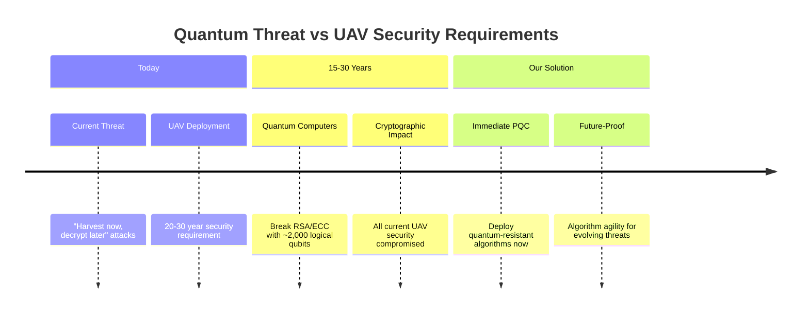
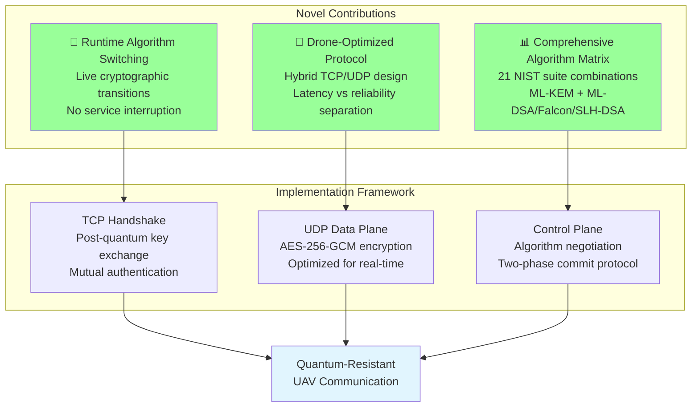
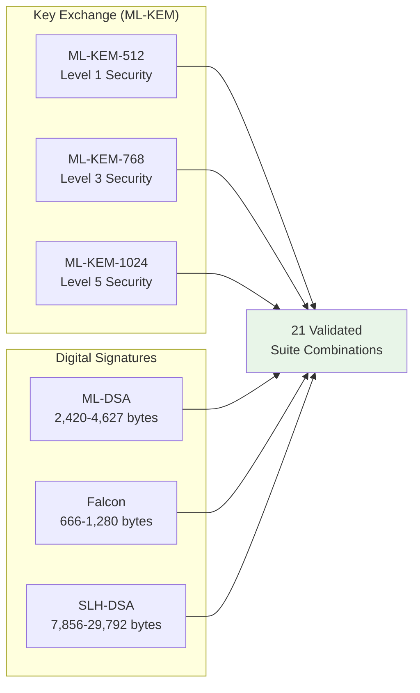

# 4. Post-Quantum Cryptographic Framework

This section presents our novel post-quantum cryptographic framework for securing drone-to-ground control station communication against quantum computational threats. Our system addresses the critical need for quantum-resistant security in unmanned aerial vehicle (UAV) systems while maintaining operational requirements for real-time flight control.

> **📖 Note**: This section provides an academic overview of our contributions. For complete technical documentation, implementation details, and comprehensive diagrams, see [Technical Documentation](docs/technical/README.md).

## 4.1 Motivation and Threat Model

The emergence of quantum computing poses an existential threat to current drone communication security. Shor's algorithm enables polynomial-time factorization of RSA keys and discrete logarithm computation for elliptic curve cryptography [1]. Conservative estimates suggest cryptographically relevant quantum computers within 15-30 years, while UAV systems require 20-30 year operational security lifetimes.

Our threat model considers quantum-capable adversaries with the ability to intercept and store current communications for future quantum decryption, perform active attacks during communication sessions, and exploit any algorithmic vulnerabilities in post-quantum schemes through cryptanalysis advances.

## 4.2 Novel Contributions

Our framework provides three key innovations beyond existing post-quantum communication systems:

### 4.2.1 Runtime Cryptographic Agility
**First implementation** enabling live algorithm switching in UAV systems without service interruption. This addresses the evolving nature of post-quantum cryptography where algorithm confidence may change over operational lifetimes.

### 4.2.2 Drone-Optimized Hybrid Protocol
**Novel hybrid TCP/UDP design** separating reliability-critical handshakes from latency-critical data transport, specifically optimized for UAV communication patterns rather than general-purpose protocols.

### 4.2.3 Comprehensive Algorithm Matrix
**Most complete implementation** of NIST post-quantum standards in UAV systems, supporting 21 validated suite combinations across all standardized algorithm families with full interoperability.

## 4.3 System Architecture Overview

Our architecture separates cryptographic concerns into three distinct phases: **TCP-based handshake** for reliable post-quantum key establishment, **UDP data plane** for low-latency encrypted communication, and **control plane** for runtime algorithm management.

> **🔗 Detailed Architecture**: [Complete System Overview](docs/technical/system-overview.md)

### 4.3.1 Simplified Handshake Walkthrough

1. **Handshake channel setup** – The drone opens a TCP connection to the GCS handshake port. No application data flows until the handshake completes.
2. **Signed ServerHello** – The GCS sends a post-quantum signed transcript containing the negotiated suite identifiers, an 8-byte session identifier, an 8-byte challenge, and the ML-KEM public key. The drone verifies the signature with the pre-installed GCS public key (certificate-equivalent) and enforces the expected suite and wire version.
3. **Drone authentication and KEM response** – The drone encapsulates the ML-KEM shared secret, then returns the ciphertext together with an HMAC-SHA256 tag computed using the 32-byte pre-shared key (`DRONE_PSK`). The GCS rejects the handshake if the tag fails comparison.
4. **Key derivation** – Both parties feed the shared secret into HKDF-SHA256 (salt `pq-drone-gcs|hkdf|v1`, info bound to the session and suite identifiers) to derive independent AES-256-GCM keys for drone→GCS and GCS→drone directions, plus nonce seeds tied to the session.
5. **Bidirectional encrypted data plane** – With keys established, UDP traffic traverses an AES-256-GCM tunnel that attaches a fixed 22-byte authenticated header (wire version, suite IDs, session, epoch, sequence). Replay protection uses a 1024-bit sliding window, and epochs increment on every rekey.

The accompanying diagram in `diagrames.md` (“Handshake & Encrypted Channel Layout”) illustrates these steps with the drone rendered on the left, the encrypted channel in the center, and the ground control station on the right.

## 4.4 Post-Quantum Algorithm Integration

We implement all four NIST-standardized post-quantum algorithm families to provide cryptographic diversity and address different operational requirements:

**Algorithm Selection Rationale**:
- **ML-KEM**: NIST FIPS 203 standard, lattice-based key exchange with proven security reductions
- **ML-DSA**: FIPS 204 lattice-based signatures, optimal performance-security balance  
- **Falcon**: Draft FIPS 206 NTRU-based, ultra-compact signatures for bandwidth constraints
- **SLH-DSA**: FIPS 205 hash-based, conservative security independent of number theory assumptions

> **🔗 Detailed Specifications**: [Algorithm Matrix](docs/technical/algorithm-matrix.md)

## 4.5 Security Properties and Performance

Our security analysis demonstrates that the framework achieves **IND-CCA2 security** for confidentiality, **sEUF-CMA security** for authentication, and **perfect forward secrecy** through ephemeral key generation. The system provides quantum security levels equivalent to AES-128, AES-192, and AES-256 through NIST Level 1, 3, and 5 parameters respectively.

**Performance Characteristics**:
- **Handshake**: <1 second completion time across all algorithm combinations
- **Data Plane**: 38-byte per-packet overhead, negligible latency impact
- **Memory**: 2-3 MB base requirements, suitable for embedded drone platforms
- **Throughput**: Comparable to classical systems after handshake completion

### 4.5.1 Suite Performance Summary (Session run_1759787312)

| Suite ID | Key Exchange | Signature | Baseline OWD p50/p95 (ms) | Saturation (Mbps) | Stop Cause | Rekey Duration (ms) |
| --- | --- | --- | --- | --- | --- | --- |
| cs-mlkem1024-aesgcm-falcon1024 | ML-KEM-1024 | Falcon-1024 | 29.28 / 50.40 | 141 | owd_p95_spike | 3,853.57 |
| cs-mlkem1024-aesgcm-falcon512 | ML-KEM-1024 | Falcon-512 | 27.15 / 30.30 | 78 | owd_p95_spike | 6,248.68 |
| cs-mlkem1024-aesgcm-mldsa44 | ML-KEM-1024 | ML-DSA-44 | 21.81 / 25.55 | 15 | owd_p95_spike | 4,057.83 |
| cs-mlkem1024-aesgcm-mldsa65 | ML-KEM-1024 | ML-DSA-65 | 23.03 / 26.43 | 75 | owd_p95_spike | 4,839.93 |
| cs-mlkem1024-aesgcm-mldsa87 | ML-KEM-1024 | ML-DSA-87 | 25.45 / 28.62 | 47 | n/a | 6,762.79 |
| cs-mlkem1024-aesgcm-sphincs128fsha2 | ML-KEM-1024 | SLH-DSA-128f | 31.82 / 35.00 | 59 | owd_p95_spike | 3,449.05 |
| cs-mlkem1024-aesgcm-sphincs256fsha2 | ML-KEM-1024 | SLH-DSA-256f | 33.64 / 36.94 | 72 | n/a | 3,904.47 |
| cs-mlkem512-aesgcm-falcon1024 | ML-KEM-512 | Falcon-1024 | 7.02 / 10.19 | 94 | n/a | 3,722.96 |
| cs-mlkem512-aesgcm-falcon512 | ML-KEM-512 | Falcon-512 | 4.11 / 7.40 | 75 | owd_p95_spike | 6,271.32 |
| cs-mlkem512-aesgcm-mldsa44 | ML-KEM-512 | ML-DSA-44 | 0.93 / 5.10 | 10 | owd_p95_spike | 4,116.37 |
| cs-mlkem512-aesgcm-mldsa65 | ML-KEM-512 | ML-DSA-65 | 0.85 / 4.65 | 109 | owd_p95_spike | 4,859.34 |
| cs-mlkem512-aesgcm-mldsa87 | ML-KEM-512 | ML-DSA-87 | 1.46 / 4.83 | 47 | n/a | 6,607.87 |
| cs-mlkem512-aesgcm-sphincs128fsha2 | ML-KEM-512 | SLH-DSA-128f | 9.53 / 12.73 | 20 | n/a | 3,819.37 |
| cs-mlkem512-aesgcm-sphincs256fsha2 | ML-KEM-512 | SLH-DSA-256f | 10.78 / 14.19 | 62 | owd_p95_spike | 4,866.41 |
| cs-mlkem768-aesgcm-falcon1024 | ML-KEM-768 | Falcon-1024 | 16.92 / 20.24 | 68 | n/a | 6,341.50 |
| cs-mlkem768-aesgcm-falcon512 | ML-KEM-768 | Falcon-512 | 15.46 / 19.43 | 47 | n/a | 3,963.53 |
| cs-mlkem768-aesgcm-mldsa44 | ML-KEM-768 | ML-DSA-44 | 12.63 / 15.76 | 47 | n/a | 4,122.15 |
| cs-mlkem768-aesgcm-mldsa65 | ML-KEM-768 | ML-DSA-65 | 0.76 / 10.92 | 20 | n/a | 3,464.27 |
| cs-mlkem768-aesgcm-mldsa87 | ML-KEM-768 | ML-DSA-87 | 13.81 / 16.89 | 68 | n/a | 6,313.60 |
| cs-mlkem768-aesgcm-sphincs128fsha2 | ML-KEM-768 | SLH-DSA-128f | 18.56 / 21.67 | 47 | n/a | 3,927.47 |
| cs-mlkem768-aesgcm-sphincs256fsha2 | ML-KEM-768 | SLH-DSA-256f | 20.01 / 23.20 | 72 | n/a | 6,291.25 |

*Values derived from empirical measurements in run_1759787312. “n/a” stop causes indicate the automated search exhausted the configured resolution without a guard-triggering spike.*

> **🔗 Detailed Analysis**: [Security Properties](docs/technical/security-analysis.md) | [Performance Benchmarks](docs/technical/performance-benchmarks.md)

## 4.6 Validation and Implementation

Our implementation includes comprehensive validation through **109 automated test functions** covering all cryptographic correctness scenarios, protocol compliance verification, security property validation, and integration testing. Hardware validation demonstrates feasibility across Windows/Linux development environments and Raspberry Pi 4B drone platforms.

The framework integrates with the **Open Quantum Safe library** [2] for NIST-approved algorithm implementations while maintaining constant-time operations and side-channel resistance required for safety-critical UAV deployments.

---

## 📖 Detailed Technical Documentation

For comprehensive implementation details, protocol specifications, and architectural deep-dives:

**🔗 [Complete Technical Documentation](docs/technical/README.md)**

### Quick Access:
- **[System Architecture](docs/technical/system-overview.md)** - Detailed module interactions and data flows
- **[Handshake Protocol](docs/technical/handshake-protocol.md)** - Complete TCP protocol specification  
- **[Algorithm Specifications](docs/technical/algorithm-matrix.md)** - Full 21-suite combination details
- **[Visual Documentation](docs/diagrams/README.md)** - Comprehensive diagrams and protocol flows

---

## References

[1] P. W. Shor, "Polynomial-time algorithms for prime factorization and discrete logarithms on a quantum computer," *SIAM Journal on Computing*, vol. 26, no. 5, pp. 1484-1509, 1997.

[2] Open Quantum Safe Project, "liboqs: C library for prototyping and experimenting with quantum-resistant cryptography," Available: https://github.com/open-quantum-safe/liboqs

[3] National Institute of Standards and Technology, "Post-Quantum Cryptography Standardization," 2024. [Online]. Available: https://csrc.nist.gov/Projects/post-quantum-cryptography

[4] National Institute of Standards and Technology, "Module-Lattice-Based Key-Encapsulation Mechanism Standard," *Federal Information Processing Standards Publication 203*, August 2024.

[5] National Institute of Standards and Technology, "Module-Lattice-Based Digital Signature Standard," *Federal Information Processing Standards Publication 204*, August 2024.