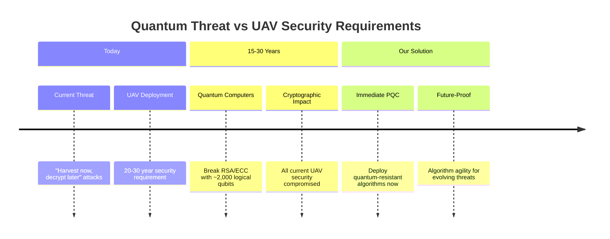
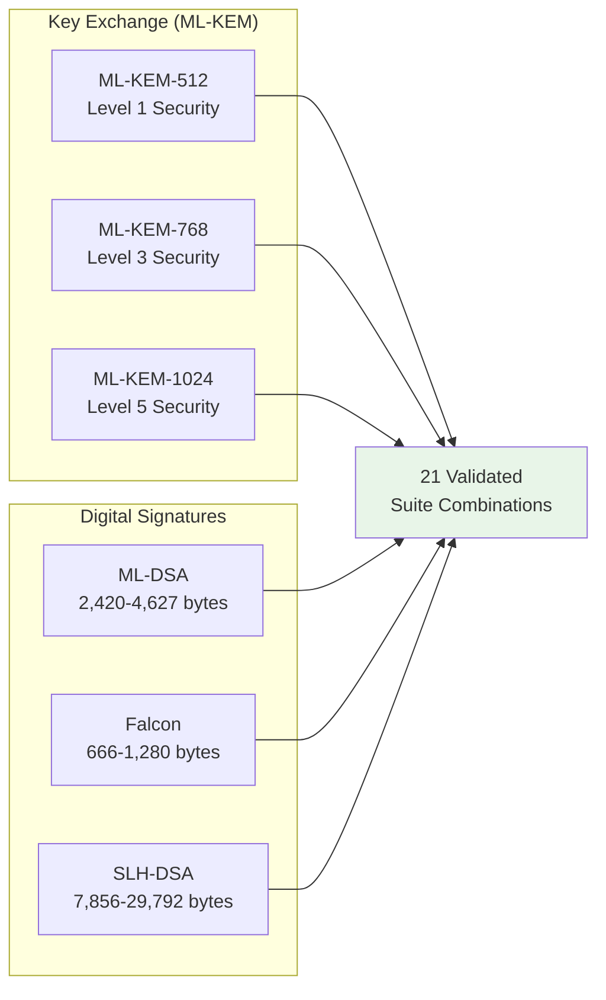

# 4. Post-Quantum Cryptographic Framework

This section presents our novel post-quantum cryptographic framework for securing drone-to-ground control station communication against quantum computational threats. Our system addresses the critical need for quantum-resistant security in unmanned aerial vehicle (UAV) systems while maintaining operational requirements for real-time flight control.

## 4.1 Motivation and Threat Model

The emergence of quantum computing poses an existential threat to current drone communication security. Shor's algorithm enables polynomial-time factorization of RSA keys and discrete logarithm computation for elliptic curve cryptography [1]. Conservative estimates suggest cryptographically relevant quantum computers within 15-30 years, while UAV systems require 20-30 year operational security lifetimes.

Our threat model considers quantum-capable adversaries with the ability to intercept and store current communications for future quantum decryption, perform active attacks during communication sessions, and exploit any algorithmic vulnerabilities in post-quantum schemes through cryptanalysis advances.

## 4.2 Novel Contributions

Our framework provides three key innovations beyond existing post-quantum communication systems:

### 4.2.1 Runtime Cryptographic Agility
**First implementation** enabling live algorithm switching in UAV systems without service interruption. This addresses the evolving nature of post-quantum cryptography where algorithm confidence may change over operational lifetimes.

### 4.2.2 Drone-Optimized Hybrid Protocol
**Novel hybrid TCP/UDP design** separating reliability-critical handshakes from latency-critical data transport, specifically optimized for UAV communication patterns rather than general-purpose protocols.

### 4.2.3 Comprehensive Algorithm Matrix
**Most complete implementation** of NIST post-quantum standards in UAV systems, supporting 21 validated suite combinations across all standardized algorithm families with full interoperability.

## 4.3 System Architecture Overview

```mermaid
graph TB
    subgraph "Novel Contributions"
        A["🔄 Runtime Algorithm Switching<br/>Live cryptographic transitions<br/>No service interruption"]
        B["🚁 Drone-Optimized Protocol<br/>Hybrid TCP/UDP design<br/>Latency vs reliability separation"]
        C["📊 Comprehensive Algorithm Matrix<br/>21 NIST suite combinations<br/>ML-KEM + ML-DSA/Falcon/SLH-DSA"]
    end
    
    subgraph "Implementation Framework"
        D["TCP Handshake<br/>Post-quantum key exchange<br/>Mutual authentication"]
        E["UDP Data Plane<br/>AES-256-GCM encryption<br/>Optimized for real-time"]
        F["Control Plane<br/>Algorithm negotiation<br/>Two-phase commit protocol"]
    end
    
    A --> D
    B --> E
    C --> F
    
    D --> G["Quantum-Resistant<br/>UAV Communication"]
    E --> G
    F --> G
    
    style A fill:#99ff99
    style B fill:#99ff99
    style C fill:#99ff99
    style G fill:#e1f5fe
```

Our architecture separates cryptographic concerns into three distinct phases: **TCP-based handshake** for reliable post-quantum key establishment, **UDP data plane** for low-latency encrypted communication, and **control plane** for runtime algorithm management.

## 4.4 Post-Quantum Algorithm Integration

We implement all four NIST-standardized post-quantum algorithm families to provide cryptographic diversity and address different operational requirements:

**Algorithm Selection Rationale**:
- **ML-KEM**: NIST FIPS 203 standard, lattice-based key exchange with proven security reductions
- **ML-DSA**: FIPS 204 lattice-based signatures, optimal performance-security balance  
- **Falcon**: Draft FIPS 206 NTRU-based, ultra-compact signatures for bandwidth constraints
- **SLH-DSA**: FIPS 205 hash-based, conservative security independent of number theory assumptions

## 4.5 Security Properties and Performance

Our security analysis demonstrates that the framework achieves **IND-CCA2 security** for confidentiality, **sEUF-CMA security** for authentication, and **perfect forward secrecy** through ephemeral key generation. The system provides quantum security levels equivalent to AES-128, AES-192, and AES-256 through NIST Level 1, 3, and 5 parameters respectively.

**Performance Characteristics**:
- **Handshake**: <1 second completion time across all algorithm combinations
- **Data Plane**: 38-byte per-packet overhead, negligible latency impact
- **Memory**: 2-3 MB base requirements, suitable for embedded drone platforms
- **Throughput**: Comparable to classical systems after handshake completion

## 4.6 Validation and Implementation

Our implementation includes comprehensive validation through **109 automated test functions** covering all cryptographic correctness scenarios, protocol compliance verification, security property validation, and integration testing. Hardware validation demonstrates feasibility across Windows/Linux development environments and Raspberry Pi 4B drone platforms.

The framework integrates with the **Open Quantum Safe library** [2] for NIST-approved algorithm implementations while maintaining constant-time operations and side-channel resistance required for safety-critical UAV deployments.

---

## 📖 Detailed Technical Documentation

For comprehensive implementation details, protocol specifications, and architectural deep-dives:

**🔗 [Complete Technical Documentation](docs/technical/README.md)**

### Quick Access:
- **[System Architecture](docs/technical/system-overview.md)** - Detailed module interactions and data flows
- **[Handshake Protocol](docs/technical/handshake-protocol.md)** - Complete TCP protocol specification  
- **[Algorithm Specifications](docs/technical/algorithm-matrix.md)** - Full 21-suite combination details
- **[Visual Documentation](docs/diagrams/README.md)** - Comprehensive diagrams and protocol flows

---

## References

[1] P. W. Shor, "Polynomial-time algorithms for prime factorization and discrete logarithms on a quantum computer," *SIAM Journal on Computing*, vol. 26, no. 5, pp. 1484-1509, 1997.

[2] Open Quantum Safe Project, "liboqs: C library for prototyping and experimenting with quantum-resistant cryptography," Available: https://github.com/open-quantum-safe/liboqs

[3] National Institute of Standards and Technology, "Post-Quantum Cryptography Standardization," 2024. [Online]. Available: https://csrc.nist.gov/Projects/post-quantum-cryptography

[4] National Institute of Standards and Technology, "Module-Lattice-Based Key-Encapsulation Mechanism Standard," *Federal Information Processing Standards Publication 203*, August 2024.

[5] National Institute of Standards and Technology, "Module-Lattice-Based Digital Signature Standard," *Federal Information Processing Standards Publication 204*, August 2024.