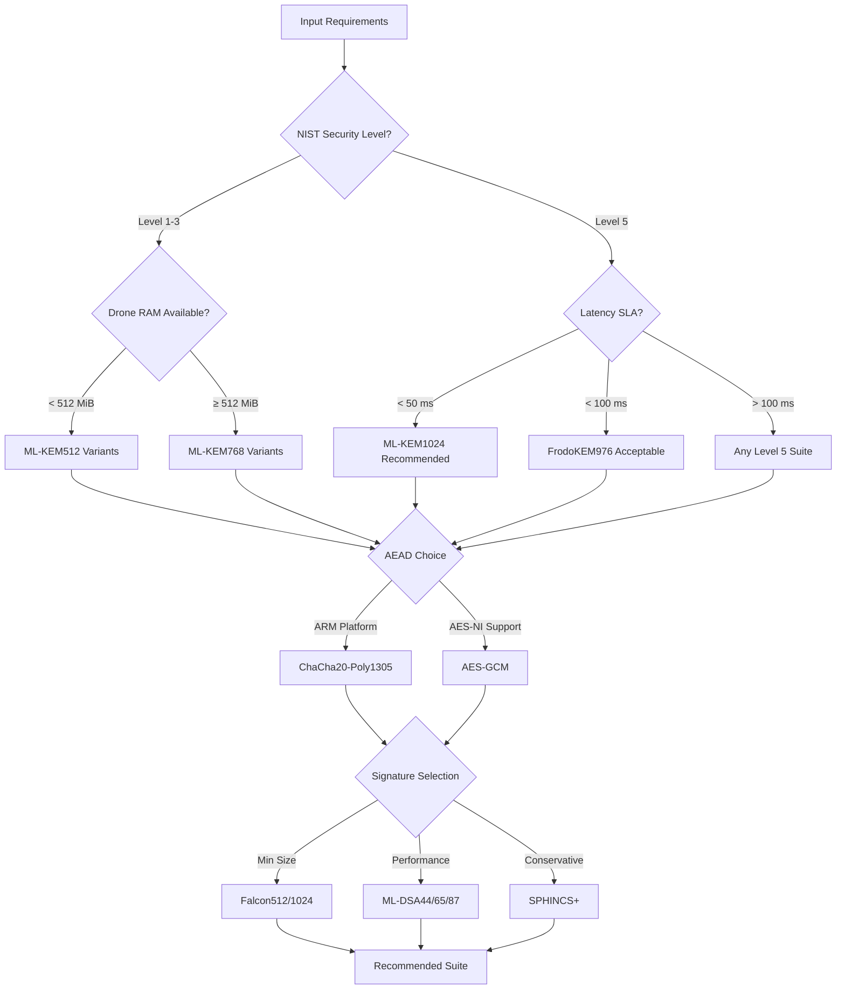
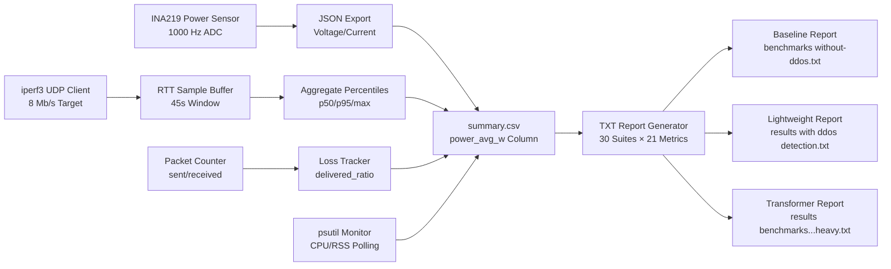
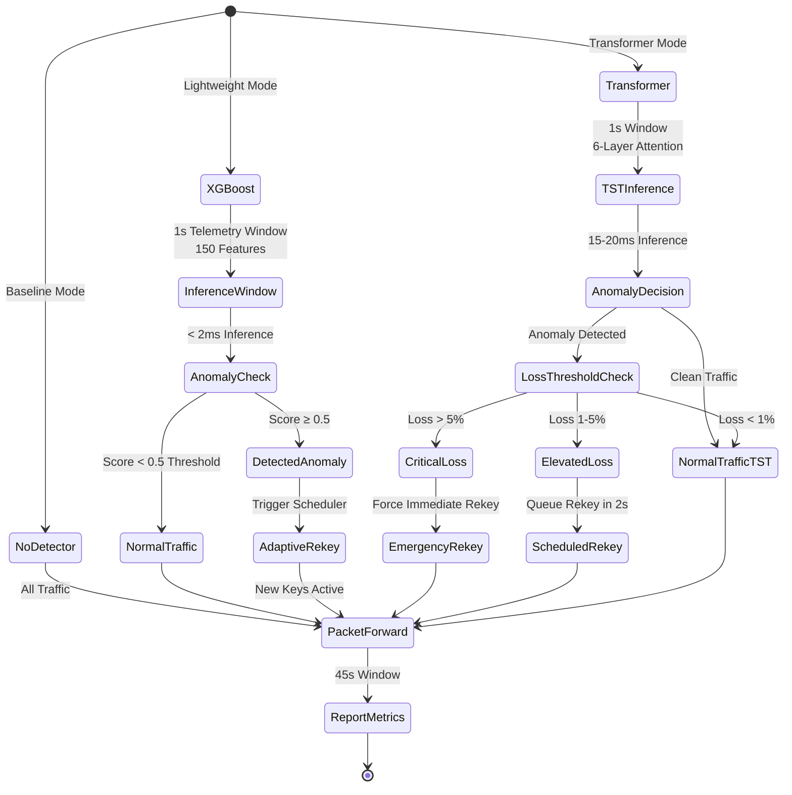
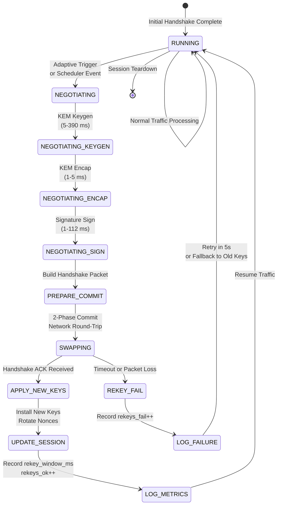

# Phase 6: Mermaid Diagrams for Performance Chapter

This document contains 5 flowchart/state-machine definitions in Mermaid syntax for integration into the LaTeX document.

---

## Diagram 1: Suite Selection Pipeline



**Figure Caption:** Suite selection decision tree based on operational requirements. Latency SLA and NIST security level determine KEM family, followed by platform-specific AEAD and signature scheme selection.

---

## Diagram 2: Telemetry Ingestion Flow



**Figure Caption:** Telemetry ingestion pipeline capturing power, network, and resource metrics from hardware sensors and OS monitors. All streams converge to summary.csv before TXT report generation.

---

## Diagram 3: Power Capture Pipeline

```mermaid
flowchart TD
    A[INA219 I2C Sensor<br/>Bus Voltage: 0-26V<br/>Shunt Current: ±3.2A] --> B[Python Monitor Script<br/>power/monitor.py]
    
    B --> C[Sample Loop<br/>1000 Hz Target<br/>Actual: 995-1005 Hz]
    
    C --> D[Timestamp + Reading<br/>ISO8601, mV, mA]
    
    D --> E[CSV Export<br/>power_*.csv<br/>~450 MB/45s]
    
    E --> F[Aggregator<br/>Mean/Std/Min/Max]
    
    F --> G[summary.csv Columns<br/>power_avg_w<br/>avg_current_a<br/>avg_voltage_v]
    
    G --> H[Energy Calculation<br/>energy_j = power_w × duration_s]
    
    H --> I[Per-Operation Energy<br/>kem_keygen_mJ = keygen_ms × power_w<br/>kem_decap_mJ = decap_ms × power_w<br/>sig_sign_mJ = sign_ms × power_w]
    
    I --> J[TXT Report Columns<br/>power X.XXX W avg over 45.0 s<br/>energy (XXX.XXX J)]
```

**Figure Caption:** Power measurement pipeline from INA219 hardware sensor to per-operation energy breakdown. High-frequency sampling (1000 Hz) enables precise energy attribution to cryptographic primitives.

---

## Diagram 4: DDOS Escalation Logic



**Figure Caption:** DDOS detection escalation state machine across three operational modes. Lightweight (XGBoost) uses binary threshold, while Transformer (TST) employs multi-tier loss-based escalation.

---

## Diagram 5: Rekey State Machine



**Figure Caption:** Rekey state machine with 2-phase commit protocol. Metrics captured: rekey_window_ms (NEGOTIATING → RUNNING transition time), rekeys_ok (successful transitions), rekeys_fail (REKEY_FAIL occurrences).

---

## Integration Notes for LaTeX

Each diagram should be included in the LaTeX document using:

```latex
\begin{figure}[htbp]
\centering
\includegraphics[width=0.9\textwidth]{diagrams/diagram01_suite_selection.png}
\caption{Suite Selection Pipeline...}
\label{fig:suite_selection}
\end{figure}
```

To generate PNG images from Mermaid:
1. Use `mmdc` (mermaid-cli): `mmdc -i diagram.mmd -o diagram.png -t neutral -b transparent`
2. Or use online editor: https://mermaid.live
3. Export at 300 DPI for publication quality

Alternatively, if compiling with lualatex, use the mermaid LaTeX package directly:

```latex
\usepackage{mermaid}
\begin{mermaid}
... diagram code ...
\end{mermaid}
```
