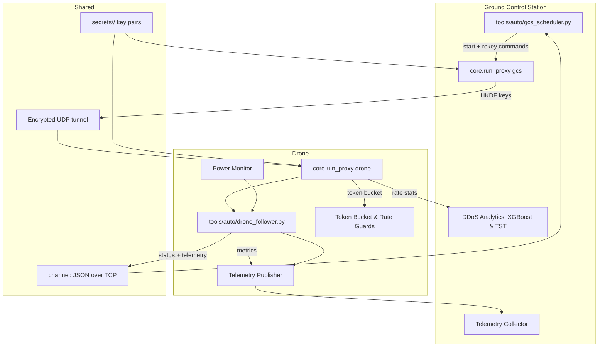
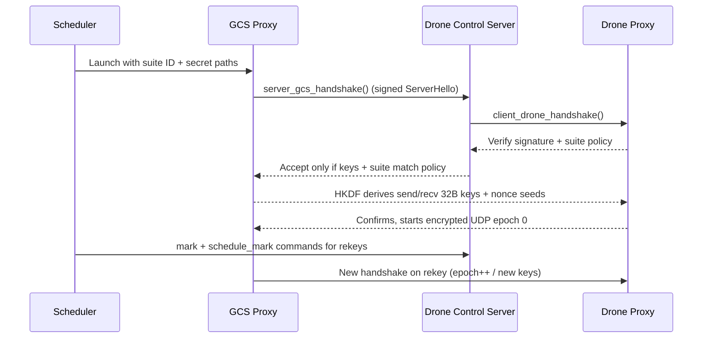
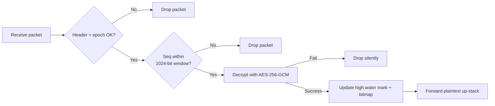
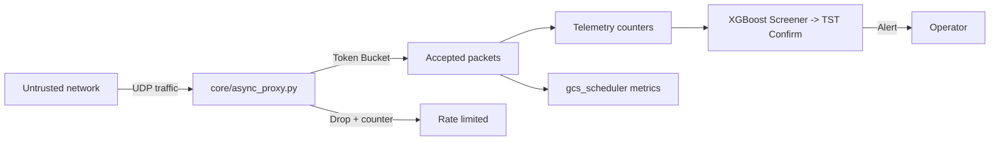
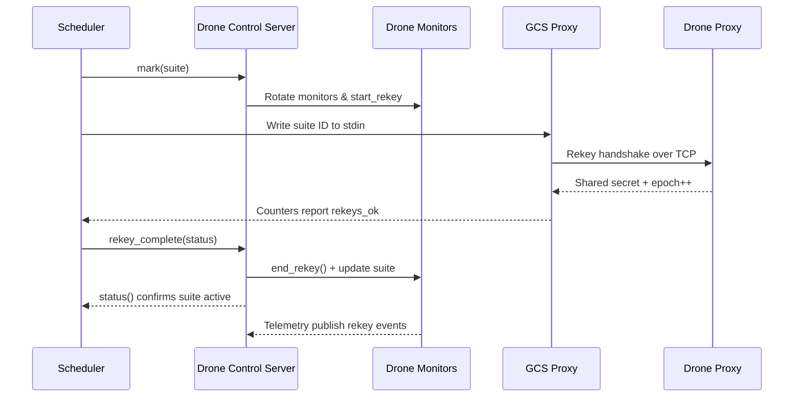
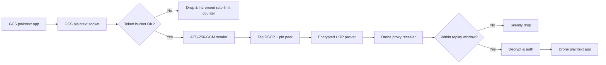
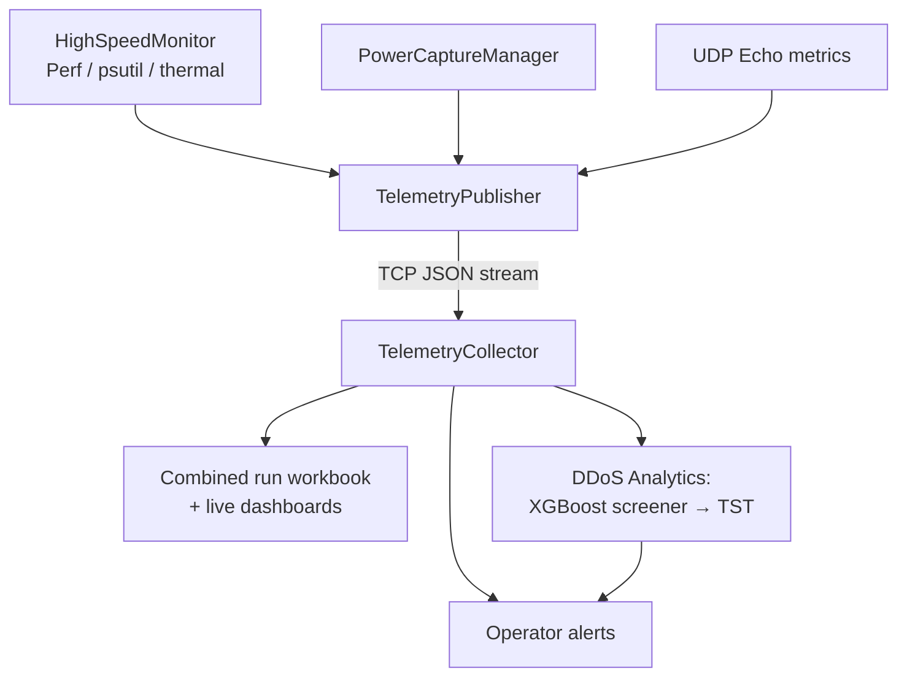

# PQC Drone↔GCS Secure Proxy — System Diagrams

This note stays high-level on purpose so it can live inside the paper without overwhelming readers. Each diagram is followed by a short list of plain-language takeaways.

## 1. Component Map

- GCS and drone proxies read matching public keys and secrets from the `secrets/` tree so they already trust each other before the network comes up.
- The scheduler drives the GCS proxy and talks to the drone follower over a small TCP control channel on loopback or LAN.
- Telemetry runs out-of-band so control or data hiccups do not hide health signals.
- Lightweight rate guards (token bucket) live inside the proxy, while the heavier DDoS detectors (XGBoost + Time Series Transformer) run on the ground station where more compute is available.

## 2. Secure Session Lifecycle (MitM Defense)

Key points:

- Every handshake carries both a post-quantum KEM shared secret and a signature from the GCS keypair. The drone rejects the session if the signature or suite ID is unexpected, blocking man-in-the-middle attempts.
- After the KEM exchange, both sides run HKDF-SHA256 with a fixed salt (`"pq-drone-gcs|hkdf|v1"`) so fresh send/receive keys and nonce seeds exist for each epoch.
- Rekeys reuse the same flow; epochs increment so old traffic can never be decrypted under the new key schedule.

## 3. Replay Protection

- `core/aead.py` keeps, per direction, the highest sequence number plus a 1024-bit replay bitmap. Anything outside the window or already seen is dropped without raising an error.
- This window still allows moderate out-of-order delivery, so bursty networks do not break the tunnel.
- Because the proxy never sends detailed decrypt errors, attackers cannot learn why their injection failed.

## 4. DDoS & Flooding Perspective

- The async proxy applies DSCP tags, pins peers, and throttles with a token bucket before traffic touches the drone.
- Scheduler-side analytics read the same counters plus live telemetry to spot sustained floods; the two-stage detector (XGBoost screener, Transformer confirmer) treats each 0.6 s window and issues alerts only on consistent abuse.
- Operators can rehearse failovers by replaying captures through `ddos/run_tst.py` or `tools/sim_driver.py` to make sure thresholds match field reality.

## 5. Artifacts & Telemetry At A Glance

| Stage | What is captured | Where it lives | Why it matters |
|-------|------------------|----------------|----------------|
| Handshake & suites | `gcs_status.json`, `drone_status.json`, markers in `logs/auto/*/` | Confirms which suite ran and whether rekeys succeeded |
| Traffic stats | `summary.csv`, `blaster_events.jsonl`, `packet_timing.csv` | Gives throughput, loss, RTT/OWD samples for reporting |
| System health | `system_monitoring_*.csv`, perf/psutil/thermal logs | Correlates CPU load, temp, and rekey duration |
| Power capture | CSV + JSON summaries under `power/` | Quantifies energy draw per suite/pass |
| Telemetry bus | TCP stream from follower → scheduler (`TelemetryPublisher` ↔ `TelemetryCollector`) | Keeps monitoring live even if data-plane is stressed |

## 6. Threat-Model Checklist

- **Key storage:** Both sides boot with pre-generated keys from `secrets/<suite>/`; nothing travels over the air in clear text.
- **MITM resistance:** Signed server hello + expected suite IDs stop impostor GCS nodes. HKDF rotates keys on every rekey.
- **Replay control:** 1024-bit sliding window plus epoch counters throw away duplicates and stale packets.
- **Flood handling:** Token bucket enforcement in the proxy and machine-learning detection on the GCS keep bandwidth hogs from starving mission traffic.
- **Observability:** All control errors respond with `{"ok": false, "error": ...}` and can be mirrored into telemetry so operators see issues quickly.

These diagrams mirror the current README + docs content and avoid any speculative claims, keeping the paper grounded in the code that actually ships.

## 7. Control Command Loop (Scheduler ↔ Follower ↔ Proxies)

- Scheduler first aligns the follower’s monitors before telling the proxy to switch suites, ensuring logs land in the correct output directory.
- The GCS proxy performs the PQC handshake with the drone proxy; the scheduler only proceeds once counters show the new suite is live.
- Final `rekey_complete` closes the loop so the drone drops back to RUNNING state, and telemetry captures the entire transition for later audits.

## 8. Data-Plane Packet Journey

- Packets leave the ground control app in plaintext, but the proxy immediately enforces a token bucket to slow abuse before encrypting with AES-256-GCM.
- The 22-byte header (version, suite IDs, session, seq, epoch) travels as AAD; any mismatch fails fast without touching the decryptor.
- On the drone side, the replay bitmap and epoch gates drop stale traffic silently, keeping adversaries from probing timing differences.

## 9. Telemetry, Power, and DDoS Analytics Pipeline

- The follower aggregates high-frequency metrics (system load, perf counters, INA219 power summaries, UDP echo latency) and pushes them through a single TCP stream.
- The scheduler records the live feed for the run workbook while also piping samples into the two-stage DDoS detector to catch slow-building floods.
- Because telemetry is decoupled from the encrypted data path, even heavy rekeys or network churn still deliver health data to operators.
