# PQC Drone↔GCS Secure Proxy — System Diagrams

This note stays high-level on purpose so it can live inside the paper without overwhelming readers. Each diagram is followed by a short list of plain-language takeaways.

## 1. Component Map

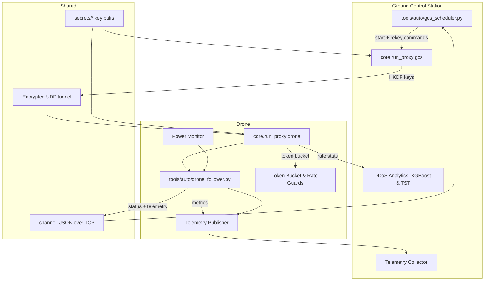

- Both sides start with the same preloaded trust material so they already know who they are talking to when the system wakes up.
- A small control program on the ground station coordinates what the drone proxy should do next.
- Status information has its own lane, so even if mission traffic hiccups we still see how the system feels.
- Basic flood protection happens right where packets arrive, while heavier analytics stay on the ground station where there is more computing power.

#### Component Map Glossary

- **GCS Scheduler (`tools/auto/gcs_scheduler.py`)** — The automation script that boots the ground proxy, triggers rekeys, and keeps mission timing on schedule.
- **GCS Proxy (`core.run_proxy gcs`)** — The ground station process that performs the post-quantum handshake and encrypts outbound traffic before it hits the network.
- **Telemetry Collector** — A lightweight listener on the ground side that stores health and mission metrics for dashboards.
- **DDoS Analytics: XGBoost & TST** — The two-stage machine-learning detector (gradient boosted trees plus Transformer) that separates normal bursts from hostile floods.
- **Drone Follower (`tools/auto/drone_follower.py`)** — The drone-side control helper that reacts to scheduler plans and nudges the proxy when suites change.
- **Drone Proxy (`core.run_proxy drone`)** — The drone process that enforces suite policy, decrypts inbound packets, and publishes telemetry.
- **Telemetry Publisher** — A drone component that streams system metrics and flight status back to the ground.
- **Power Monitor** — Hardware + scripts (INA219 helpers) that log voltage and current so teams can track energy usage.
- **Token Bucket & Rate Guards** — Local rate limiters that throttle suspicious bursts before they stress the drone.
- **`secrets/<suite>/` key pairs** — Pre-generated signing/KEM credentials stored securely on both sides so identities are known at boot.
- **Control channel (JSON over TCP)** — A management pipe carrying human-readable commands between scheduler and follower.
- **Encrypted UDP tunnel** — The AES-256-GCM data path that transports all mission traffic once the handshake succeeds.

### Component Map — Simplified View

*Read this as a story first, then peek at the detailed box diagram above.*

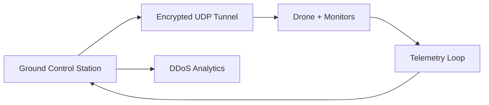

- Ground station drives the tunnel and analytics.
- Drone handles mission tasks and keeps an eye on its own sensors.
- Telemetry flows in a loop so operators always know what is happening.

**Plain-language walkthrough**

1. The ground station prepares mission commands and keeps the bigger-picture analytics.
2. The encrypted tunnel is the safe hallway where messages travel.
3. The drone runs the actual flight logic and reports what it sees.
4. Telemetry is the constant status whisper coming back to the operators.

#### Simplified View Glossary

- **Ground Control Station** — The operator side that plans missions, performs analytics, and houses the signing key material.
- **Encrypted UDP Tunnel** — The protected path created after the handshake where every packet is wrapped in AES-256-GCM.
- **Drone + Monitors** — The airborne endpoint plus its onboard health checks and rate guards.
- **Telemetry Loop** — The always-on feedback channel that streams status data to the ground.
- **DDoS Analytics** — Ground-based detectors that watch traffic counters for long-running floods.

## 2. Secure Session Lifecycle (MitM Defense)

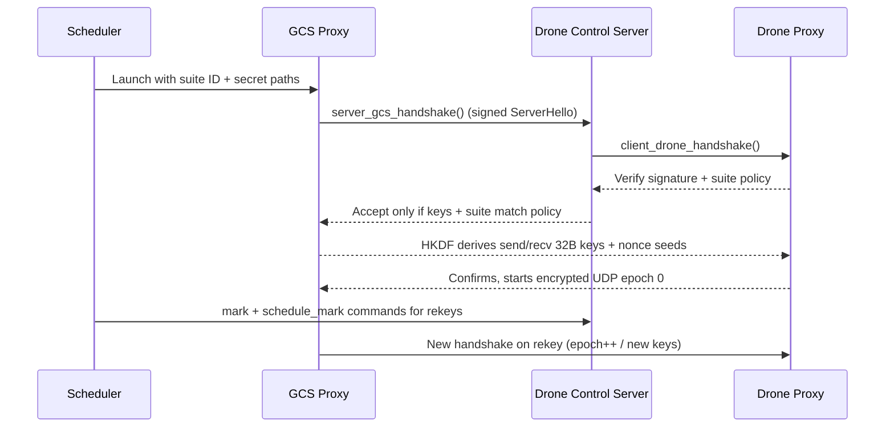

Key points:

- Every handshake carries both a post-quantum KEM shared secret and a signature from the GCS keypair. The drone rejects the session if the signature or suite ID is unexpected, blocking man-in-the-middle attempts.
- After the KEM exchange, both sides run HKDF-SHA256 with a fixed salt (`"pq-drone-gcs|hkdf|v1"`) so fresh send/receive keys and nonce seeds exist for each epoch.
- Rekeys reuse the same flow; epochs increment so old traffic can never be decrypted under the new key schedule.

#### Session Sequence Glossary

- **Scheduler** — The automation script that launches proxies, issues rekey commands, and keeps the mission timeline aligned.
- **GCS Proxy** — The ground station process that speaks the post-quantum handshake and owns the signing key pair.
- **Drone Control Server** — The follower service on the drone that coordinates monitors and forwards handshake results.
- **Drone Proxy** — The drone-side endpoint that validates suites, derives keys, and runs the encrypted UDP tunnel.
- **suite ID + secret paths** — Configuration values from `core/config.py` that point to the desired cryptographic suite and the shared secrets directory.
- **server_gcs_handshake() / client_drone_handshake()** — Functions in `core/handshake.py` that orchestrate the request/response handshake logic for each side.
- **HKDF** — A key-derivation function (HKDF-SHA256) that stretches the shared secret into distinct send and receive keys.
- **epoch** — A counter that increments on every rekey so replayed packets from an old key schedule are discarded.

### Session Lifecycle — Simplified View

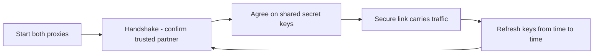

- First we bring both ends online.
- They perform a handshake to prove they are talking to the right partner.
- A shared set of secret keys is agreed before any sensitive data moves.
- Everyday traffic rides the secure link, and the same steps repeat whenever keys need a refresh.

#### Simplified Lifecycle Glossary

- **Start both proxies** — Boot the ground and drone proxy programs so they can talk.
- **Handshake - confirm trusted partner** — A quick exchange that proves each side is genuine before keys are issued.
- **Agree on shared secret keys** — Both sides derive identical encryption keys without sending them directly.
- **Secure link carries traffic** — Mission and telemetry packets move through the encrypted tunnel.
- **Refresh keys from time to time** — Rekey events that reset the encryption keys and advance the epoch counter.

#### Plain-English Quick Flow (Reader First)

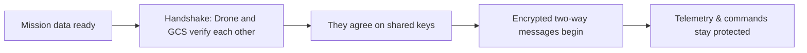

#### Quick Flow Glossary

- **Mission data ready:** The ground station has instructions or telemetry to move.
- **Handshake:** Both sides exchange a quick "hello" that proves identity before anything sensitive is shared.
- **Shared keys:** Think of these as a matching pair of locks—one for each direction—so only the drone and the GCS can read the conversation.
- **Encrypted two-way messages:** Once the locks are in place, commands and status updates travel both ways in a protected tunnel, keeping outsiders from spying or tampering.

Anyone starting with this flow should grasp the story before reading the deeper technical details that follow.

### Handshake & Encrypted Channel Layout

Before looking at the callouts below, read the flow like a short story: the drone first dials the dedicated handshake TCP port on the ground station. The GCS immediately answers with a signed ServerHello that lists the exact post-quantum suite, an 8-byte session identifier, a one-time challenge, and the ML-KEM public key it just generated. The drone validates that signature with the pre-installed GCS public key, double-checks that the announced suite and wire version match policy, then responds with a ML-KEM ciphertext plus an HMAC-SHA256 tag computed with its 32-byte pre-shared key. Once the GCS verifies that tag, both sides run the same HKDF routine to turn the shared secret into distinct AES-256-GCM keys for the drone→GCS and GCS→drone directions. Those keys immediately light up epoch 0 of the encrypted UDP tunnel so that telemetry and mission traffic can flow bidirectionally with replay protection.

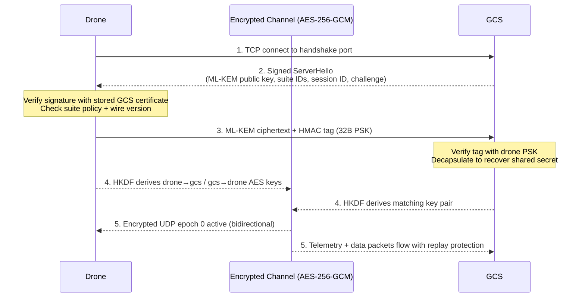

- **Credential use:** The GCS signs the ServerHello with its post-quantum signature private key stored under `secrets/`; the drone verifies using the corresponding public key (certificate-equivalent).
- **Drone authentication:** The drone appends an HMAC-SHA256 tag calculated with the 32-byte pre-shared key (`DRONE_PSK`). The GCS refuses the handshake if this tag fails.
- **Key agreement:** Both sides feed the ML-KEM shared secret into HKDF-SHA256 (`salt="pq-drone-gcs|hkdf|v1"`) to derive independent AES-256-GCM keys for each direction.
- **Data plane:** Once keys are in place, all UDP traffic traverses the encrypted channel, carrying 22-byte authenticated headers with session, epoch, and sequence fields.

*Mermaid note: keep the opening directive as `sequenceDiagram`—Mermaid does not accept variant suffixes.*

#### Handshake Diagram Glossary

- **Drone:** The client proxy launched via `core.run_proxy drone`; it enforces suite policy, generates telemetry, and protects its identity with a pre-shared key.
- **GCS:** The ground control station proxy (`core.run_proxy gcs`) that owns the signing key pair stored in `secrets/` and listens on the configured handshake TCP port from `core.config`.
- **Handshake TCP port:** Loopback or LAN port defined in `CONFIG["TCP_HANDSHAKE_PORT"]` (via `core/config.py`) that carries only the authenticated KEM+signature exchange, not application data.
- **Signed ServerHello:** The transcript built by `build_server_hello()` in `core/handshake.py`; it contains the wire version, chosen suite identifiers from `core/suites.py`, a fresh 8-byte `session_id`, an 8-byte random `challenge`, and the temporary ML-KEM public key, all signed with the GCS post-quantum signature secret.
- **ML-KEM public key:** The ephemeral key encapsulation public key generated by `oqs.KeyEncapsulation`, used by the drone to derive the shared secret; its size depends on the suite (e.g., ML-KEM-512/768/1024).
- **Suite IDs:** Canonical identifiers such as `cs-mlkem768-aesgcm-mldsa65` that bind the KEM, AEAD, and signature choices; they are validated on the drone to prevent downgrade attacks.
- **Session ID:** An 8-byte random value that uniquely labels the negotiated epoch so rekeys cannot be confused.
- **Challenge:** An 8-byte random nonce included in the signature to defeat transcript replay attempts.
- **Verify signature with stored GCS certificate:** The drone loads the GCS public key bundled under `secrets/` for the active suite and calls `parse_and_verify_server_hello()` to ensure the ServerHello signature is authentic.
- **Check suite policy + wire version:** The drone compares the negotiated KEM/signature names and the wire protocol version against its expected configuration; mismatches raise `HandshakeVerifyError`.
- **ML-KEM ciphertext:** The encapsulated shared secret emitted by `client_encapsulate()`; it is transmitted back to the GCS and later decapsulated server-side to recover the same shared secret.
- **HMAC tag (32B PSK):** An HMAC-SHA256 computed with the 32-byte hex pre-shared key `DRONE_PSK`; the GCS recomputes it with `_drone_psk_bytes()` to authenticate the drone.
- **HKDF derives drone→gcs / gcs→drone AES keys:** Both parties call `derive_transport_keys()` to stretch the ML-KEM shared secret into two 32-byte AES-256-GCM keys plus nonce seeds, keeping send and receive directions independent.
- **Encrypted UDP epoch 0:** The initial AEAD epoch established after the handshake; subsequent rekeys increment the epoch counter so old traffic cannot be replayed under new keys.
- **Telemetry + data packets with replay protection:** Mission traffic and health telemetry traverse the tunnel with the 22-byte authenticated header processed by `core/aead.py`, which enforces a 1024-bit sliding window to drop replays silently.

## 3. Replay Protection

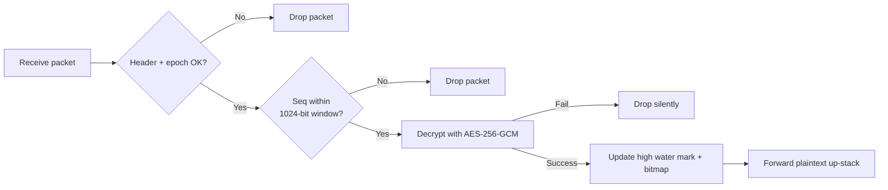

- `core/aead.py` keeps, per direction, the highest sequence number plus a 1024-bit replay bitmap. Anything outside the window or already seen is dropped without raising an error.
- This window still allows moderate out-of-order delivery, so bursty networks do not break the tunnel.
- Because the proxy never sends detailed decrypt errors, attackers cannot learn why their injection failed.

#### Replay Diagram Glossary

- **Header + epoch OK?** — Checks that the 22-byte header matches the active session ID, epoch, and configured suite.
- **1024-bit window** — The sliding bitmap in `core/aead.py` used to remember the last 1024 sequence numbers and block repeats.
- **AES-256-GCM** — The authenticated cipher that both encrypts and verifies each packet.
- **High water mark** — The largest sequence number seen so far, used to slide the replay window forward.
- **Drop silently** — The proxy's practice of discarding bad packets without sending clues back to attackers.

### Replay Protection — Simplified View

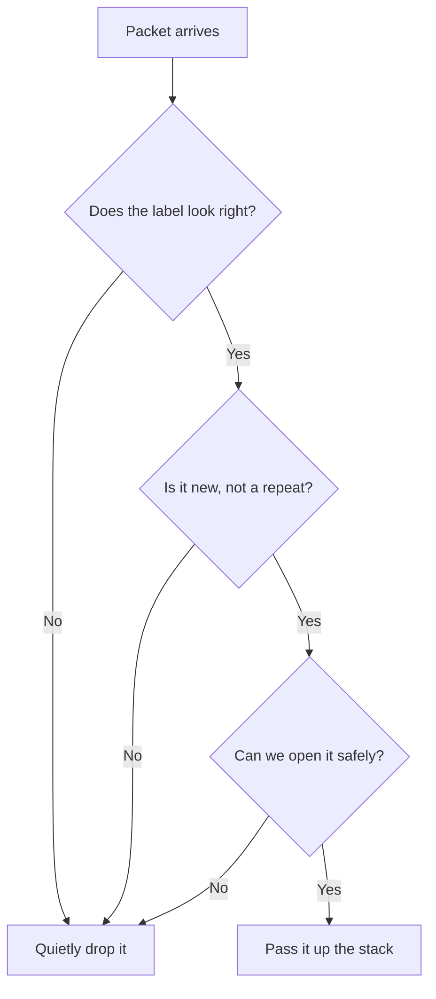

- If a packet shows the wrong label, we simply ignore it.
- If we have already seen that sequence number, we ignore it again so attackers cannot replay old traffic.
- Only fresh, well-formed packets make it to the flight software.
- Every rejection is silent, giving intruders no clues.

#### Simplified Replay Glossary

- **Label** — A quick shorthand for the session, suite, and epoch values in the packet header.
- **Replay guard** — The check that ensures a sequence number is fresh and within the window.
- **Open it safely** — The AES-256-GCM decrypt-and-verify step that catches any tampering.
- **Quietly drop it** — Discarding a packet without generating any error response the attacker could measure.

## 4. DDoS & Flooding Perspective

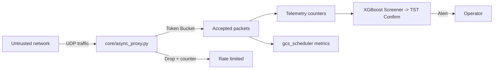

- The async proxy applies DSCP tags, pins peers, and throttles with a token bucket before traffic touches the drone.
- Scheduler-side analytics read the same counters plus live telemetry to spot sustained floods; the two-stage detector (XGBoost screener, Transformer confirmer) treats each 0.6 s window and issues alerts only on consistent abuse.
- Operators can rehearse failovers by replaying captures through `ddos/run_tst.py` or `tools/sim_driver.py` to make sure thresholds match field reality.

#### DDoS Diagram Glossary

- **Untrusted network** — Any external network segment (internet, RF link) that can send UDP packets toward the proxy.
- **`core/async_proxy.py`** — The loop that routes plaintext and encrypted sockets, applies DSCP tags, and enforces token buckets.
- **Token Bucket** — A rate limiter that allows bursts up to a limit while keeping the long-term average controlled.
- **Drop + counter** — The action of rejecting packets that exceed the allowance while incrementing telemetry counters.
- **Telemetry counters** — Live statistics exported through telemetry so operators can see accepted vs dropped traffic.
- **XGBoost Screener → TST Confirm** — The machine-learning pipeline that classifies windows of traffic as benign or suspicious before paging an operator.

### DDoS Flow — Simplified View

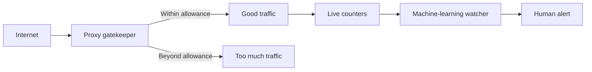

- The proxy acts like a bouncer, letting in only the amount of traffic that looks healthy.
- Anything that exceeds the allowance is dropped immediately before it touches the drone.
- We keep simple counters of what gets through and what gets blocked.
- A machine-learning watcher looks for longer-term patterns and pings an operator if something smells off.

#### Simplified DDoS Glossary

- **Proxy gatekeeper** — The software guard at the edge that makes yes/no decisions on every packet.
- **Within allowance** — Traffic that fits inside the token bucket limits.
- **Beyond allowance** — Bursty or abusive traffic that surpasses the configured rate and gets dropped.
- **Live counters** — Running totals of accepted and dropped packets exposed to the analytics layer.
- **Machine-learning watcher** — The XGBoost + TST combo that spots multi-second anomalies.

## 5. Artifacts & Telemetry At A Glance

| Stage | What is captured | Where it lives | Why it matters |
|-------|------------------|----------------|----------------|
| Handshake & suites | `gcs_status.json`, `drone_status.json`, markers in `logs/auto/*/` | Confirms which suite ran and whether rekeys succeeded |
| Traffic stats | `summary.csv`, `blaster_events.jsonl`, `packet_timing.csv` | Gives throughput, loss, RTT/OWD samples for reporting |
| System health | `system_monitoring_*.csv`, perf/psutil/thermal logs | Correlates CPU load, temp, and rekey duration |
| Power capture | CSV + JSON summaries under `power/` | Quantifies energy draw per suite/pass |
| Telemetry bus | TCP stream from follower → scheduler (`TelemetryPublisher` ↔ `TelemetryCollector`) | Keeps monitoring live even if data-plane is stressed |

## 6. Threat-Model Checklist

- **Key storage:** Both sides boot with pre-generated keys from `secrets/<suite>/`; nothing travels over the air in clear text.
- **MITM resistance:** Signed server hello + expected suite IDs stop impostor GCS nodes. HKDF rotates keys on every rekey.
- **Replay control:** 1024-bit sliding window plus epoch counters throw away duplicates and stale packets.
- **Flood handling:** Token bucket enforcement in the proxy and machine-learning detection on the GCS keep bandwidth hogs from starving mission traffic.
- **Observability:** All control errors respond with `{"ok": false, "error": ...}` and can be mirrored into telemetry so operators see issues quickly.

These diagrams mirror the current README + docs content and avoid any speculative claims, keeping the paper grounded in the code that actually ships.

## 7. Control Command Loop (Scheduler ↔ Follower ↔ Proxies)

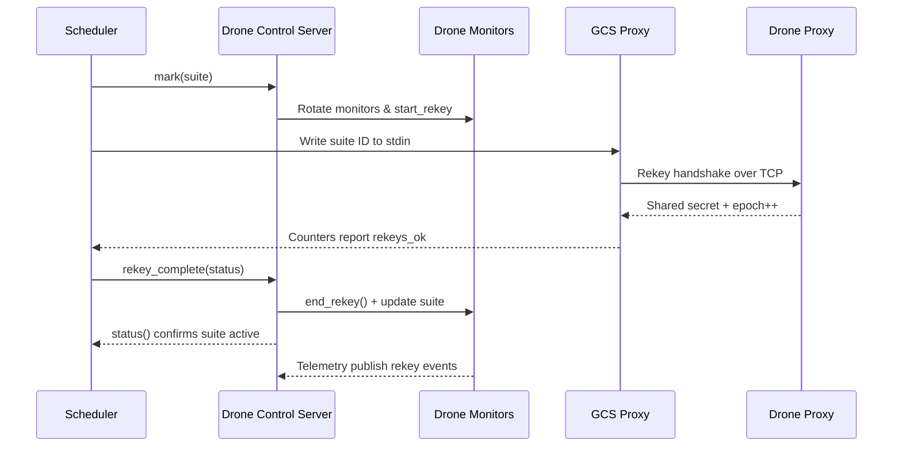

- Scheduler first aligns the follower’s monitors before telling the proxy to switch suites, ensuring logs land in the correct output directory.
- The GCS proxy performs the PQC handshake with the drone proxy; the scheduler only proceeds once counters show the new suite is live.
- Final `rekey_complete` closes the loop so the drone drops back to RUNNING state, and telemetry captures the entire transition for later audits.

#### Control Loop Glossary

- **Scheduler (`core.run_proxy gcs` helpers)** — The automation client that sequences commands and watches counters.
- **Drone Control Server** — The follower process that turns scheduler instructions into local actions and telemetry annotations.
- **Drone Monitors** — Health collectors (power, latency, perf) that may rotate or pause during rekey operations.
- **GCS Proxy / Drone Proxy** — The cryptographic agents that conduct handshakes, derive keys, and ship encrypted traffic.
- **mark(suite)** — A scheduler command that prepares the follower and telemetry sinks for a suite change.
- **start_rekey / end_rekey** — Control hooks that wrap the actual handshake so logs capture its duration and outcome.
- **epoch++** — The incremented counter showing a new key epoch is live.

### Control Loop — Simplified View

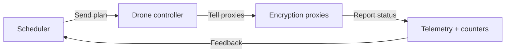

- The scheduler decides what should happen next and sends a simple plan.
- The follower turns that plan into actions for the proxies and spins up monitors when needed.
- The proxies execute the cryptographic steps and keep score of what happened.
- Telemetry runs the scoreboard back to the scheduler so humans can confirm everything worked.

#### Simplified Control Glossary

- **Scheduler** — The planner that decides which suite or mode should run next.
- **Drone controller** — The on-drone service that translates the plan into proxy instructions.
- **Encryption proxies** — The ground and drone proxy pair that carry out the handshake and encrypted traffic.
- **Telemetry + counters** — The feedback stream reporting success, errors, and metrics.

## 8. Data-Plane Packet Journey

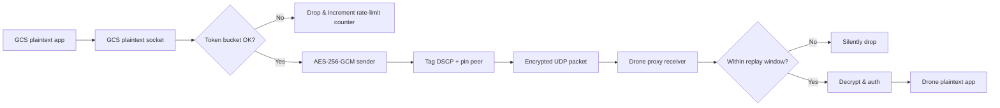

- Packets leave the ground control app in plaintext, but the proxy immediately enforces a token bucket to slow abuse before encrypting with AES-256-GCM.
- The 22-byte header (version, suite IDs, session, seq, epoch) travels as AAD; any mismatch fails fast without touching the decryptor.
- On the drone side, the replay bitmap and epoch gates drop stale traffic silently, keeping adversaries from probing timing differences.

#### Packet Journey Glossary

- **GCS plaintext app** — The flight-control software or operator console sending mission commands.
- **Plaintext socket** — The local UDP or TCP port on loopback that feeds packets into the proxy.
- **Token bucket** — The rate limiter that smooths bursty traffic before encryption.
- **AES-256-GCM sender** — The encryptor that wraps packets with confidentiality and integrity protection.
- **DSCP tag / pin peer** — Network metadata that marks priority and locks the remote IP/port to the expected drone address.
- **Encrypted UDP packet** — The ciphertext payload carrying the 22-byte authenticated header and encrypted data.
- **Replay window** — The 1024-bit bitmap guarding against duplicated sequence numbers.
- **Decrypt & auth** — The AES-256-GCM verify step that checks the tag before releasing plaintext to the drone application.

### Packet Journey — Simplified View

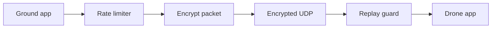

- The ground control software produces a packet.
- A gentle rate limiter keeps bursts from overwhelming the link.
- The packet is locked with encryption and a tamper-evident tag.
- The drone receives the encrypted packet, checks the replay guard, and only then hands the plaintext to flight logic.

#### Simplified Packet Glossary

- **Ground app** — The mission control program producing outbound packets.
- **Rate limiter** — The guard that meters how fast packets can leave.
- **Encrypt packet** — Applying AES-256-GCM to protect the data.
- **Encrypted UDP** — The secure tunnel that carries the ciphertext across the link.
- **Replay guard** — The check that blocks stale or duplicated packets.
- **Drone app** — The onboard logic that finally acts on the decrypted message.

## 9. Telemetry, Power, and DDoS Analytics Pipeline

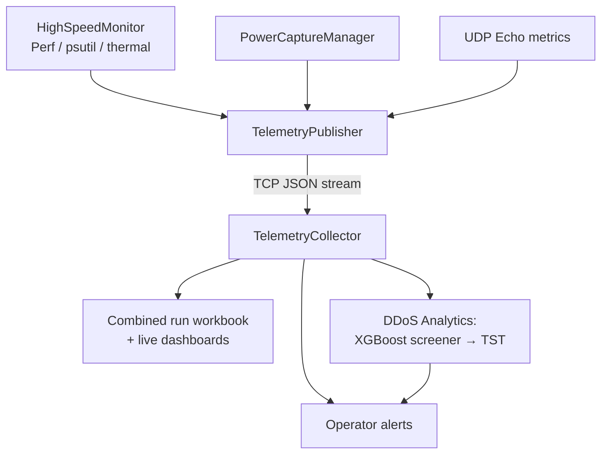

- The follower aggregates high-frequency metrics (system load, perf counters, INA219 power summaries, UDP echo latency) and pushes them through a single TCP stream.
- The scheduler records the live feed for the run workbook while also piping samples into the two-stage DDoS detector to catch slow-building floods.
- Because telemetry is decoupled from the encrypted data path, even heavy rekeys or network churn still deliver health data to operators.

#### Telemetry Pipeline Glossary

- **HighSpeedMonitor / Perf / psutil / thermal** — Collectors that sample CPU usage, hardware counters, and temperature at high frequency.
- **TelemetryPublisher** — The drone-side service that merges all monitor outputs and streams them out over TCP.
- **PowerCaptureManager** — The component that records voltage/current data from INA219 sensors and feeds it into telemetry.
- **UDP Echo metrics** — Latency measurements from echo probes that reveal network jitter and loss.
- **TelemetryCollector** — The ground service that receives the JSON stream and fans it out to dashboards and logs.
- **Combined run workbook** — The structured log bundle used for after-action review and reporting.
- **DDoS Analytics: XGBoost screener → TST** — The same ML pipeline that analyses telemetry windows for flood signatures.
- **Operator alerts** — Notifications (CLI/log/GUI) that inform humans about anomalies or threshold breaches.

### Telemetry Pipeline — Simplified View

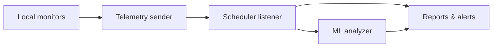

- All local monitors (system stats, power draw, latency probes) hand their readings to one telemetry sender.
- That sender streams the data to the scheduler, which listens for every update.
- The scheduler immediately files the data into operator reports and dashboards.
- The same stream also feeds the machine-learning analyzer that can trigger alerts.

#### Simplified Telemetry Glossary

- **Local monitors** — Sensors and scripts on the drone gathering health data.
- **Telemetry sender** — The process bundling and transmitting those readings.
- **Scheduler listener** — The ground receiver that writes the data down.
- **Reports & alerts** — Dashboards, CSV logs, or notifications built from the incoming stream.
- **ML analyzer** — The machine-learning module that watches for DDoS or health anomalies in real time.
