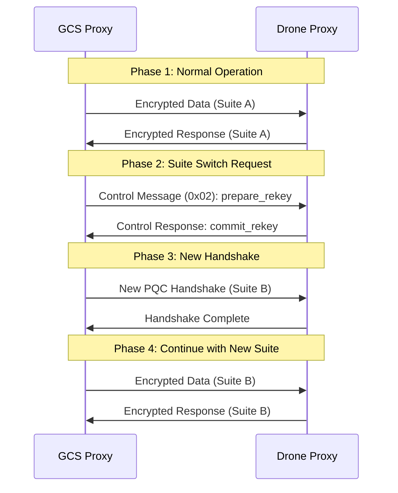
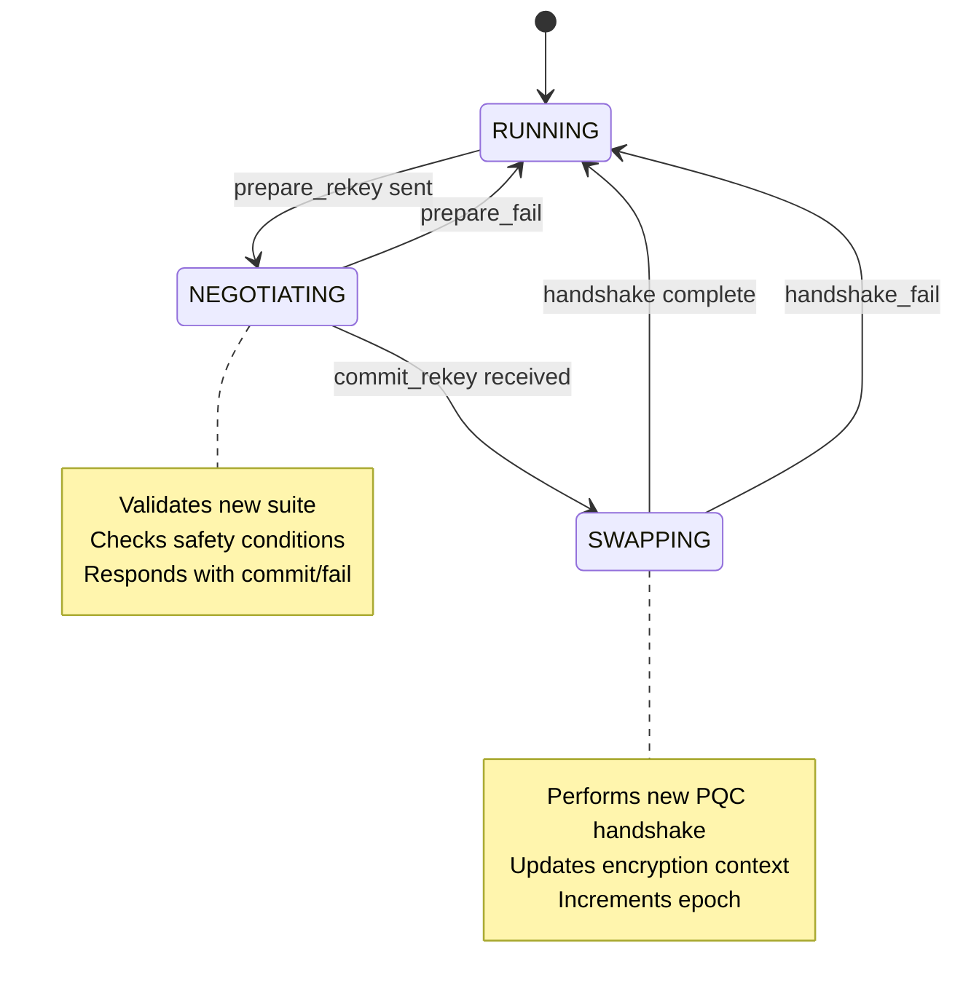

# Runtime Cryptographic Suite Switching

A comprehensive guide to the **live algorithm switching** capability of the PQC Drone-GCS Secure Proxy system. This feature enables dynamic cryptographic agility during active communication sessions without connection interruption.

## 🎯 Overview

The runtime suite switching mechanism allows operators to change cryptographic algorithms (ML-KEM, ML-DSA, Falcon, SPHINCS+) during active drone-GCS communication. This provides:

- **Zero-downtime algorithm changes**
- **Adaptive security levels** based on threat assessment
- **Cryptographic agility** for operational flexibility
- **Automated negotiation** between drone and GCS

## 🏗️ Architecture

### Control Channel Design



### Two-Phase Commit Protocol



## 🔧 Implementation Components

### Core Files

| File | Purpose | Key Functions |
|------|---------|---------------|
| `core/policy_engine.py` | Control state machine | `request_prepare()`, `handle_control()`, `record_rekey_result()` |
| `core/async_proxy.py` | Main proxy logic | `_launch_rekey()`, control message processing |
| `core/config.py` | Feature configuration | `ENABLE_PACKET_TYPE` flag |
| `core/aead.py` | Epoch management | Sender/Receiver epoch handling |

### Control Message Format

**Prepare Rekey Message (0x02):**
```json
{
    "type": "prepare_rekey",
    "suite": "cs-mlkem1024-aesgcm-falcon1024",
    "rid": "unique-request-id",
    "t_ms": 1234567890
}
```

**Commit Rekey Response:**
```json
{
    "type": "commit_rekey", 
    "suite": "cs-mlkem1024-aesgcm-falcon1024",
    "rid": "unique-request-id",
    "t_ms": 1234567891
}
```

## 🚀 Manual Testing Guide

### Prerequisites

1. **Enable Control Channel:**
   ```python
   # In core/config.py
   "ENABLE_PACKET_TYPE": True  # Must be True
   ```

2. **Required Arguments:**
   - GCS: `--control-manual` flag
   - Both: `--stop-seconds` with sufficient time (300+)

### Step-by-Step Manual Test

#### 1. Start Proxies with Control Enabled

**GCS (Windows PowerShell):**
```powershell
conda activate gcs-env
python -m core.run_proxy gcs --suite cs-mlkem768-aesgcm-mldsa65 --stop-seconds 300 --control-manual --json-out gcs_runtime.json
```

**Drone (Raspberry Pi bash):**
```bash
source ~/cenv/bin/activate  
python -m core.run_proxy drone --suite cs-mlkem768-aesgcm-mldsa65 --stop-seconds 300 --json-out drone_runtime.json
```

#### 2. Verify Initial Communication

**GCS Terminal 2:**
```powershell
python tools\traffic_gcs.py --pps 10 --seconds 250 --pattern "seq:{n} suite:mldsa65"
```

**Drone Terminal 2:**
```bash
python tools/traffic_drone.py --expect 2500 --log --output drone_traffic.log
```

#### 3. Monitor Encrypted Traffic (Optional)

**GCS Terminal 3:**
```powershell
python tools\udp_forward_log.py --listen 0.0.0.0:46011 --forward 127.0.0.1:46011 --label "GCS_RX"
```

**Drone Terminal 3:**
```bash
python tools/udp_forward_log.py --listen 0.0.0.0:46012 --forward 127.0.0.1:46012 --label "DRONE_RX"
```

#### 4. Perform Runtime Suite Switch

In the **GCS proxy terminal** (Terminal 1), you'll see an interactive prompt:
```
rekey> 
```

**Available Commands:**

| Command | Purpose | Example |
|---------|---------|---------|
| `<suite_id>` | Switch to new suite | `cs-mlkem1024-aesgcm-falcon1024` |
| `list` | Show available suites | Lists all 21 suites |
| `status` | Show current state | Current suite, stats, etc. |
| `quit` | Exit control console | Stops manual control |

**Example Suite Switches:**
```bash
# Switch to NIST L5 with Falcon signatures
rekey> cs-mlkem1024-aesgcm-falcon1024

# Switch to NIST L1 for performance
rekey> cs-mlkem512-aesgcm-mldsa44

# Switch to hash-based signatures
rekey> cs-mlkem768-aesgcm-sphincs128fsha2

# Check current status
rekey> status

# List all available suites
rekey> list
```

## 📊 Verification Methods

### 1. Counter Verification

**Check Successful Rekeys:**
```bash
# Both should show rekeys_ok incremented
grep "rekeys_ok" gcs_runtime.json
grep "rekeys_ok" drone_runtime.json

# Check last rekey suite
grep "last_rekey_suite" gcs_runtime.json
grep "last_rekey_suite" drone_runtime.json
```

### 2. Log Analysis

**GCS Log Patterns:**
```bash
grep "Control rekey negotiation started" logs/gcs-*.log
grep "Rekey handshake completed" logs/gcs-*.log
grep "rekey_ok" logs/gcs-*.log
```

**Drone Log Patterns:**
```bash
grep "prepare_rekey received" logs/drone-*.log  
grep "commit_rekey sent" logs/drone-*.log
grep "New session established" logs/drone-*.log
```

### 3. Traffic Tap Analysis

**Header Field Changes:**
```bash
# Before switch: kem=1, sig=1 (ML-KEM-768 + ML-DSA-65)
# After switch:  kem=1, sig=2 (ML-KEM-768 + Falcon-1024)

grep "kem=" udp_forward_log_output.txt | tail -10
```

**Epoch Increments:**
```bash
# Should see epoch change from 0 to 1
grep "epoch=" udp_forward_log_output.txt | tail -10
```

## 🧪 Automated Testing Scripts

### Full Suite Matrix Test

**Test All 21 Suite Combinations:**

```python
# tools/test_runtime_switching.py (create this script)
import subprocess
import time
import json

suites = [
    # NIST L1
    "cs-mlkem512-aesgcm-mldsa44",
    "cs-mlkem512-aesgcm-falcon512", 
    "cs-mlkem512-aesgcm-sphincs128fsha2",
    
    # NIST L3  
    "cs-mlkem768-aesgcm-mldsa65",
    "cs-mlkem768-aesgcm-falcon1024",
    "cs-mlkem768-aesgcm-sphincs256fsha2",
    
    # NIST L5
    "cs-mlkem1024-aesgcm-mldsa87", 
    "cs-mlkem1024-aesgcm-falcon1024",
    "cs-mlkem1024-aesgcm-sphincs256fsha2"
]

def test_suite_switch(from_suite, to_suite):
    """Test switching from one suite to another"""
    print(f"Testing switch: {from_suite} -> {to_suite}")
    
    # Implementation would use subprocess to:
    # 1. Start proxies with from_suite
    # 2. Initiate traffic
    # 3. Send rekey command to to_suite  
    # 4. Verify successful switch
    # 5. Check counters and logs
    
    return {"success": True, "rekey_time_ms": 150}

# Test matrix of all combinations
results = []
for i, from_suite in enumerate(suites):
    for j, to_suite in enumerate(suites):
        if i != j:  # Don't test same-to-same
            result = test_suite_switch(from_suite, to_suite)
            results.append({
                "from": from_suite,
                "to": to_suite, 
                **result
            })

# Save results for research paper
with open("runtime_switching_results.json", "w") as f:
    json.dump(results, f, indent=2)
```

### Performance Measurement Script

```python
# tools/measure_rekey_performance.py
import time
import psutil
import subprocess
from contextlib import contextmanager

@contextmanager
def measure_rekey_performance():
    """Context manager to measure rekey performance"""
    start_time = time.time()
    start_cpu = psutil.cpu_percent()
    start_memory = psutil.virtual_memory().used
    
    yield
    
    end_time = time.time()
    end_cpu = psutil.cpu_percent() 
    end_memory = psutil.virtual_memory().used
    
    return {
        "duration_ms": (end_time - start_time) * 1000,
        "cpu_usage_delta": end_cpu - start_cpu,
        "memory_delta_mb": (end_memory - start_memory) / 1024 / 1024
    }

# Usage in rekey tests
with measure_rekey_performance() as metrics:
    # Perform rekey operation
    pass
    
print(f"Rekey took {metrics['duration_ms']:.2f}ms")
```

## 🔍 Troubleshooting

### Common Issues

| Issue | Cause | Solution |
|-------|-------|---------|
| `rekey>` prompt not appearing | Missing `--control-manual` flag | Add flag to GCS command |
| Control messages ignored | `ENABLE_PACKET_TYPE=False` | Set to `True` in config |
| Rekey fails with "unknown suite" | Invalid suite ID | Use `list` command to see valid IDs |
| Handshake timeout during rekey | Network issues or suite mismatch | Check logs for specific error |
| Traffic stops after rekey | Epoch synchronization issue | Restart both proxies |

### Debug Commands

**Check Control State:**
```python
# In GCS proxy terminal
rekey> status
# Shows: current_suite, state, pending operations, stats
```

**Verbose Logging:**
```bash
# Add to proxy startup
export LOG_LEVEL=DEBUG
python -m core.run_proxy gcs --suite ... --control-manual
```

**Monitor Control Messages:**
```bash
# Watch for control packet processing
tail -f logs/gcs-*.log | grep "control"
tail -f logs/drone-*.log | grep "control"
```

## 📈 Performance Characteristics

### Rekey Timing Breakdown

```mermaid
gantt
    title Runtime Suite Switch Timeline
    dateFormat X
    axisFormat %s
    
    section Control Phase
    Send prepare_rekey    :0, 10
    Validate suite        :10, 30
    Send commit_rekey     :30, 40
    
    section Handshake Phase  
    New PQC handshake     :40, 200
    Key derivation        :200, 220
    Context update        :220, 240
    
    section Resume Phase
    Traffic resumes       :240, 250
```



**Typical Performance (Raspberry Pi 4B):**
- **Control negotiation**: 10-50ms
- **PQC handshake**: 50-200ms (varies by suite)
- **Total rekey time**: 100-300ms
- **Traffic interruption**: <10ms

## 🎯 Research Applications

### Adaptive Security Scenarios

1. **Threat Level Escalation:**
   ```bash
   # Normal operation: L1 for performance
   cs-mlkem512-aesgcm-mldsa44
   
   # Threat detected: Switch to L5
   cs-mlkem1024-aesgcm-mldsa87
   ```

2. **Performance Optimization:**
   ```bash
   # High traffic: Use Falcon for compact signatures
   cs-mlkem768-aesgcm-falcon512
   
   # Security critical: Switch to ML-DSA
   cs-mlkem768-aesgcm-mldsa65
   ```

3. **Algorithm Diversity:**
   ```bash
   # Rotate through different signature families
   cs-mlkem768-aesgcm-mldsa65      # Lattice-based
   cs-mlkem768-aesgcm-falcon1024   # NTRU-based  
   cs-mlkem768-aesgcm-sphincs256fsha2  # Hash-based
   ```

### Benchmarking Framework

For research papers, measure:
- **Rekey latency** across all 21 suites
- **CPU overhead** during algorithm switches
- **Memory usage** patterns
- **Network interruption** duration
- **Success rate** under various conditions

## 🔗 Related Documentation

- [Main README](../README.md) - System overview
- [Test Manual](../manual.md) - Comprehensive testing guide  
- [Configuration Guide](CONFIG.md) - System configuration
- [Security Analysis](SECURITY.md) - Security properties and analysis

---

**This runtime suite switching capability represents a novel contribution to post-quantum cryptographic systems, enabling unprecedented cryptographic agility in safety-critical drone communications.**
