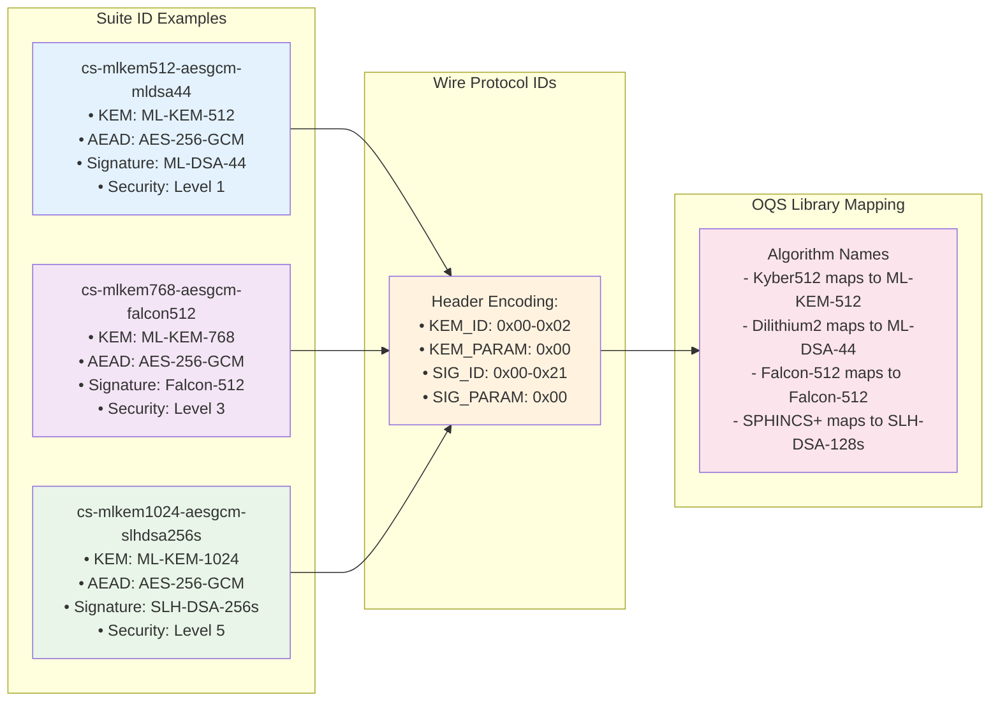
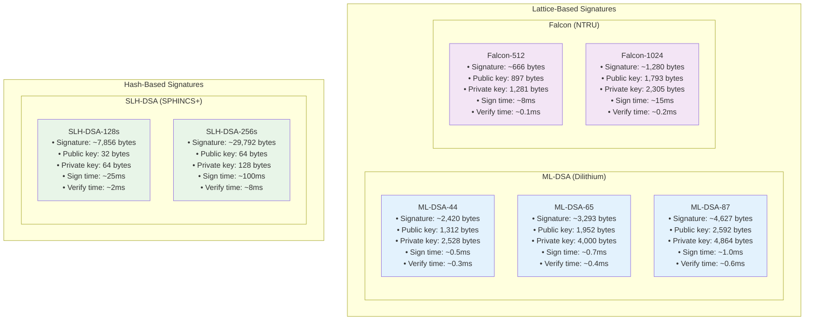
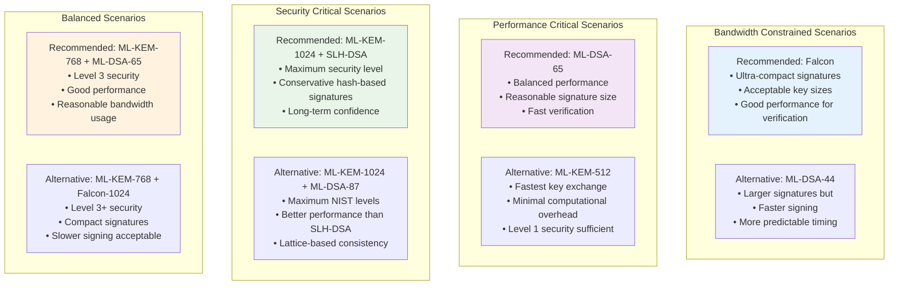
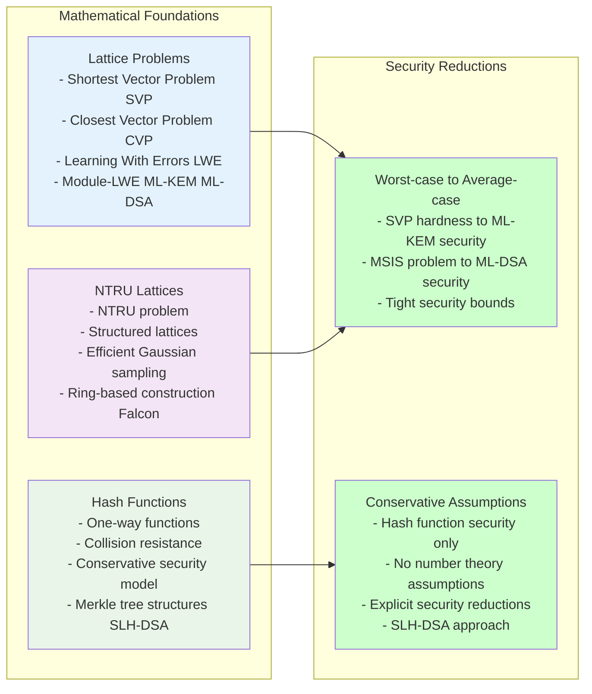
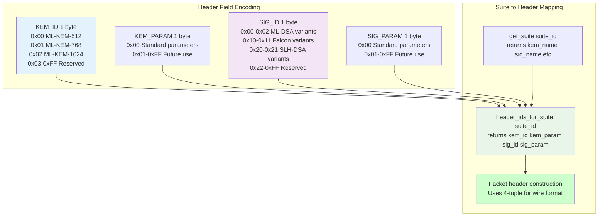
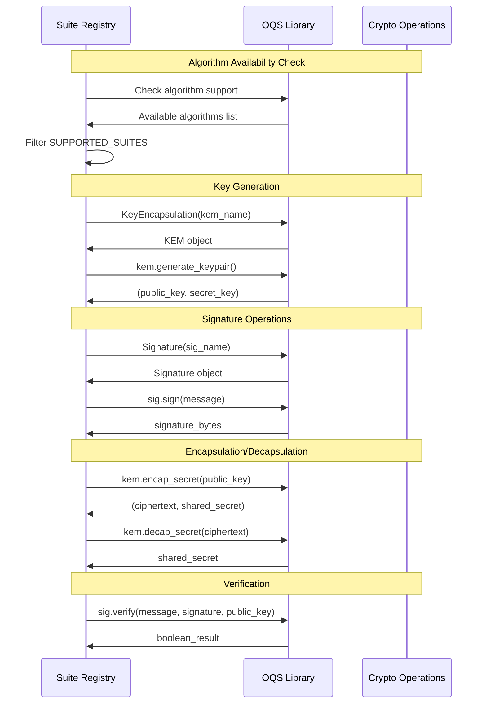

# Algorithm Matrix and Specifications

This document contains detailed visualizations of the post-quantum algorithm matrix and specifications.

## Complete Algorithm Matrix

### 21 Supported Suite Combinations

```mermaid
graph TB
    subgraph "Key Exchange Algorithms (ML-KEM)"
        KEM1[ML-KEM-512<br/>NIST Level 1<br/>128-bit security<br/>Public key: 800 bytes<br/>Ciphertext: 768 bytes]
        
        KEM2[ML-KEM-768<br/>NIST Level 3<br/>192-bit security<br/>Public key: 1,184 bytes<br/>Ciphertext: 1,088 bytes]
        
        KEM3[ML-KEM-1024<br/>NIST Level 5<br/>256-bit security<br/>Public key: 1,568 bytes<br/>Ciphertext: 1,568 bytes]
    end
    
    subgraph "Digital Signature Algorithms"
        SIG1[ML-DSA-44<br/>NIST Level 1<br/>~2,420 bytes signatures<br/>Fast performance]
        
        SIG2[ML-DSA-65<br/>NIST Level 3<br/>~3,293 bytes signatures<br/>Balanced choice]
        
        SIG3[ML-DSA-87<br/>NIST Level 5<br/>~4,627 bytes signatures<br/>Maximum security]
        
        SIG4[Falcon-512<br/>NIST Level 1<br/>~666 bytes signatures<br/>Ultra-compact]
        
        SIG5[Falcon-1024<br/>NIST Level 5<br/>~1,280 bytes signatures<br/>Compact + secure]
        
        SIG6[SLH-DSA-128s<br/>NIST Level 1<br/>~7,856 bytes signatures<br/>Conservative security]
        
        SIG7[SLH-DSA-256s<br/>NIST Level 5<br/>~29,792 bytes signatures<br/>Ultimate security]
    end
    
    subgraph "21 Valid Combinations"
        MATRIX[3 KEM variants<br/>×<br/>7 Signature variants<br/>=<br/>21 Suite Combinations]
    end
    
    KEM1 --> MATRIX
    KEM2 --> MATRIX
    KEM3 --> MATRIX
    SIG1 --> MATRIX
    SIG2 --> MATRIX
    SIG3 --> MATRIX
    SIG4 --> MATRIX
    SIG5 --> MATRIX
    SIG6 --> MATRIX
    SIG7 --> MATRIX
    
    classDef kem fill:#e3f2fd,stroke:#0277bd,stroke-width:2px
    classDef sig fill:#f3e5f5,stroke:#7b1fa2,stroke-width:2px
    classDef matrix fill:#e8f5e8,stroke:#2e7d32,stroke-width:2px
    
    class KEM1,KEM2,KEM3 kem
    class SIG1,SIG2,SIG3,SIG4,SIG5,SIG6,SIG7 sig
    class MATRIX matrix
```

### Suite Configuration Mapping

## Algorithm Family Details

### ML-KEM (Key Exchange) Specifications

```mermaid
graph TB
    subgraph "ML-KEM-512 (Level 1)"
        A1[Security Level: 128-bit quantum<br/>Module rank: 2<br/>Polynomial degree: 256<br/>Modulus q: 3329]
        
        A2[Key Sizes:<br/>• Public key: 800 bytes<br/>• Secret key: 1,632 bytes<br/>• Ciphertext: 768 bytes<br/>• Shared secret: 32 bytes]
        
        A3[Performance:<br/>• KeyGen: ~0.1ms<br/>• Encaps: ~0.15ms<br/>• Decaps: ~0.2ms<br/>• Memory: ~3KB]
    end
    
    subgraph "ML-KEM-768 (Level 3)"
        B1[Security Level: 192-bit quantum<br/>Module rank: 3<br/>Polynomial degree: 256<br/>Modulus q: 3329]
        
        B2[Key Sizes:<br/>• Public key: 1,184 bytes<br/>• Secret key: 2,400 bytes<br/>• Ciphertext: 1,088 bytes<br/>• Shared secret: 32 bytes]
        
        B3[Performance:<br/>• KeyGen: ~0.15ms<br/>• Encaps: ~0.2ms<br/>• Decaps: ~0.25ms<br/>• Memory: ~4KB]
    end
    
    subgraph "ML-KEM-1024 (Level 5)"
        C1[Security Level: 256-bit quantum<br/>Module rank: 4<br/>Polynomial degree: 256<br/>Modulus q: 3329]
        
        C2[Key Sizes:<br/>• Public key: 1,568 bytes<br/>• Secret key: 3,168 bytes<br/>• Ciphertext: 1,568 bytes<br/>• Shared secret: 32 bytes]
        
        C3[Performance:<br/>• KeyGen: ~0.2ms<br/>• Encaps: ~0.25ms<br/>• Decaps: ~0.3ms<br/>• Memory: ~5KB]
    end
    
    A1 --> A2
    A2 --> A3
    B1 --> B2
    B2 --> B3
    C1 --> C2
    C2 --> C3
    
    style A1 fill:#e3f2fd
    style B1 fill:#f3e5f5
    style C1 fill:#e8f5e8
```

### Digital Signature Algorithm Comparison

## Algorithm Selection Guidelines

### Performance vs Security Trade-offs

### Algorithm Security Foundations

## Wire Protocol Integration

### Algorithm ID Encoding

### OQS Library Integration

---

**Navigation**: 
- **Back to**: [Diagrams Index](../README.md)
- **Related**: [ML-KEM Details](ml-kem.md) | [Signature Algorithms](signatures.md) | [Security Levels](security-levels.md)
- **Technical Docs**: [Algorithm Matrix](../../technical/algorithm-matrix.md)