# Big picture: End-to-end architecture

This diagram shows both sides (GCS and Drone), the control-plane handshake, the data-plane AEAD path, and the internal modules that move data and perform rekeying and policy decisions. The Mermaid nodes use shortened labels so the renderer stays stable; the legend below spells out exactly which scripts and subsystems each node represents.

```mermaid
%%{init: {'securityLevel': 'loose', 'flowchart': {'htmlLabels': true}}}%%
flowchart LR
  %% LAYOUT
  classDef comp fill:#eef,stroke:#447,stroke-width:1px
  classDef mod fill:#f7faff,stroke:#6699cc,stroke-width:1px
  classDef io fill:#fffaf0,stroke:#cc9900,stroke-width:1px
  classDef net fill:#f9f9f9,stroke:#888,stroke-dasharray:3 3
  classDef warn fill:#ffecec,stroke:#cc6666
  classDef note fill:#ffffe0,stroke:#999,stroke-dasharray:3 3,color:#333

  %% GCS SIDE
  subgraph GCS[Ground Control Station]
    direction TB
  GCSApps[Traffic Control Apps]
  GCSProxy[run_proxy]
  GCSAsync[async_proxy]
  GCSHS[handshake]
  GCSAEAD[aead]
  GCSPolicy[policy_engine]
  GCSCfg[config & suites]
  GCSLog[logging]

    GCSApps -->|UDP plaintext| GCSProxy
    GCSProxy --> GCSAsync
    GCSAsync --> GCSHS
    GCSAsync --> GCSAEAD
    GCSAsync --> GCSPolicy
    GCSHS --> GCSCfg
    GCSAEAD --> GCSCfg
    GCSPolicy --> GCSCfg
    GCSProxy --> GCSLog
  end

  %% DRONE SIDE
  subgraph DRN[Drone]
    direction TB
  DroneApps[Telemetry Apps]
  DroneProxy[run_proxy]
  DroneAsync[async_proxy]
  DroneHS[handshake]
  DroneAEAD[aead]
  DronePolicy[policy_engine]
  DroneCfg[config & suites]
  DroneLog[logging]

    DroneApps <-->|UDP plaintext| DroneProxy
    DroneProxy --> DroneAsync
    DroneAsync --> DroneHS
    DroneAsync --> DroneAEAD
    DroneAsync --> DronePolicy
    DroneHS --> DroneCfg
    DroneAEAD --> DroneCfg
    DronePolicy --> DroneCfg
    DroneProxy --> DroneLog
  end

  %% NETWORK / CONTROL + DATA PLANES
  subgraph NET[Network]
    direction LR
  TCPHS[TCP Handshake]
  UDPAEAD[Encrypted UDP]
  UDPPlain[Plaintext UDP]
  end

  %% Cross links
  GCSAsync -- Client role --> TCPHS
  TCPHS -- Server role --> DroneAsync

  GCSAEAD -- AEAD UDP --> UDPAEAD
  UDPAEAD -- AEAD UDP --> DroneAEAD

  GCSApps -. app traffic .-> UDPPlain
  UDPPlain -. app traffic .-> DroneApps

  %% LABELS & NOTES (flowchart doesn't support "note over"; use dedicated nodes)
  NoteTCPHS[KEM verify + HKDF keys]
  NoteTCPHS -.-> TCPHS
  NoteUDPAEAD[22-byte header; epoch+seq nonce; replay window]
  NoteUDPAEAD -.-> UDPAEAD
  NoteRekey[Rekey FSM: NEGOTIATING -> SWAPPING -> RUNNING]
  NoteRekey -.-> GCSPolicy
  NoteRekey -.-> DronePolicy

  %% DATA PATH DETAIL
  subgraph DATAFLOW[Data-plane flow]
    direction TB
  AppOut[App payload] --> Header[Header build] --> Nonce[Nonce] --> Encrypt[Encrypt] --> Packet[Packet frame]
  Packet --> Verify[Verify + replay] --> Open[Decrypt] --> AppIn[Deliver plaintext]
  end

  GCSApps --> AppOut
  AppIn --> DroneApps

  %% CONTROL PATH DETAIL
  subgraph CONTROL[Control-plane rekey]
    direction LR
  Propose[Propose new suite IDs] --> Neg[NEGOTIATING] --> Swap[SWAPPING freeze old set new epoch] --> Run[RUNNING new keys]
  end
  GCSPolicy --> Propose
  Run --> DronePolicy

  %% ERROR/OBSERVABILITY
  GCSAEAD -. AeadAuthError on auth fail .-> GCSLog
  DroneAEAD -. AeadAuthError on auth fail .-> DroneLog
  GCSHS -. HandshakeVerifyError on decaps/verify fail .-> GCSLog
  DroneHS -. HandshakeVerifyError on decaps/verify fail .-> DroneLog

  %% GROUPED CLASS ASSIGNMENTS
  class GCSProxy,DroneProxy comp
  class GCSAsync,DroneAsync,GCSHS,DroneHS,GCSAEAD,DroneAEAD,GCSPolicy,DronePolicy,GCSCfg,DroneCfg,GCSLog,DroneLog,Header,Nonce,Encrypt,Verify,Open,Propose,Neg,Swap,Run mod
  class GCSApps,DroneApps,AppOut,Packet,AppIn io
  class TCPHS,UDPAEAD,UDPPlain net
  class NoteTCPHS,NoteUDPAEAD,NoteRekey note
```

## Legend: node meanings

### Ground Control Station nodes
- `Traffic Control Apps`: load generators, diagnostics, and schedulers in `gcs/` and `tools/auto/gcs_scheduler.py` that feed plaintext UDP traffic into the proxy.
- `run_proxy`: `core/run_proxy.py`; boots the proxy, parses CLI flags, exposes the plaintext UDP socket, and wires in async helpers.
- `async_proxy`: `core/async_proxy.py`; runs the selector loop, initiates the TCP handshake as a client, manages encrypted UDP sockets, and coordinates rekeys.
- `handshake`: `core/handshake.py`; executes ML-KEM encapsulation/decapsulation plus ML-DSA signature checks and feeds keys into HKDF-SHA256.
- `aead`: `core/aead.py`; assembles the 22-byte header, constructs nonces from `epoch || seq`, enforces replay windows, and wraps payloads in AES-GCM (or the configured suite).
- `policy_engine`: `core/policy_engine.py`; implements the two-phase rekey state machine and manual override commands.
- `config & suites`: `core/config.py` (validation, env overrides) and `core/suites.py` (PQC suite registry with header IDs, key lengths, HKDF salts).
- `logging`: `core/logging_utils.py`; structured JSON logging with hashed session IDs, never logging secrets.

### Drone nodes
- `Telemetry Apps`: utilities launched by `tools/auto/drone_follower.py` (e.g., `UdpEcho`, `TelemetryPublisher`, `PowerCaptureManager`) and custom flight software under `drone/`.
- `run_proxy`, `async_proxy`, `handshake`, `aead`, `policy_engine`, `config & suites`, `logging`: the same modules as on the GCS, but `async_proxy` acts as the TCP server and the telemetry apps are the primary producers of plaintext UDP.

### Network and planes
- `TCP Handshake`: the control-channel socket created by `async_proxy._perform_handshake()`, transporting PQC KEM/SIG messages before switching to AEAD keys.
- `Encrypted UDP`: data-plane socket carrying the header defined in `core/aead.py::HEADER_STRUCT`, sealed with AES-GCM (or the selected AEAD suite).
- `Plaintext UDP`: local UDP sockets exposed to apps; locked to loopback unless `ALLOW_NON_LOOPBACK_PLAINTEXT=1`.

### Data-plane flow subgraph
- `App payload`: plaintext generated by traffic or telemetry producers.
- `Header build`: `core/aead.Sender._build_header()` filling wire version, suite IDs, epoch, sequence, and payload length.
- `Nonce`: deterministic `epoch || seq` nonce forwarded into the AEAD algorithm.
- `Encrypt`: `core/aead.Sender.encrypt()` sealing payloads and returning header + ciphertext + tag.
- `Packet frame`: concatenation emitted onto the encrypted UDP socket.
- `Verify + replay`: `core/aead.Receiver._check_header()` plus the sliding replay window.
- `Decrypt`: `Receiver.decrypt()` AES-GCM open; auth failures raise `AeadAuthError` (surfacing in logging).
- `Deliver plaintext`: the decrypted bytes written back to application UDP sockets on the receiving node.

### Control-plane flow subgraph
- `Propose`: `policy_engine.request_prepare()` (GCS) or `handle_control()` (Drone) suggesting a new suite and epoch.
- `NEGOTIATING`: both ends acknowledge preparation; `ControlState` prevents early reuse of old keys.
- `SWAPPING`: `_launch_rekey()` spins up new Sender/Receiver pairs and freezes the previous epoch.
- `RUNNING`: steady state using the newly derived keys; old epoch retired after the swap completes.

### Notes and error edges
- `KEM verify + HKDF keys`: highlights that both sides must derive the same outputs from `core/handshake`. Divergence aborts the handshake.
- `22-byte header; epoch+seq nonce; replay window`: summarises the invariants enforced by `core/aead.Receiver` to detect tampering/replays.
- `Rekey FSM: NEGOTIATING -> SWAPPING -> RUNNING`: emphasises the allowed transitions enforced by `policy_engine.ControlState`.
- Error edges from AEAD/handshake modules funnel into `logging`, showing where structured errors (e.g., `AeadAuthError`, `HandshakeVerifyError`) are emitted.

## Execution walkthroughs

### GCS path
1. `core/run_proxy.py` parses CLI/env config and initialises modules using `core/config.validate_config()`.
2. `core/async_proxy.AsyncProxy` opens TCP sockets, performs the client half of the handshake, and builds AEAD Sender/Receiver objects via `core/suites.py` metadata.
3. `core/policy_engine.PolicyEngine` monitors counters, triggers `_launch_rekey()` based on epochs or manual commands, and reports status for logging.
4. Traffic applications hand plaintext UDP into the proxy, which frames packets, applies AEAD, and forwards them across the encrypted UDP channel to the drone.

### Drone path
1. `core/run_proxy.py` runs in server mode, accepting handshake connections from the GCS.
2. `core/async_proxy.AsyncProxy` verifies signatures, decaps the ciphertext, and spins up mirrored AEAD Sender/Receiver components.
3. `tools/auto/drone_follower.py` services telemetry/power modules that read/write the plaintext UDP socket.
4. The drone responds to rekey proposals, transitions through the same FSM, and hands decrypted payloads to telemetry or flight controllers.

### Repository guardrails
- Wire compatibility: any header or packet-type change requires updating `tests/test_aead_framing.py` and `tests/test_packet_types.py`.
- Constant-time behaviour: avoid secret-dependent branching or logging in crypto paths under `core/`.
- Plaintext safety: `core/config.validate_config()` enforces loopback unless `ALLOW_NON_LOOPBACK_PLAINTEXT=1`.
