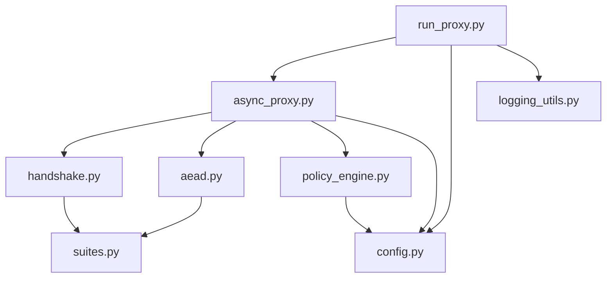

# Core modules wiring

```mermaid
flowchart TB
  run[run_proxy.py]
  ap[async_proxy.py]
  hs[handshake.py]
  ae[aead.py]
  su[suites.py]
  pe[policy_engine.py]
  cf[config.py]
  lg[logging_utils.py]

  run --> ap
  run --> cf
  run --> lg
  ap --> hs
  ap --> ae
  hs --> su
  ae --> su
  ap --> pe
  ap --> cf
  pe --> cf
```
