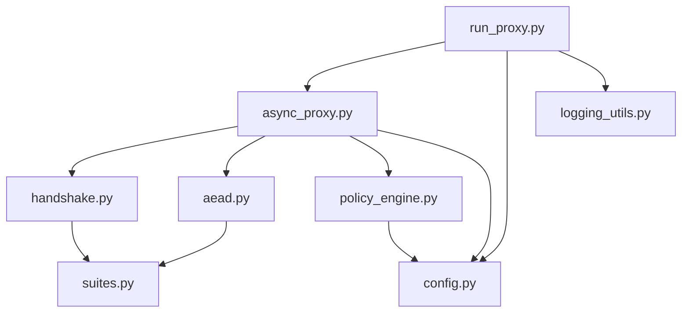

# Core modules wiring

## Module map

- `run_proxy.py`: CLI entry point that launches the proxy, parses suites, and constructs async/io workers.
- `async_proxy.py`: selector loop, handshake coordinator, UDP bridge, rekey launcher.
- `handshake.py`: PQC KEM/SIG exchange and HKDF key derivation.
- `aead.py`: header framing, nonce derivation, AES-GCM sealing/opening, replay enforcement.
- `suites.py`: single source of truth for algorithm IDs, HKDF salts, and key sizes.
- `policy_engine.py`: control-plane FSM governing NEGOTIATING → SWAPPING → RUNNING transitions.
- `config.py`: validates CLI/env configuration, suite compatibility, and network guardrails.
- `logging_utils.py`: structured logging pipeline with hashed session identifiers.
