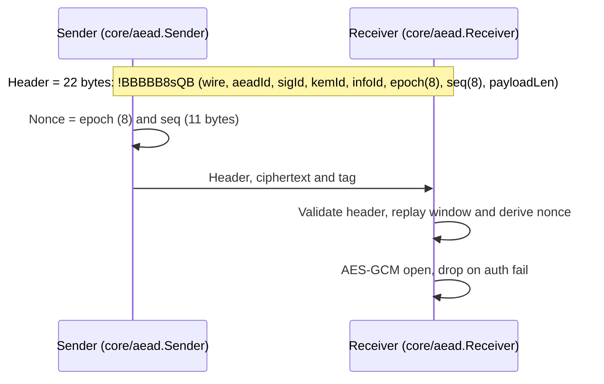
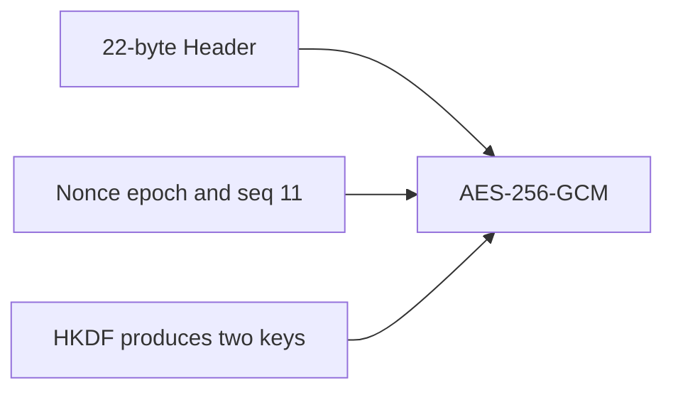

# Data plane: header and nonce

## Sequence notes

- **Sender (core/aead.Sender)** builds headers via `_build_header()`, increments sequence numbers, and seals payloads.
- **Receiver (core/aead.Receiver)** validates header structure, enforces the replay window, and authenticates/decrypts with AES-GCM.
- **AES-GCM open, drop on auth fail** corresponds to raising `AeadAuthError`, surfacing through structured logs.

## Data flow notes

- `22-byte Header`: layout defined in `core/aead.HEADER_STRUCT` containing wire version, suite IDs, epoch, sequence, and payload length.
- `Nonce`: deterministic concatenation of epoch and padded sequence counter (11 bytes) per `Sender._build_nonce()`.
- `HKDF produces two keys`: `core/handshake.derive_transport_keys()` feeding `Sender`/`Receiver` key material.
- `AES-256-GCM`: default AEAD implementation; suite selection may swap in ChaCha20-Poly1305 or ASCON.

