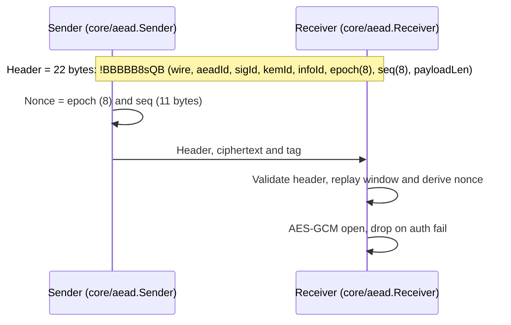
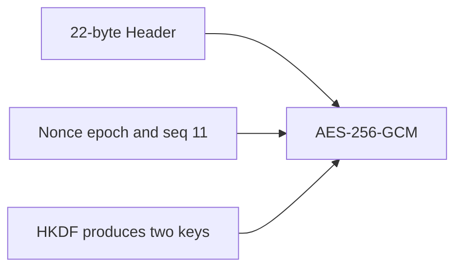

# Data plane: header and nonce

```mermaid
sequenceDiagram
  participant S as Sender (core/aead.Sender)
  participant R as Receiver (core/aead.Receiver)
  Note over S,R: Header = 22 bytes: !BBBBB8sQB (wire, aeadId, sigId, kemId, infoId, epoch(8), seq(8), payloadLen)
  S->>S: Nonce = epoch (8) and seq (11 bytes)
  S->>R: Header, ciphertext and tag
  R->>R: Validate header, replay window and derive nonce
  R->>R: AES-GCM open, drop on auth fail
```

```mermaid
flowchart LR
hdr["22-byte Header"]
nce["Nonce epoch and seq 11"]
kdf["HKDF produces two keys"]
aead["AES-256-GCM"]
hdr-->aead
nce-->aead
kdf-->aead
```
