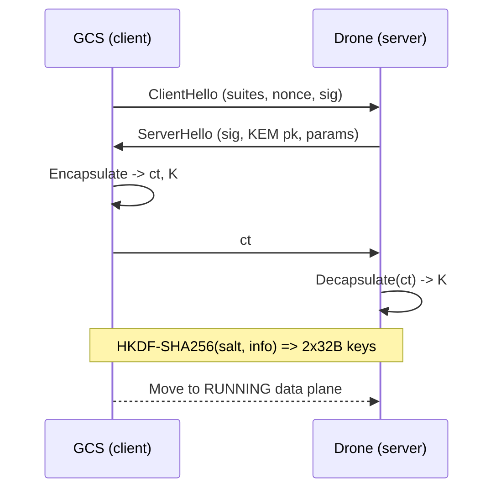

# Handshake overview

```mermaid
sequenceDiagram
  participant C as GCS (client)
  participant S as Drone (server)
  C->>S: ClientHello (suites, nonce, sig)
  S->>C: ServerHello (sig, KEM pk, params)
  C->>C: Encapsulate -> ct, K
  C->>S: ct
  S->>S: Decapsulate(ct) -> K
  Note over C,S: HKDF-SHA256(salt, info) => 2x32B keys
  C-->>S: Move to RUNNING data plane
```
