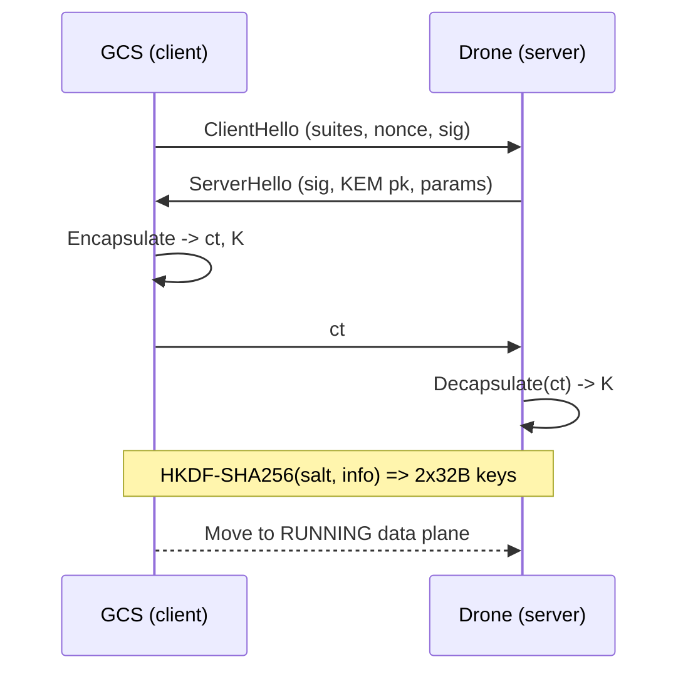

# Handshake overview

## Step-by-step

1. **ClientHello** from `core/async_proxy` (GCS) advertises supported PQC suites, includes a random nonce, and proves identity with ML-DSA signature.
2. **ServerHello** from the drone returns its signature, selected KEM public key, and parameters validated against `core/suites.py`.
3. **Encapsulate** uses ML-KEM (default ML-KEM768) to produce ciphertext `ct` and shared secret `K`.
4. **Decapsulate** on the drone recomputes `K`; mismatch raises `HandshakeVerifyError`.
5. **HKDF-SHA256** derives two 32-byte keys (one for each direction) and two 16-byte IVs, feeding `core/aead` constructors.
6. Transition to **RUNNING data plane** triggers creation of AEAD Sender/Receiver pairs and starts proxy loops.
