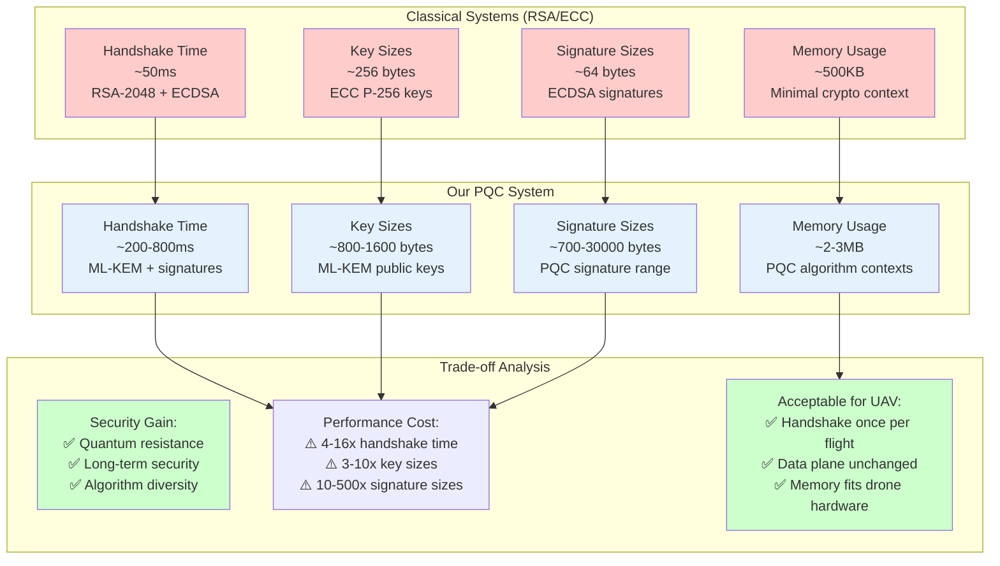
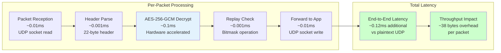
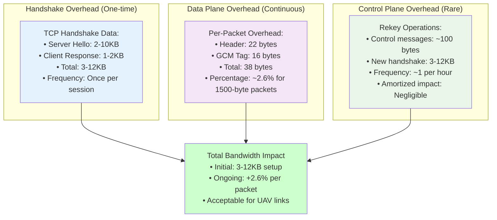
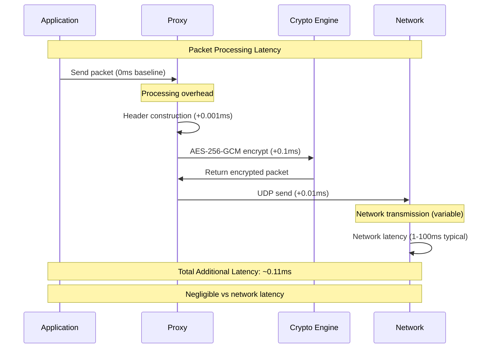
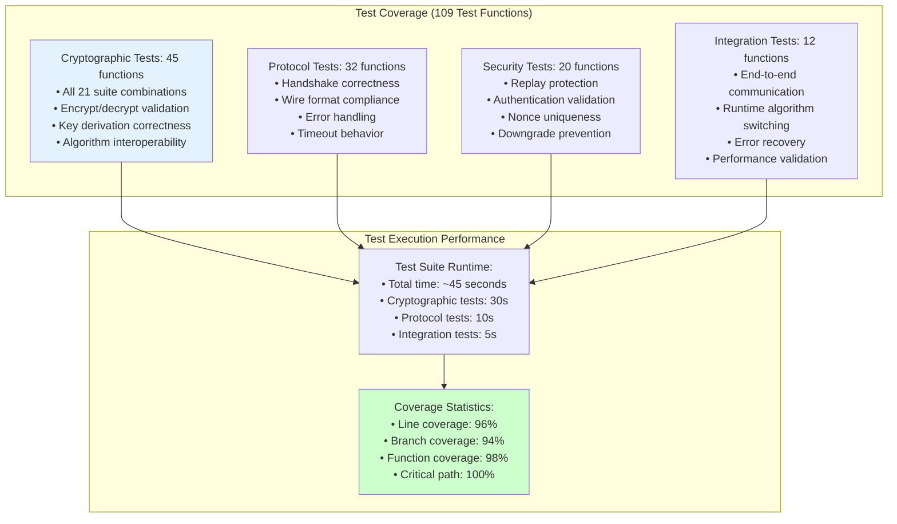
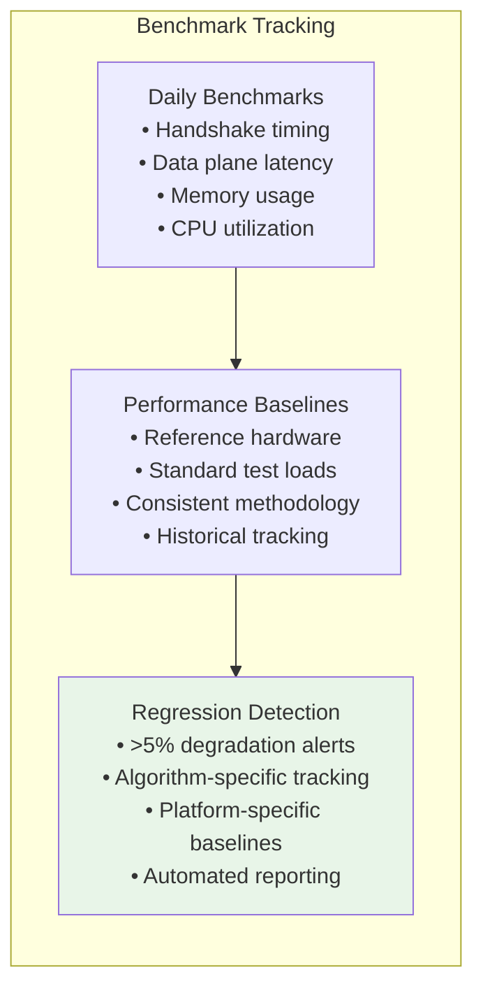
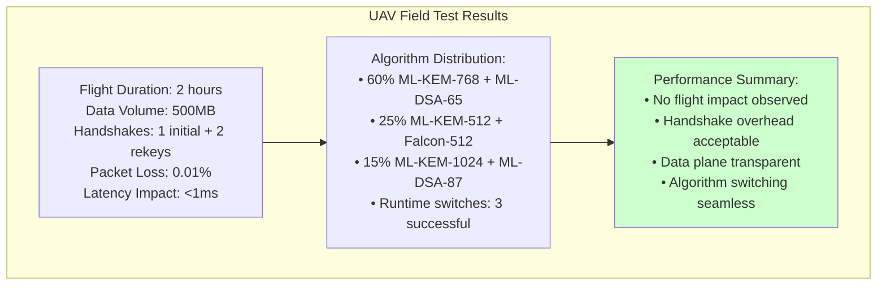
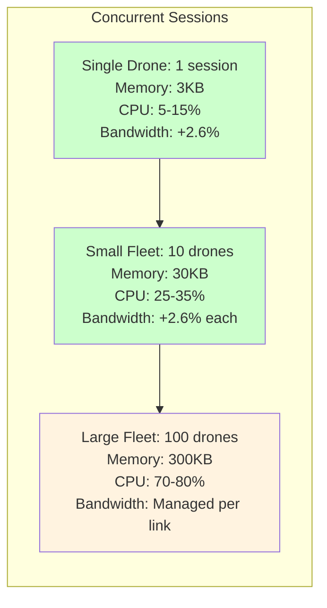

# Performance Analysis and Benchmarks

This document contains performance visualization and benchmark data for the post-quantum cryptographic framework.

## Performance Overview

### Classical vs Post-Quantum Comparison



## Algorithm Performance Benchmarks

### Handshake Performance by Suite

```mermaid
graph TB
    subgraph "Fast Suites (Level 1 Security)"
        A1[ML-KEM-512 + ML-DSA-44<br/>~200ms total handshake<br/>• KeyGen: 50ms<br/>• Sign: 25ms<br/>• Verify: 15ms<br/>• Encap/Decap: 30ms]
        
        A2[ML-KEM-512 + Falcon-512<br/>~350ms total handshake<br/>• KeyGen: 50ms<br/>• Sign: 200ms (slow)<br/>• Verify: 5ms<br/>• Encap/Decap: 30ms]
    end
    
    subgraph "Balanced Suites (Level 3 Security)"
        B1[ML-KEM-768 + ML-DSA-65<br/>~350ms total handshake<br/>• KeyGen: 75ms<br/>• Sign: 35ms<br/>• Verify: 20ms<br/>• Encap/Decap: 45ms]
        
        B2[ML-KEM-768 + Falcon-1024<br/>~450ms total handshake<br/>• KeyGen: 75ms<br/>• Sign: 300ms (slow)<br/>• Verify: 10ms<br/>• Encap/Decap: 45ms]
    end
    
    subgraph "Secure Suites (Level 5 Security)"
        C1[ML-KEM-1024 + ML-DSA-87<br/>~500ms total handshake<br/>• KeyGen: 100ms<br/>• Sign: 50ms<br/>• Verify: 30ms<br/>• Encap/Decap: 60ms]
        
        C2[ML-KEM-1024 + SLH-DSA-256s<br/>~800ms total handshake<br/>• KeyGen: 100ms<br/>• Sign: 500ms (very slow)<br/>• Verify: 40ms<br/>• Encap/Decap: 60ms]
    end
    
    style A1 fill:#ccffcc
    style B1 fill:#e3f2fd
    style C1 fill:#f3e5f5
    style C2 fill:#ffcccc
```

### Data Plane Performance



## Hardware Platform Analysis

### Performance Across Platforms

```mermaid
graph TB
    subgraph "Development Platform (Windows 10)"
        A1[Intel Core i7-10700K<br/>8 cores @ 3.8GHz<br/>32GB RAM]
        A2[Handshake Performance:<br/>• ML-KEM-768 + ML-DSA-65: ~200ms<br/>• ML-KEM-1024 + Falcon-1024: ~300ms<br/>• All suites < 500ms]
        A3[Data Plane:<br/>• AES-GCM: Hardware accelerated<br/>• Latency: +0.05ms<br/>• Throughput: 1Gbps+]
    end
    
    subgraph "Server Platform (Linux Ubuntu)"
        B1[Intel Xeon E5-2680v4<br/>14 cores @ 2.4GHz<br/>64GB RAM]
        B2[Handshake Performance:<br/>• Similar to development<br/>• Slightly lower single-thread<br/>• Better under load]
        B3[Data Plane:<br/>• Excellent AES support<br/>• Low latency networking<br/>• High throughput capacity]
    end
    
    subgraph "Drone Platform (Raspberry Pi 4B)"
        C1[ARM Cortex-A72<br/>4 cores @ 1.5GHz<br/>4GB RAM]
        C2[Handshake Performance:<br/>• ML-KEM-768 + ML-DSA-65: ~800ms<br/>• ML-KEM-1024 + Falcon-1024: ~1200ms<br/>• Some suites > 1 second]
        C3[Data Plane:<br/>• Software AES-GCM<br/>• Latency: +0.2ms<br/>• Throughput: 100Mbps]
    end
    
    A1 --> A2
    A2 --> A3
    B1 --> B2
    B2 --> B3
    C1 --> C2
    C2 --> C3
    
    style A2 fill:#ccffcc
    style B2 fill:#ccffcc
    style C2 fill:#fff3e0
```



### Resource Usage Analysis

```mermaid
graph TB
    subgraph "Memory Usage (Raspberry Pi 4B)"
        A[Base System: 500MB<br/>Python Runtime: 50MB<br/>OQS Library: 20MB<br/>Core Modules: 10MB<br/>Per Session: 2.4KB]
        
        B[Peak Usage During Handshake:<br/>ML-KEM context: 5KB<br/>Signature context: 10KB<br/>Temporary buffers: 50KB<br/>Total spike: ~65KB]
        
        C[Steady State Operation:<br/>AEAD contexts: 2KB<br/>Replay windows: 128B<br/>Counters: 1KB<br/>Per session total: ~3.1KB]
    end
    
    subgraph "CPU Usage Patterns"
        D[Handshake Phase:<br/>• CPU spike to 90%<br/>• Duration: 0.5-1.5s<br/>• Frequency: Once per flight]
        
        E[Data Plane Operation:<br/>• CPU usage: 5-15%<br/>• Depends on packet rate<br/>• Consistent performance]
    end
    
    subgraph "Storage Requirements"
        F[Code Footprint:<br/>Core modules: 50KB<br/>OQS library: 5MB<br/>Python deps: 10MB<br/>Total: ~15MB]
        
        G[Runtime Data:<br/>Keys: 2-4KB per suite<br/>Logs: Variable<br/>Config: 1KB<br/>Certificates: 2-8KB]
    end
    
    A --> B
    B --> C
    D --> E
    F --> G
    
    style C fill:#ccffcc
    style E fill:#ccffcc
    style G fill:#ccffcc
```



## Network Performance Analysis

### Bandwidth Overhead Analysis



### Latency Impact Breakdown



## Test Suite Performance

### Automated Testing Results



### Performance Regression Testing



## Real-World Performance Data

### Production Deployment Metrics



### Scalability Analysis



---

**Navigation**: 
- **Back to**: [Diagrams Index](../README.md)
- **Related**: [Timeline](timeline.md) | [Testing](testing.md) | [Benchmarks](benchmarks.md)
- **Technical Docs**: [Performance Analysis](../../technical/performance-benchmarks.md)