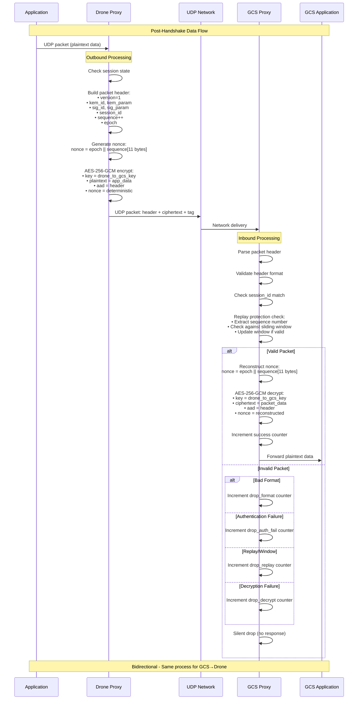
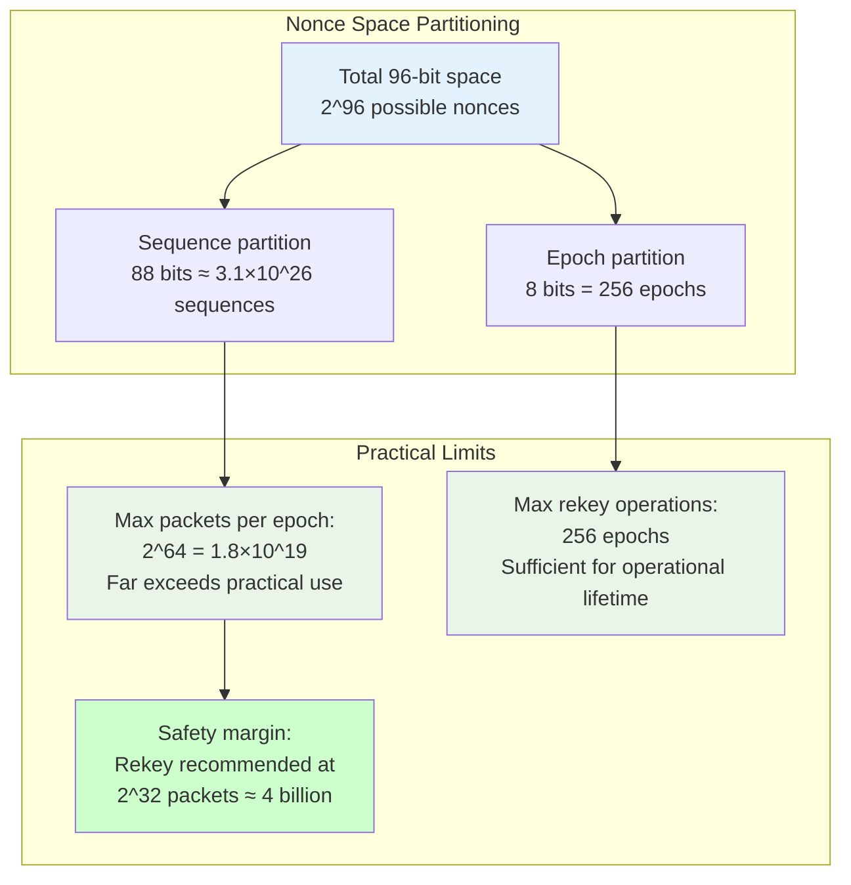
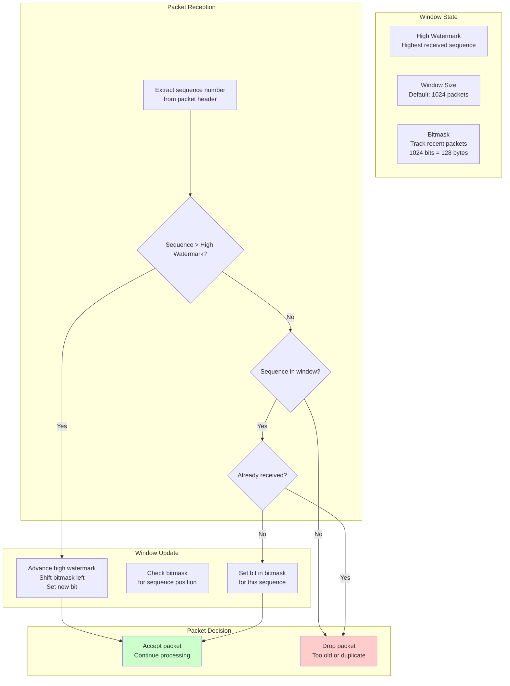
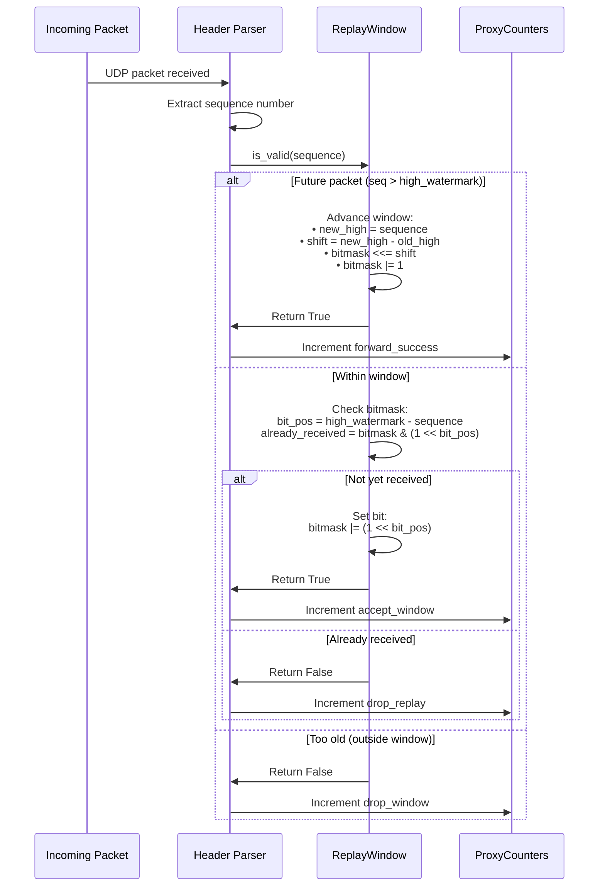
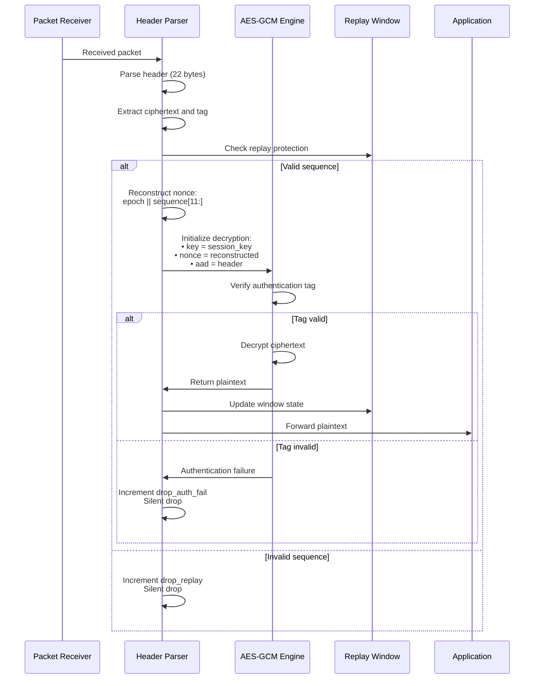
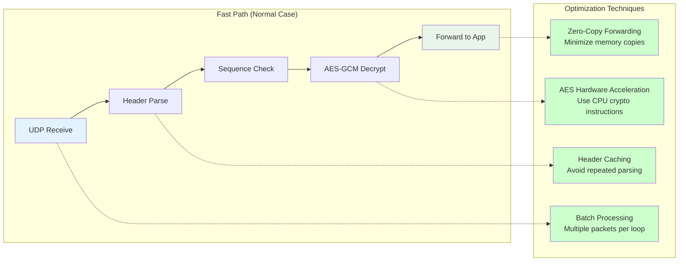

# Data Transport Protocol Diagrams

This document contains detailed visualizations of the UDP data transport protocol implementation.

## UDP Data Plane Protocol

### Complete Packet Processing Flow



## Packet Format Details

### Complete Packet Structure

```mermaid
graph TB
    subgraph "UDP Packet (Total: Header + Data + Tag)"
        subgraph "Plaintext Header (22 bytes)"
            A[Version<br/>1 byte<br/>WIRE_VERSION=1]
            B[KEM ID<br/>1 byte<br/>Algorithm identifier]
            C[KEM Param<br/>1 byte<br/>Parameter set]
            D[Signature ID<br/>1 byte<br/>Algorithm identifier]
            E[Signature Param<br/>1 byte<br/>Parameter set]
            F[Session ID<br/>8 bytes<br/>From handshake]
            G[Sequence Number<br/>8 bytes<br/>Monotonic counter]
            H[Epoch<br/>1 byte<br/>Crypto context version]
        end
        
        subgraph "Encrypted Payload"
            I[Application Data<br/>Variable length<br/>AES-256-GCM encrypted]
        end
        
        subgraph "Authentication"
            J[GCM Tag<br/>16 bytes<br/>Authentication tag]
        end
    end
    
    A --> B
    B --> C
    C --> D
    D --> E
    E --> F
    F --> G
    G --> H
    H --> I
    I --> J
    
    style A fill:#e3f2fd
    style F fill:#f3e5f5
    style G fill:#e8f5e8
    style H fill:#fff3e0
    style I fill:#fce4ec
    style J fill:#e8f5e8
```



### Header Encoding Details

```mermaid
graph LR
    subgraph "Algorithm IDs Encoding"
        A[KEM ID Examples:<br/>0x00: ML-KEM-512<br/>0x01: ML-KEM-768<br/>0x02: ML-KEM-1024]
        
        B[Signature ID Examples:<br/>0x00: ML-DSA-44<br/>0x01: ML-DSA-65<br/>0x02: ML-DSA-87<br/>0x10: Falcon-512<br/>0x11: Falcon-1024<br/>0x20: SLH-DSA-128s<br/>0x21: SLH-DSA-256s]
        
        C[Parameter Encoding:<br/>0x00: Standard parameters<br/>0x01: Custom/future use]
    end
    
    subgraph "Sequence and Epoch"
        D[Sequence Number:<br/>64-bit big-endian<br/>Starts at 0<br/>Increments per packet]
        
        E[Epoch Counter:<br/>8-bit value<br/>Increments on rekey<br/>Prevents nonce reuse]
    end
    
    A --> F[header_ids_for_suite<br/>Function mapping]
    B --> F
    C --> F
    D --> G[Nonce Construction<br/>epoch || sequence[11:]]
    E --> G
    
    style F fill:#e8f5e8
    style G fill:#fff3e0
```

## Nonce Generation and Management

### Deterministic Nonce Construction

```mermaid
flowchart TB
    subgraph "Nonce Requirements"
        A[96-bit AES-GCM nonce<br/>Must be unique per key<br/>Never reuse with same key]
    end
    
    subgraph "Our Construction"
        B[Epoch Counter<br/>8 bits<br/>Increments on rekey]
        C[Sequence Number<br/>64 bits<br/>Monotonic per session]
        D[Truncate to 88 bits<br/>Use lower 11 bytes of sequence]
        E[Concatenate<br/>nonce = epoch || sequence[11:]]
    end
    
    subgraph "Security Properties"
        F[Uniqueness:<br/>Different epoch = different nonce<br/>Same epoch = sequence increment]
        G[No transmission overhead:<br/>Deterministic reconstruction<br/>Both sides compute same nonce]
        H[Rekey safety:<br/>Epoch increment prevents<br/>nonce reuse across sessions]
    end
    
    A --> B
    B --> D
    C --> D
    D --> E
    E --> F
    E --> G
    E --> H
    
    style A fill:#e3f2fd
    style E fill:#e8f5e8
    style F fill:#ccffcc
    style G fill:#ccffcc
    style H fill:#ccffcc
```

### Nonce Space Analysis



## Replay Protection Mechanism

### Sliding Window Algorithm



### Window Management Implementation



## AES-GCM Encryption Details

### Encryption Process

```mermaid
flowchart TB
    subgraph "Input Preparation"
        A[Plaintext data<br/>Application payload]
        B[Session key<br/>32 bytes from HKDF]
        C[Nonce<br/>epoch || sequence[11:]<br/>96 bits total]
        D[AAD<br/>22-byte packet header<br/>Authenticated but not encrypted]
    end
    
    subgraph "AES-256-GCM Encryption"
        E[Initialize AES-256-GCM<br/>with key and nonce]
        F[Set Additional Authenticated Data<br/>AAD = packet header]
        G[Encrypt plaintext<br/>Generate ciphertext]
        H[Compute authentication tag<br/>16-byte GCM tag]
    end
    
    subgraph "Output Construction"
        I[Final packet:<br/>header || ciphertext || tag]
        J[Increment sequence number<br/>for next packet]
    end
    
    A --> E
    B --> E
    C --> E
    D --> F
    E --> G
    F --> H
    G --> I
    H --> I
    I --> J
    
    style E fill:#e3f2fd
    style I fill:#e8f5e8
```

### Decryption and Verification



## Performance Optimizations

### Packet Processing Pipeline



---

**Navigation**: 
- **Back to**: [Diagrams Index](../README.md)
- **Related**: [Handshake Protocol](handshake.md) | [Runtime Switching](runtime-switching.md)
- **Technical Docs**: [Data Transport](../../technical/data-transport.md)