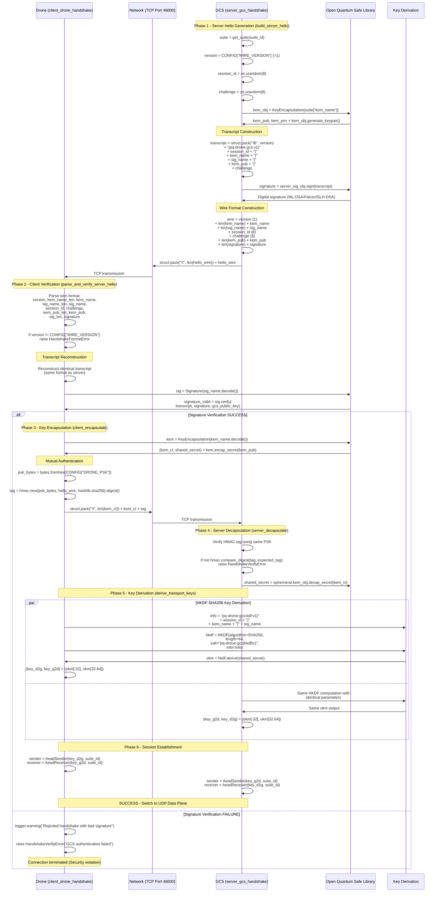
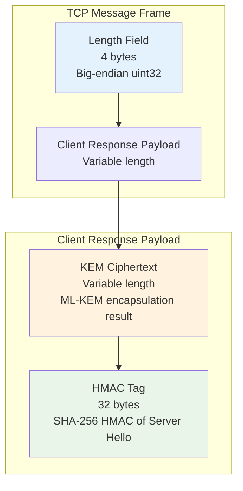
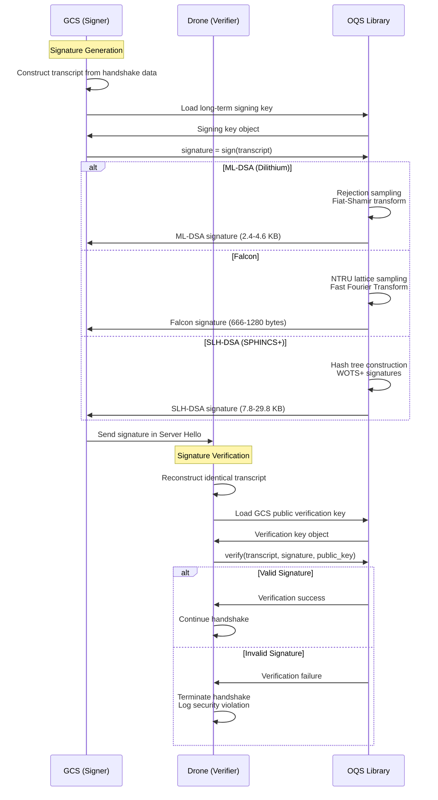
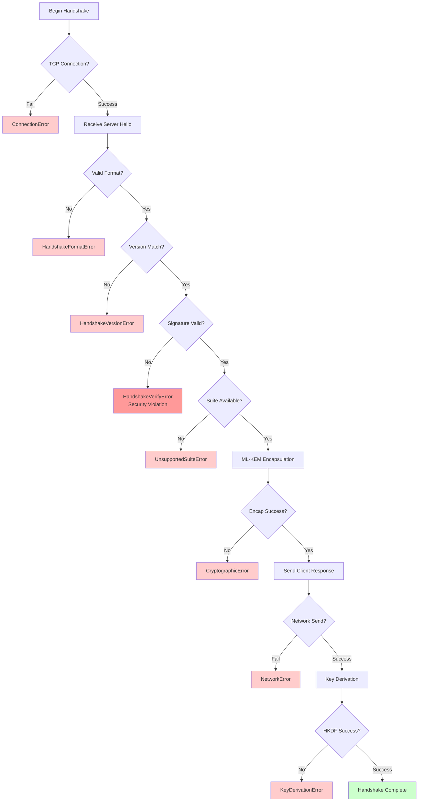
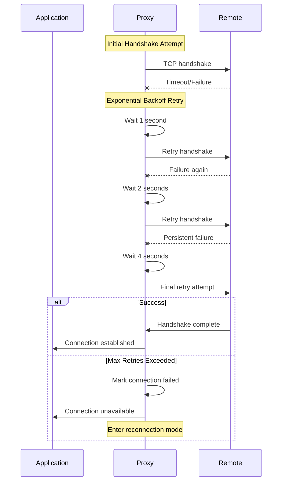

# Handshake Protocol Diagrams

This document contains detailed visualizations of the post-quantum handshake protocol implementation.

## Complete Handshake Protocol Flow

### Detailed TCP Handshake Sequence



## Wire Format Details

### Server Hello Message Structure

```mermaid
graph TB
    subgraph "TCP Message Frame"
        A[Length Field<br/>4 bytes<br/>Big-endian uint32]
        B[Server Hello Payload<br/>Variable length]
    end
    
    subgraph "Server Hello Payload"
        C[Version<br/>1 byte<br/>WIRE_VERSION=1]
        D[KEM Name Length<br/>1 byte]
        E[KEM Name<br/>Variable<br/>e.g., "Kyber512"]
        F[Sig Name Length<br/>1 byte]
        G[Sig Name<br/>Variable<br/>e.g., "Dilithium2"]
        H[Session ID<br/>8 bytes<br/>Random]
        I[Challenge<br/>8 bytes<br/>Random]
        J[KEM Public Key Length<br/>2 bytes<br/>Big-endian uint16]
        K[KEM Public Key<br/>Variable<br/>ML-KEM public key]
        L[Signature Length<br/>2 bytes<br/>Big-endian uint16]
        M[Signature<br/>Variable<br/>Digital signature]
    end
    
    A --> B
    B --> C
    C --> D
    D --> E
    E --> F
    F --> G
    G --> H
    H --> I
    I --> J
    J --> K
    K --> L
    L --> M
    
    style A fill:#e3f2fd
    style C fill:#f3e5f5
    style H fill:#e8f5e8
    style I fill:#e8f5e8
    style K fill:#fff3e0
    style M fill:#fce4ec
```

### Client Response Message Structure



## Algorithm-Specific Flows

### ML-KEM Key Exchange Detail

```mermaid
flowchart TB
    subgraph "GCS (Server) Side"
        A1[Generate ML-KEM Keypair]
        A2[Sample secret vector s]
        A3[Sample error vector e]
        A4[Compute A·s + e = t]
        A5[Public key: (A, t)]
        A6[Private key: s]
    end
    
    subgraph "Drone (Client) Side"
        B1[Receive public key (A, t)]
        B2[Sample randomness r, e1, e2]
        B3[Compute u = A^T·r + e1]
        B4[Compute v = t^T·r + e2 + m]
        B5[Ciphertext: (u, v)]
        B6[Shared secret: derived from m]
    end
    
    subgraph "GCS Decapsulation"
        C1[Receive ciphertext (u, v)]
        C2[Compute m' = v - s^T·u]
        C3[Shared secret: derived from m']
    end
    
    A1 --> A2
    A2 --> A3
    A3 --> A4
    A4 --> A5
    A5 --> B1
    B1 --> B2
    B2 --> B3
    B3 --> B4
    B4 --> B5
    B5 --> C1
    C1 --> C2
    C2 --> C3
    
    style A5 fill:#e3f2fd
    style B5 fill:#f3e5f5
    style C3 fill:#e8f5e8
```

### Digital Signature Verification Flow



## Error Handling in Handshake

### Handshake Failure Scenarios



### Recovery and Retry Logic



---

**Navigation**: 
- **Back to**: [Diagrams Index](../README.md)
- **Related**: [Data Transport](data-transport.md) | [Runtime Switching](runtime-switching.md)
- **Technical Docs**: [Handshake Protocol](../../technical/handshake-protocol.md)