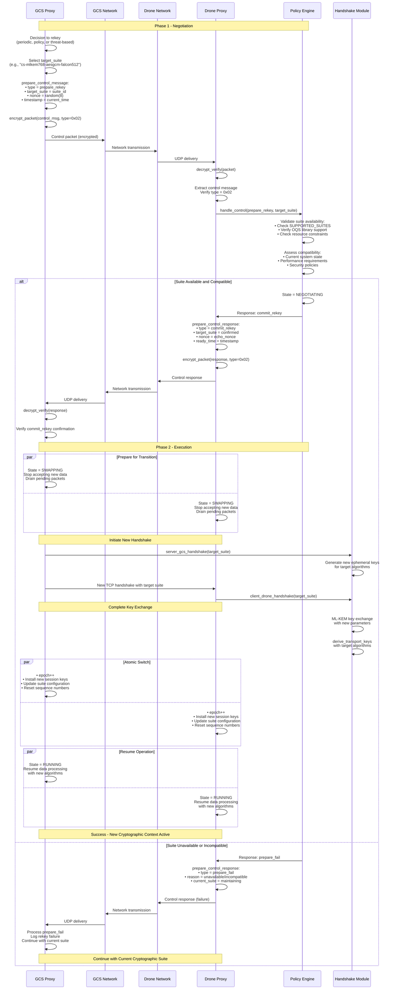
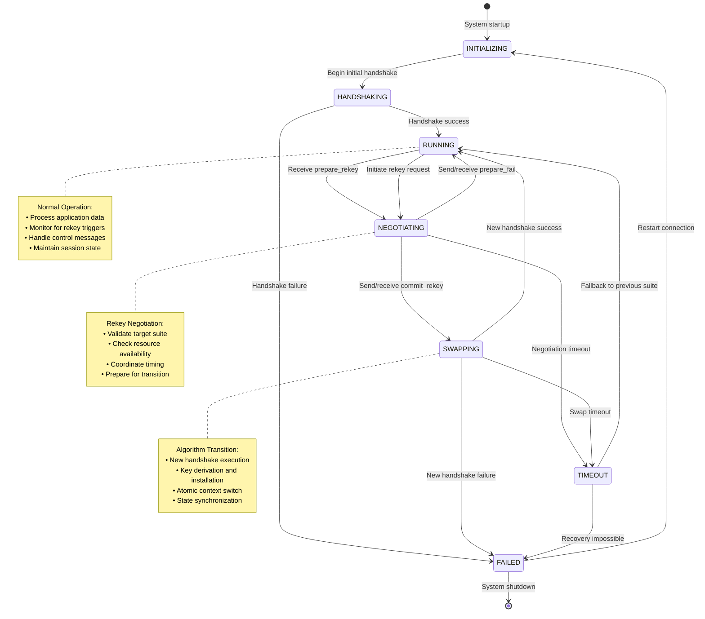
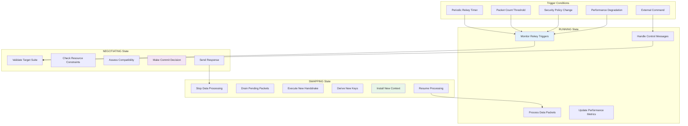
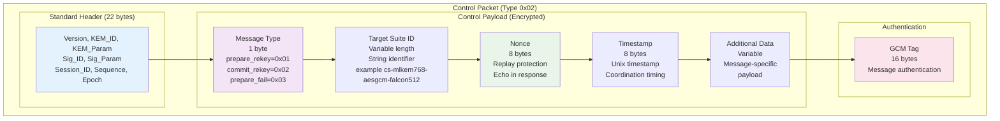
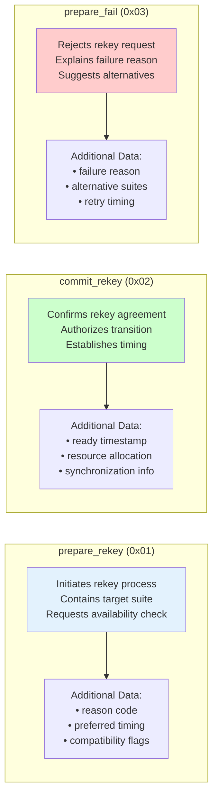
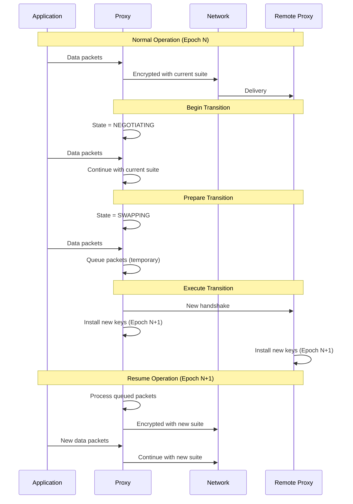
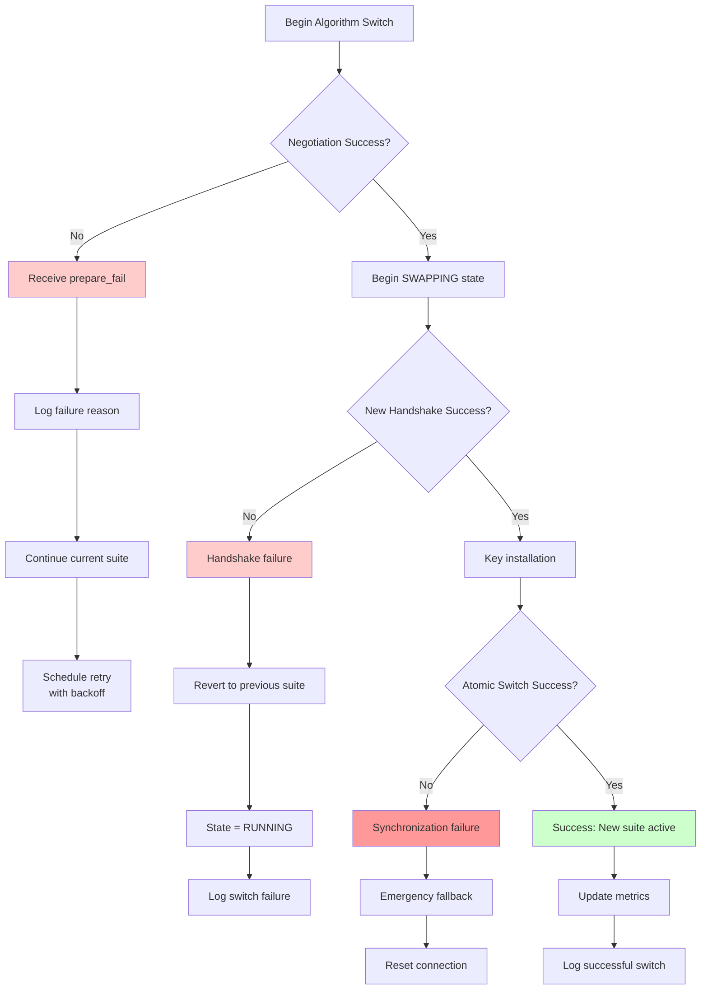
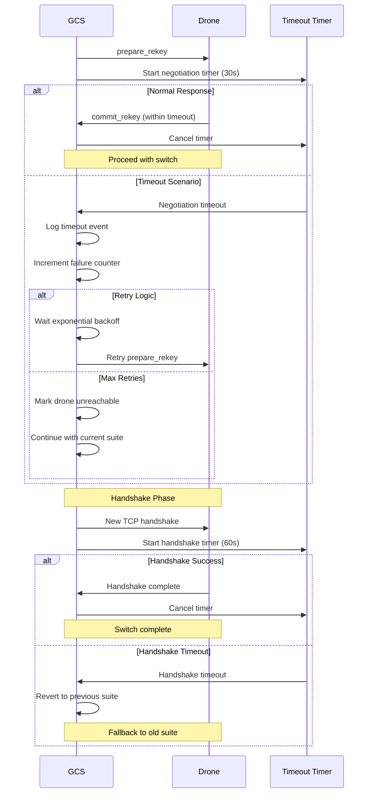

# Runtime Algorithm Switching Diagrams

This document contains detailed visualizations of the runtime cryptographic algorithm switching mechanism.

## Complete Algorithm Switching Protocol

### Two-Phase Commit Sequence



## State Machine Implementation

### Control State Transitions



### Detailed State Behaviors



## Control Message Format

### Control Packet Structure



### Message Type Specifications



## Synchronization and Timing

### Coordination Timeline

```mermaid
gantt
    title Runtime Algorithm Switch Timeline
    dateFormat X
    axisFormat %s
    
    section Negotiation
    Send prepare_rekey     :done, neg1, 0, 1s
    Process request        :done, neg2, 1s, 2s
    Send commit_rekey      :done, neg3, 2s, 3s
    
    section Preparation
    Drain packets         :done, prep1, 3s, 4s
    Prepare handshake     :done, prep2, 4s, 5s
    
    section Transition
    New TCP handshake     :done, trans1, 5s, 6s
    Key derivation        :done, trans2, 6s, 7s
    Atomic switch         :crit, trans3, 7s, 8s
    
    section Resume
    Resume processing     :done, resume1, 8s, 9s
    Normal operation      :done, resume2, 9s, 10s
```

### Packet Flow During Transition



## Error Handling and Recovery

### Failure Scenarios and Recovery



### Timeout and Recovery Logic



---

**Navigation**: 
- **Back to**: [Diagrams Index](../README.md)
- **Related**: [Handshake Protocol](handshake.md) | [State Machines](../implementation/state-machines.md)
- **Technical Docs**: [Runtime Switching](../../technical/runtime-switching.md)