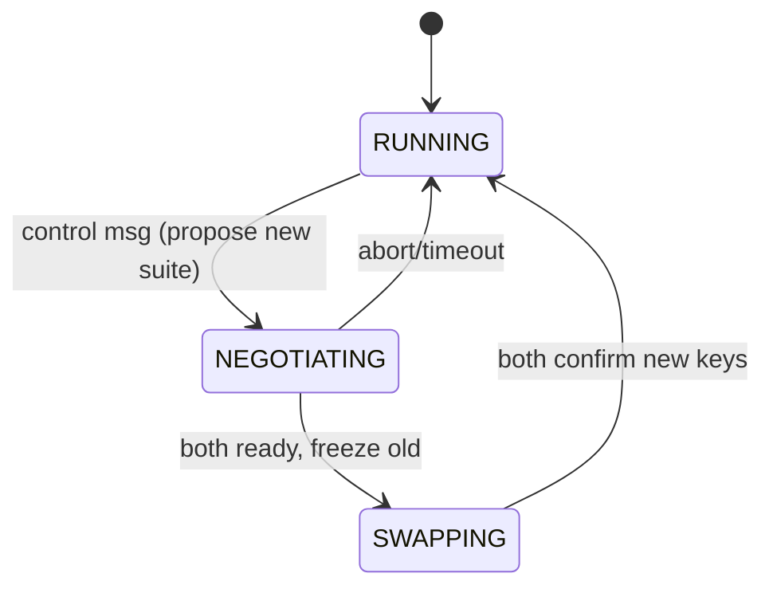

# Rekey two-phase commit

## State descriptions

- **RUNNING**: steady state; data plane uses the current epoch keys.
- **NEGOTIATING**: `policy_engine.request_prepare()` exchanged; waiting for both peers to acknowledge the new suite/epoch.
- **SWAPPING**: `_launch_rekey()` spinning up new `Sender`/`Receiver` pairs and freezing the previous epoch until counters drain.
- **Abort/timeout**: failure path; reverts to RUNNING with previous keys while logging diagnostics.
