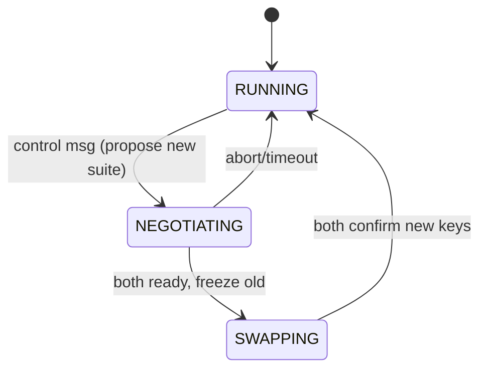

# Rekey two-phase commit

```mermaid
stateDiagram-v2
  [*] --> RUNNING
  RUNNING --> NEGOTIATING: control msg (propose new suite)
  NEGOTIATING --> SWAPPING: both ready, freeze old
  SWAPPING --> RUNNING: both confirm new keys
  NEGOTIATING --> RUNNING: abort/timeout
```
