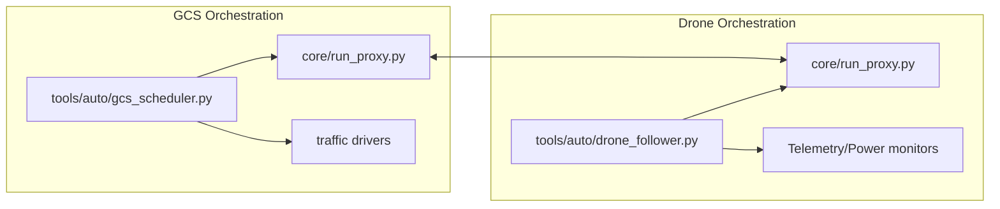

# Scheduler and follower

```mermaid
flowchart LR
  subgraph GCS Orchestration
    sch[tools/auto/gcs_scheduler.py]
    gcsProxy[core/run_proxy.py]
    blaster[traffic drivers]
  end

  subgraph Drone Orchestration
    fol[tools/auto/drone_follower.py]
    droneProxy[core/run_proxy.py]
    telem[Telemetry/Power monitors]
  end

  sch --> gcsProxy
  sch --> blaster
  fol --> droneProxy
  fol --> telem
  gcsProxy <---> droneProxy
```
