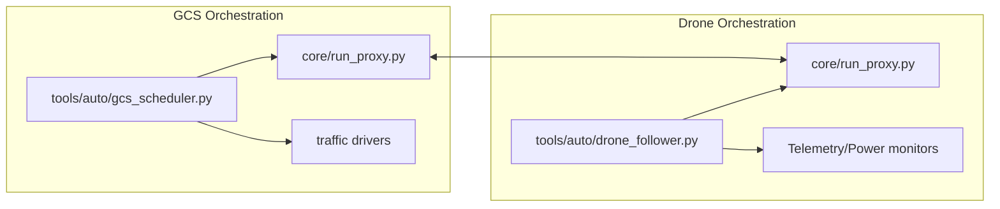

# Scheduler and follower

## Legend

- `tools/auto/gcs_scheduler.py`: orchestrates suite rotations, traffic drivers, and artifact collection on the GCS host.
- `core/run_proxy.py` (GCS): portal that the scheduler controls; passes suite selections into `core/async_proxy` and starts the handshake.
- `traffic drivers`: custom workload generators (iperf wrappers, echo storms, etc.) launched by the scheduler to stress the link.
- `tools/auto/drone_follower.py`: automation runner that keeps the drone in sync, launches telemetry/power collectors, and applies control commands.
- `Telemetry/Power monitors`: classes inside the follower (e.g., `TelemetryPublisher`, `PowerCaptureManager`, INA219 integration) pushing metrics to disk.
- Bidirectional arrow between proxies: AEAD UDP channel plus control TCP handshake.
