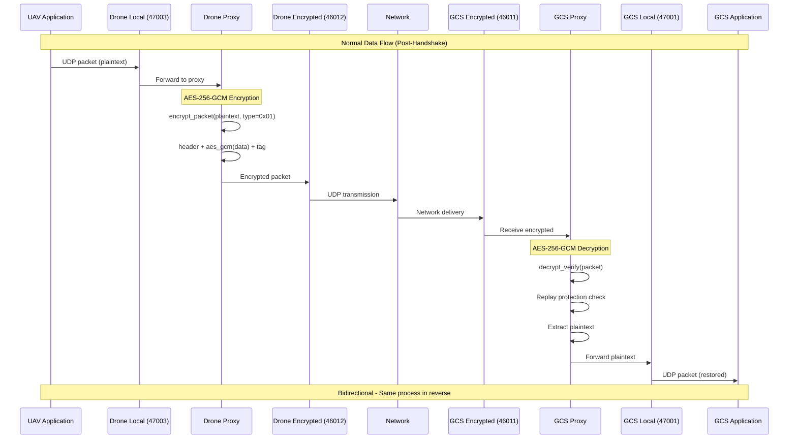
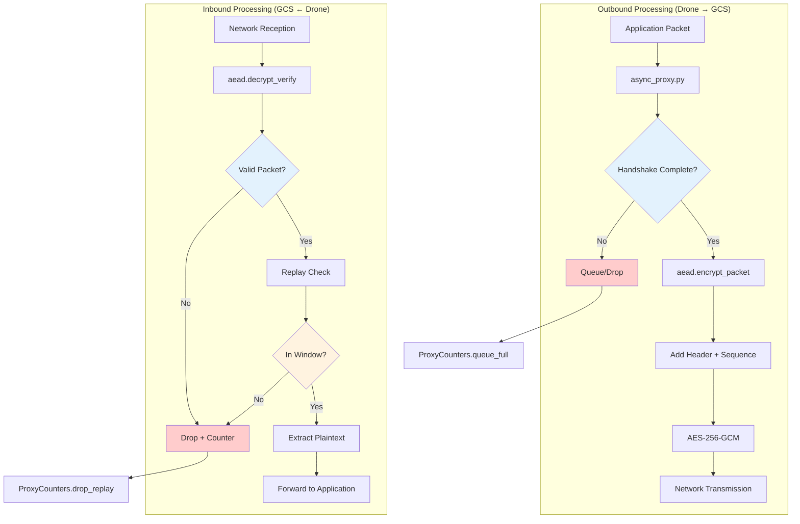
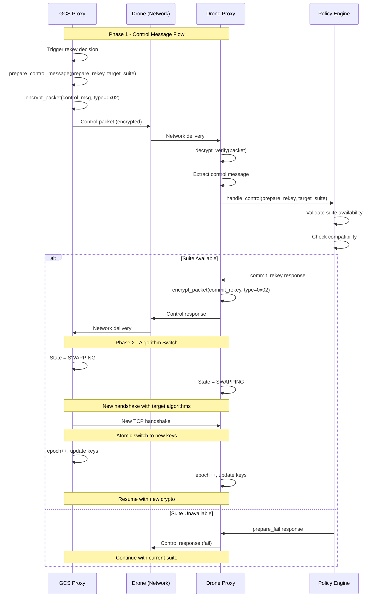
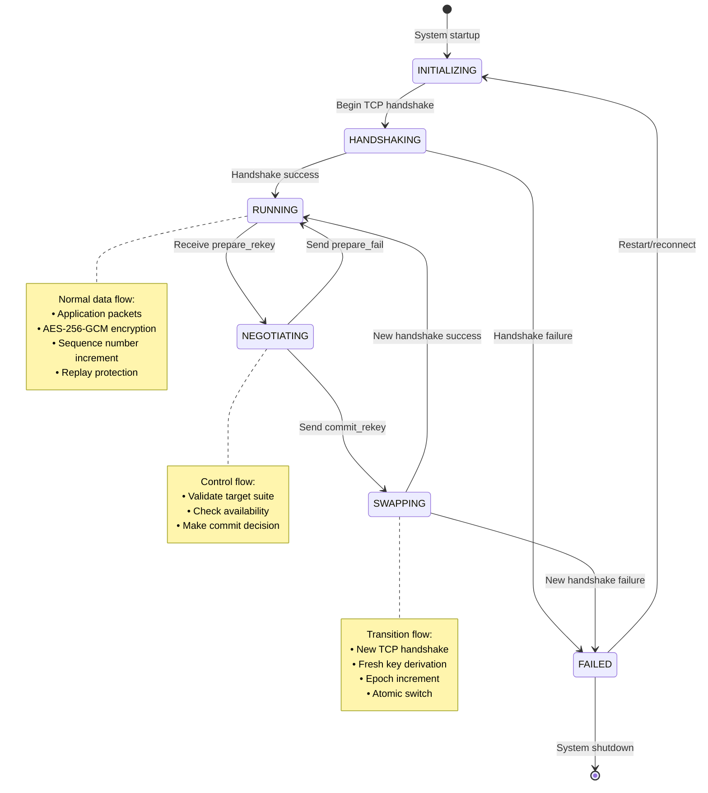
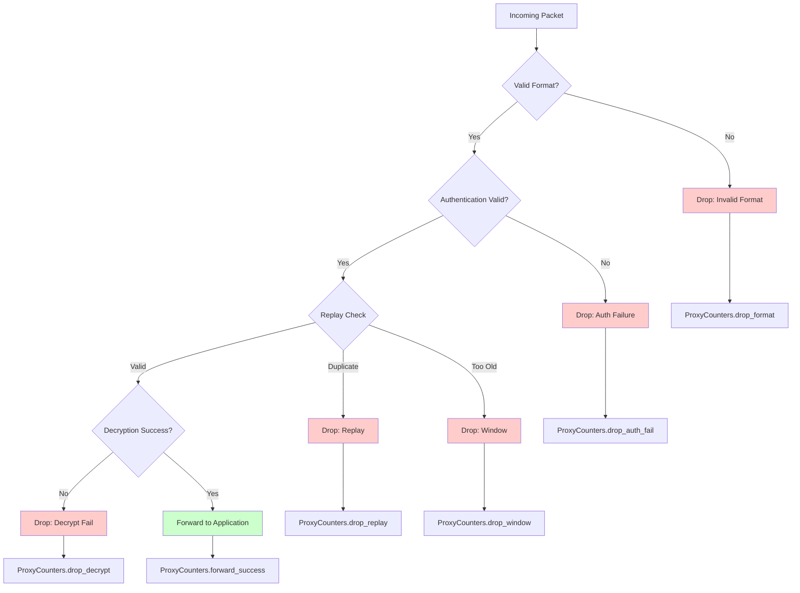
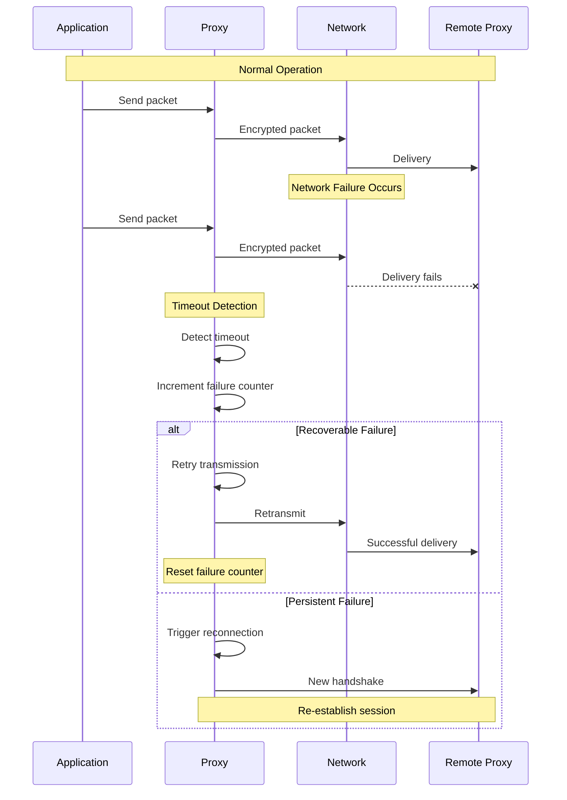

# Data Flow Diagrams

This document contains detailed data flow visualizations for the post-quantum cryptographic framework.

## Application Data Flow

### End-to-End Data Flow

### Packet Processing Pipeline

## Control Plane Data Flow

### Runtime Algorithm Switching Flow

### State Machine Data Flow

## Error Handling Data Flow

### Packet Drop Scenarios

### Network Failure Handling

---

**Navigation**: 
- **Back to**: [System Overview](overview.md)
- **Related**: [Protocol Flows](../protocols/handshake.md) | [State Machines](../implementation/state-machines.md)
- **Technical Docs**: [System Architecture](../../technical/system-overview.md)