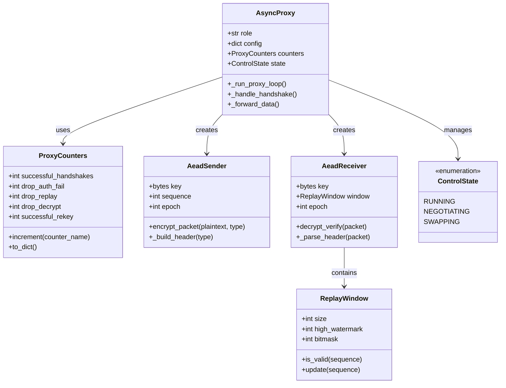
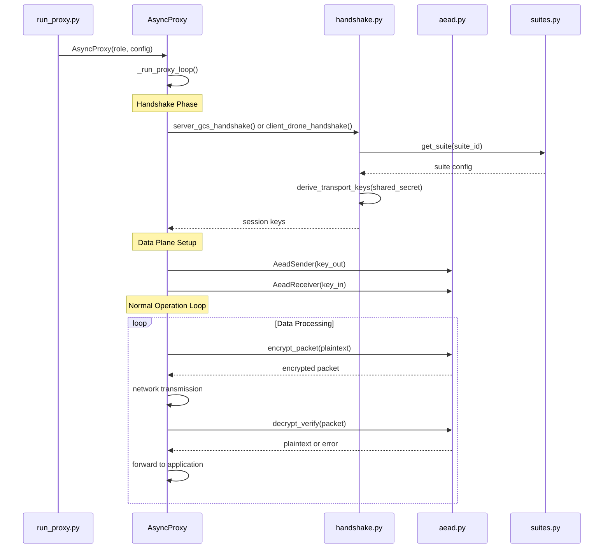
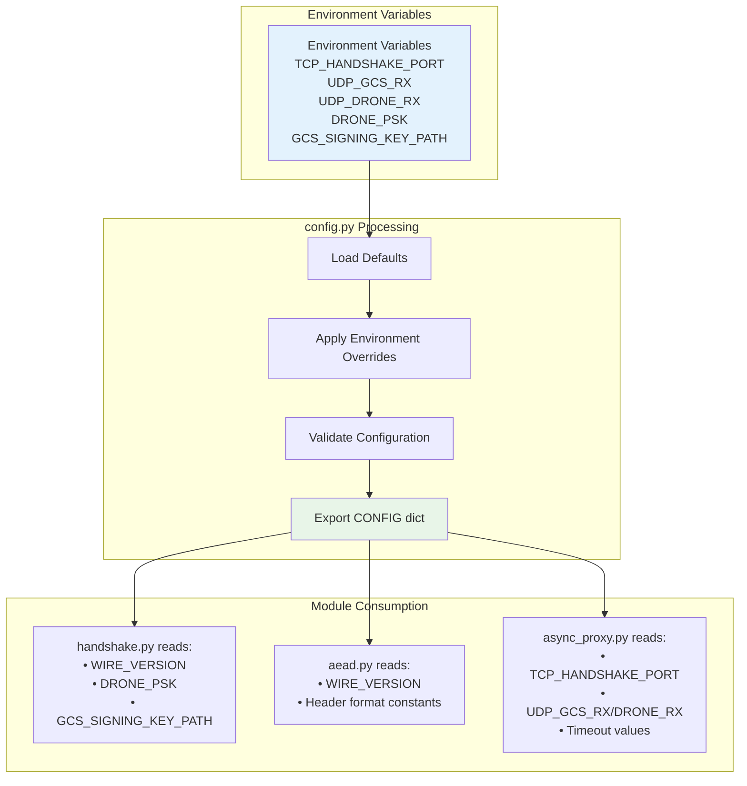

# Core Module Relationships

This document visualizes the relationships and dependencies between core modules in the post-quantum cryptographic framework.

## Module Dependency Graph

### Complete Dependency Map

```mermaid
graph TB
    subgraph "Configuration Layer"
        CONFIG[config.py<br/>• TCP_HANDSHAKE_PORT: 46000<br/>• UDP_GCS_RX: 46011<br/>• UDP_DRONE_RX: 46012<br/>• WIRE_VERSION: 1<br/>• DRONE_PSK: hex string]
    end
    
    subgraph "Algorithm Management"
        SUITES[suites.py<br/>• SUPPORTED_SUITES dict<br/>• get_suite(suite_id)<br/>• header_ids_for_suite()<br/>• suite_bytes_for_hkdf()]
    end
    
    subgraph "Cryptographic Core"
        HANDSHAKE[handshake.py<br/>• server_gcs_handshake()<br/>• client_drone_handshake()<br/>• derive_transport_keys()<br/>• build_server_hello()<br/>• parse_and_verify_server_hello()]
        
        AEAD[aead.py<br/>• AeadSender class<br/>• AeadReceiver class<br/>• encrypt_packet()<br/>• decrypt_verify()<br/>• ReplayWindow]
    end
    
    subgraph "Control & Policy"
        POLICY[policy_engine.py<br/>• handle_control()<br/>• record_rekey_result()<br/>• ControlState enum<br/>• prepare_rekey/commit_rekey]
    end
    
    subgraph "Network Coordination"
        PROXY[async_proxy.py<br/>• AsyncProxy class<br/>• _run_proxy_loop()<br/>• ProxyCounters<br/>• Socket management]
    end
    
    subgraph "External Libraries"
        OQS[Open Quantum Safe<br/>• KeyEncapsulation<br/>• Signature<br/>• ML-KEM, ML-DSA<br/>• Falcon, SLH-DSA]
        
        CRYPTO[Python Cryptography<br/>• AES-GCM<br/>• HKDF<br/>• HMAC-SHA256]
    end
    
    %% Configuration Dependencies
    CONFIG --> HANDSHAKE
    CONFIG --> AEAD
    CONFIG --> PROXY
    CONFIG --> POLICY
    
    %% Suite Dependencies
    SUITES --> HANDSHAKE
    SUITES --> AEAD
    SUITES --> POLICY
    
    %% Core Crypto Dependencies
    HANDSHAKE --> OQS
    HANDSHAKE --> CRYPTO
    AEAD --> CRYPTO
    
    %% Network Layer Dependencies
    PROXY --> HANDSHAKE
    PROXY --> AEAD
    PROXY --> POLICY
    
    %% Policy Dependencies
    POLICY --> HANDSHAKE
    
    classDef config fill:#e3f2fd,stroke:#0277bd,stroke-width:2px
    classDef algo fill:#f3e5f5,stroke:#7b1fa2,stroke-width:2px
    classDef crypto fill:#e8f5e8,stroke:#2e7d32,stroke-width:2px
    classDef policy fill:#fff3e0,stroke:#ef6c00,stroke-width:2px
    classDef network fill:#fce4ec,stroke:#c2185b,stroke-width:2px
    classDef external fill:#f0f0f0,stroke:#666666,stroke-width:2px
    
    class CONFIG config
    class SUITES algo
    class HANDSHAKE,AEAD crypto
    class POLICY policy
    class PROXY network
    class OQS,CRYPTO external
```

## Class and Function Relationships

### Core Class Hierarchy



### Function Call Flow



## Configuration Flow

### Configuration Dependency Chain



### Suite Configuration Flow

```mermaid
flowchart LR
    subgraph "Suite Definition"
        DEFINE[SUPPORTED_SUITES = {<br/>'cs-mlkem512-aesgcm-mldsa44': {<br/>  'kem_name': 'Kyber512',<br/>  'sig_name': 'Dilithium2',<br/>  'display_name': '...'<br/>}<br/>}]
    end
    
    subgraph "Runtime Access"
        GET[get_suite(suite_id)]
        HEADERS[header_ids_for_suite(suite_id)]
        HKDF[suite_bytes_for_hkdf(suite_id)]
    end
    
    subgraph "Usage Points"
        HANDSHAKE_USE[Handshake Protocol<br/>Algorithm Selection]
        AEAD_USE[AEAD Headers<br/>Wire Format IDs]
        POLICY_USE[Policy Engine<br/>Suite Validation]
    end
    
    DEFINE --> GET
    DEFINE --> HEADERS
    DEFINE --> HKDF
    
    GET --> HANDSHAKE_USE
    HEADERS --> AEAD_USE
    GET --> POLICY_USE
    
    style DEFINE fill:#f3e5f5
    style HANDSHAKE_USE fill:#e8f5e8
    style AEAD_USE fill:#e8f5e8
    style POLICY_USE fill:#fff3e0
```

## Interface Definitions

### Inter-Module API

```mermaid
graph LR
    subgraph "Public APIs"
        HANDSHAKE_API[handshake.py<br/>• server_gcs_handshake(suite_id, gcs_key)<br/>• client_drone_handshake(suite_id, gcs_pub)<br/>• derive_transport_keys(shared, session, algs)]
        
        AEAD_API[aead.py<br/>• AeadSender(key, suite_id)<br/>• AeadReceiver(key, suite_id, window)<br/>• encrypt_packet(data, type)<br/>• decrypt_verify(packet)]
        
        SUITE_API[suites.py<br/>• get_suite(suite_id) → dict<br/>• header_ids_for_suite(suite_id) → tuple<br/>• suite_bytes_for_hkdf(suite_id) → bytes]
        
        POLICY_API[policy_engine.py<br/>• handle_control(msg_type, payload)<br/>• record_rekey_result(success, suite)<br/>• ControlState enum]
    end
    
    subgraph "Internal Implementation"
        HANDSHAKE_IMPL[• build_server_hello()<br/>• parse_and_verify_server_hello()<br/>• client_encapsulate()<br/>• server_decapsulate()]
        
        AEAD_IMPL[• _build_header()<br/>• _parse_header()<br/>• ReplayWindow.is_valid()<br/>• ReplayWindow.update()]
        
        POLICY_IMPL[• _validate_suite()<br/>• _transition_state()<br/>• _handle_prepare_rekey()<br/>• _handle_commit_rekey()]
    end
    
    HANDSHAKE_API -.-> HANDSHAKE_IMPL
    AEAD_API -.-> AEAD_IMPL
    POLICY_API -.-> POLICY_IMPL
    
    style HANDSHAKE_API fill:#ccffcc
    style AEAD_API fill:#ccffcc
    style SUITE_API fill:#ccffcc
    style POLICY_API fill:#ccffcc
```

---

**Navigation**: 
- **Back to**: [System Overview](overview.md)
- **Related**: [Data Flow](data-flow.md) | [Protocol Flows](../protocols/handshake.md)
- **Technical Docs**: [Core Modules](../../technical/core-modules.md)