# System Overview Diagrams

This document contains comprehensive system architecture diagrams for the post-quantum cryptographic framework.

## Complete System Architecture

### High-Level System Overview

```mermaid
graph TB
    subgraph "Application Layer"
        UA[UAV Application<br/>Flight Controller<br/>Telemetry System]
        GCS_APP[GCS Application<br/>Control Software<br/>Mission Planning]
    end
    
    subgraph "Proxy Layer - Core Modules"
        DRONE_PROXY[Drone Proxy<br/>async_proxy.py --drone<br/>Port Management]
        GCS_PROXY[GCS Proxy<br/>async_proxy.py --gcs<br/>Connection Handling]
    end
    
    subgraph "Cryptographic Core (core/)"
        HANDSHAKE[handshake.py<br/>• server_gcs_handshake<br/>• client_drone_handshake<br/>• derive_transport_keys]
        AEAD[aead.py<br/>• AeadSender/Receiver<br/>• encrypt_packet<br/>• decrypt_verify]
        SUITES[suites.py<br/>• get_suite<br/>• header_ids_for_suite<br/>• SUPPORTED_SUITES]
        CONFIG[config.py<br/>• TCP_HANDSHAKE_PORT<br/>• UDP_GCS_RX/UDP_DRONE_RX<br/>• WIRE_VERSION]
    end
    
    subgraph "Transport Layer"
        TCP_HS[TCP Handshake<br/>Port 46000<br/>Reliable Authentication]
        UDP_ENC[Encrypted UDP<br/>GCS: 46011, Drone: 46012<br/>Low-latency Data]
        UDP_PLAIN[Plaintext UDP<br/>Loopback: 47001-47004<br/>Application Interface]
    end
    
    subgraph "Security Features"
        POLICY[policy_engine.py<br/>• handle_control<br/>• record_rekey_result<br/>• ControlState FSM]
        DDOS[ddos/<br/>• xgb_stage1.py<br/>• mitigations.py<br/>• features.py]
        RL[rl/<br/>• linucb.py<br/>• agent_runtime.py<br/>• safety.py]
    end
    
    subgraph "Monitoring & Tools"
        LOGGING[logging_utils.py<br/>• get_logger<br/>• session_id tracking]
        COUNTERS[ProxyCounters<br/>• drop_auth_fail<br/>• drop_replay<br/>• successful_rekey]
        TOOLS[tools/<br/>• counter_utils.py<br/>• encrypted_sniffer.py<br/>• audit_endpoints.py]
    end
    
    subgraph "PQC Algorithm Layer"
        OQS[Open Quantum Safe<br/>• ML-KEM: 512/768/1024<br/>• ML-DSA: 44/65/87<br/>• Falcon: 512/1024<br/>• SLH-DSA: 128s/192s/256s]
    end
    
    %% Data Flow Connections
    UA ---|Plaintext UDP| UDP_PLAIN
    UDP_PLAIN ---|Bridge| DRONE_PROXY
    DRONE_PROXY ---|Encrypted UDP| UDP_ENC
    UDP_ENC ---|Network| GCS_PROXY
    GCS_PROXY ---|Bridge| UDP_PLAIN
    UDP_PLAIN ---|Application Data| GCS_APP
    
    %% Handshake Flow
    DRONE_PROXY ---|Key Exchange| TCP_HS
    TCP_HS ---|Mutual Auth| GCS_PROXY
    
    %% Core Dependencies
    DRONE_PROXY --> HANDSHAKE
    GCS_PROXY --> HANDSHAKE
    HANDSHAKE --> SUITES
    HANDSHAKE --> OQS
    DRONE_PROXY --> AEAD
    GCS_PROXY --> AEAD
    AEAD --> CONFIG
    
    %% Security Integration
    DRONE_PROXY --> POLICY
    GCS_PROXY --> POLICY
    POLICY --> RL
    DRONE_PROXY --> DDOS
    GCS_PROXY --> DDOS
    
    %% Monitoring Integration
    DRONE_PROXY --> LOGGING
    GCS_PROXY --> LOGGING
    DRONE_PROXY --> COUNTERS
    GCS_PROXY --> COUNTERS
    LOGGING --> TOOLS
    COUNTERS --> TOOLS
    
    %% Configuration Dependencies
    DRONE_PROXY --> CONFIG
    GCS_PROXY --> CONFIG
    HANDSHAKE --> CONFIG
    POLICY --> CONFIG
    
    classDef coreModule fill:#e1f5fe,stroke:#0277bd,stroke-width:2px
    classDef cryptoLayer fill:#f3e5f5,stroke:#7b1fa2,stroke-width:2px
    classDef networkLayer fill:#e8f5e8,stroke:#2e7d32,stroke-width:2px
    classDef securityLayer fill:#fff3e0,stroke:#ef6c00,stroke-width:2px
    classDef appLayer fill:#fce4ec,stroke:#c2185b,stroke-width:2px
    
    class DRONE_PROXY,GCS_PROXY,HANDSHAKE,AEAD,SUITES,CONFIG coreModule
    class TCP_HS,UDP_ENC,UDP_PLAIN cryptoLayer
    class POLICY,DDOS,RL securityLayer
    class UA,GCS_APP appLayer
    class LOGGING,COUNTERS,TOOLS networkLayer
```

### Simplified Architecture (For Academic Papers)

## Core Module Dependencies

### Module Interaction Flow

## Data Flow Visualization

### Complete Data Flow Path

---

**Navigation**: 
- **Back to**: [Diagrams Index](../README.md)
- **Related**: [Protocol Flows](../protocols/handshake.md) | [Algorithm Matrix](../algorithms/algorithm-matrix.md)
- **Technical Docs**: [System Overview](../../technical/system-overview.md)