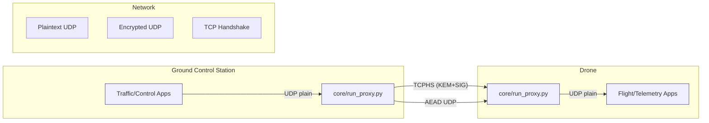

# System overview

```mermaid
flowchart LR
  subgraph GCS[Ground Control Station]
    GCSApp[Traffic/Control Apps]
    GCSProxy[core/run_proxy.py]
  end

  subgraph Network
    UDPPlain[Plaintext UDP]
    UDPEnc[Encrypted UDP]
    TCPHS[TCP Handshake]
  end

  subgraph Drone
    DroneApp[Flight/Telemetry Apps]
    DroneProxy[core/run_proxy.py]
  end

  GCSApp-- UDP plain -->GCSProxy
  GCSProxy-- TCPHS (KEM+SIG) -->DroneProxy
  GCSProxy-- AEAD UDP -->DroneProxy
  DroneProxy-- UDP plain -->DroneApp

  classDef comp fill:#eef,stroke:#447
  class GCSApp,GCSProxy,DroneApp,DroneProxy comp
```