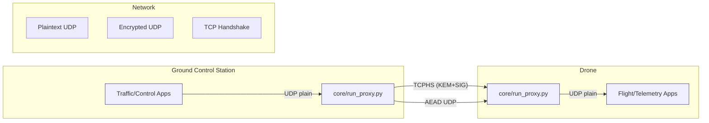

# System overview

## Legend

- `Traffic/Control Apps`: suite schedulers and blasters under `gcs/` and `tools/auto/` that emit plaintext telemetry commands.
- `core/run_proxy.py` (GCS): proxy entry point that mediates between plaintext apps and encrypted transport.
- `Plaintext UDP`: local loopback socket used by apps; locked down unless `ALLOW_NON_LOOPBACK_PLAINTEXT=1`.
- `TCP Handshake`: PQC handshake over TCP orchestrated by `core/async_proxy._perform_handshake()`.
- `Encrypted UDP`: AEAD-protected packets carrying the `HEADER_STRUCT` fields defined in `core/aead.py`.
- `core/run_proxy.py` (Drone): mirror proxy forwarding decrypted payloads to flight/telemetry software.
- `Flight/Telemetry Apps`: `drone/` binaries, `tools/auto/drone_follower.py` modules, and power/telemetry collectors.