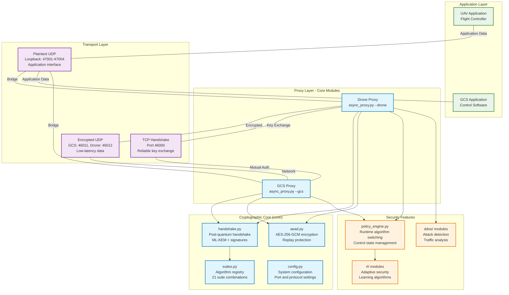

# Complete System Architecture

This document provides comprehensive technical details for the post-quantum cryptographic framework implementation, including detailed module interactions, data flows, and implementation specifications.

## System Overview



## Core Module Architecture

### Central Proxy Logic (`core/async_proxy.py`)

The `AsyncProxy` class implements the core network coordination logic using Python's `selectors` module for efficient I/O multiplexing. Key components include:

**Main Event Loop (`_run_proxy_loop`)**:
- Manages TCP handshake connections and UDP data plane sockets
- Implements timeout handling and connection state management
- Coordinates between encrypted and plaintext communication channels
- Handles automatic failover and error recovery

**Socket Management**:
```python
# TCP handshake socket (server mode for GCS)
handshake_sock = socket.socket(socket.AF_INET, socket.SOCK_STREAM)
handshake_sock.bind((CONFIG["TCP_HANDSHAKE_HOST"], CONFIG["TCP_HANDSHAKE_PORT"]))

# UDP encrypted data sockets
encrypted_sock = socket.socket(socket.AF_INET, socket.SOCK_DGRAM)
encrypted_sock.bind((host, CONFIG["UDP_GCS_RX"] if is_gcs else CONFIG["UDP_DRONE_RX"]))

# UDP plaintext application sockets  
plaintext_sock = socket.socket(socket.AF_INET, socket.SOCK_DGRAM)
plaintext_sock.bind((CONFIG["LOOPBACK_HOST"], app_port))
```

**State Machine Integration**:
The proxy integrates with the `ControlState` finite state machine for runtime algorithm switching:
- `RUNNING`: Normal data forwarding operation
- `NEGOTIATING`: Processing rekey requests via two-phase commit
- `SWAPPING`: Executing algorithm transition with new handshake

### Cryptographic Suite Management (`core/suites.py`)

The suite registry provides runtime algorithm selection and validation:

```python
SUPPORTED_SUITES = {
    "cs-mlkem512-aesgcm-mldsa44": {
        "kem_name": "Kyber512",
        "kem_param": 0,
        "sig_name": "Dilithium2", 
        "sig_param": 0,
        "display_name": "ML-KEM-512 + AES-GCM + ML-DSA-44"
    },
    # ... 20 additional suite combinations
}
```

**Key Functions**:
- `get_suite(suite_id)`: Returns complete algorithm specification
- `header_ids_for_suite(suite_id)`: Provides wire protocol identifiers
- `suite_bytes_for_hkdf(suite_id)`: Returns HKDF info parameter

### Handshake Protocol Implementation (`core/handshake.py`)

**Server-side Handshake (`server_gcs_handshake`)**:
1. Generate ephemeral ML-KEM keypair
2. Create cryptographic transcript with session parameters
3. Sign transcript using GCS long-term signature key
4. Send ServerHello with public key and signature
5. Verify client response and HMAC authentication
6. Derive session keys using HKDF-SHA256

**Client-side Handshake (`client_drone_handshake`)**:
1. Parse ServerHello and verify signature
2. Perform mandatory GCS authentication
3. Generate shared secret via ML-KEM encapsulation
4. Compute HMAC for mutual authentication
5. Send ClientResponse with ciphertext and HMAC
6. Derive identical session keys using HKDF

**Key Derivation (`derive_transport_keys`)**:
```python
def derive_transport_keys(shared_secret, session_id, kem_name, sig_name):
    info = f"pq-drone-gcs:kdf:v1|{session_id}|{kem_name}|{sig_name}"
    hkdf = HKDF(
        algorithm=hashes.SHA256(),
        length=64,
        salt=b"pq-drone-gcs|hkdf|v1",
        info=info.encode()
    )
    okm = hkdf.derive(shared_secret)
    return okm[:32], okm[32:64]  # (drone_to_gcs_key, gcs_to_drone_key)
```

### Authenticated Encryption (`core/aead.py`)

**Packet Format**:
```
[Header: 22 bytes][Encrypted Data: Variable][GCM Tag: 16 bytes]
```

**Header Structure**:
- Version (1 byte): Protocol version identifier
- KEM ID (1 byte): Key exchange algorithm identifier  
- KEM Param (1 byte): Algorithm parameter set
- Signature ID (1 byte): Digital signature algorithm
- Signature Param (1 byte): Signature parameter set
- Session ID (8 bytes): Links packet to handshake session
- Sequence (8 bytes): Monotonic counter for replay protection
- Epoch (1 byte): Cryptographic context version

**Encryption Process (`AeadSender.encrypt_packet`)**:
```python
def encrypt_packet(self, plaintext, packet_type=1):
    # Deterministic nonce: epoch || sequence_number
    nonce = struct.pack(">B", self.epoch) + struct.pack(">Q", self.sequence)[1:]
    
    # Header as Additional Authenticated Data
    header = self._build_header(packet_type)
    
    # AES-256-GCM encryption
    ciphertext = self.cipher.encrypt(nonce, plaintext, header)
    
    self.sequence += 1
    return header + ciphertext
```

**Replay Protection (`AeadReceiver.decrypt_verify`)**:
Implements sliding window anti-replay based on RFC 3711:
- Maintains high watermark for highest received sequence
- Uses bitmask to track recently received packets within window
- Rejects duplicate packets and those outside acceptance window
- Advances window for legitimate future packets

## Transport Layer Architecture

### TCP Handshake Channel

**Purpose**: Reliable delivery of cryptographic handshake messages
**Port**: 46000 (configurable via `TCP_HANDSHAKE_PORT`)
**Protocol**: Custom post-quantum handshake over TCP

**Message Format**:
```
[Length: 4 bytes][Handshake Message: Variable]
```

**Connection Management**:
- GCS operates in server mode, listening for drone connections
- Timeout-based connection handling (30-second default)
- Automatic connection cleanup after handshake completion
- Error handling for network failures and protocol violations

### UDP Data Plane

**Purpose**: Low-latency encrypted application data transport
**Ports**: 
- GCS RX: 46011 (configurable via `UDP_GCS_RX`)
- Drone RX: 46012 (configurable via `UDP_DRONE_RX`)

**Optimization Features**:
- Non-blocking socket operations
- Configurable DSCP marking for QoS (`ENCRYPTED_DSCP`)
- Efficient packet forwarding between encrypted and plaintext channels
- Minimal per-packet processing overhead

### Application Interface

**Purpose**: Transparent proxy interface for existing UAV applications
**Ports**: 47001-47004 (configurable loopback range)
**Protocol**: Unmodified UDP for seamless application integration

**Key Features**:
- Zero-modification integration with existing UAV software
- Bidirectional data forwarding with cryptographic protection
- Maintains original application semantics and timing
- Transparent error handling and connection management

---

**Navigation**: 
- **Next**: [Handshake Protocol Details](handshake-protocol.md)
- **Related**: [Algorithm Specifications](algorithm-matrix.md)
- **Back to**: [Technical Documentation Index](README.md)